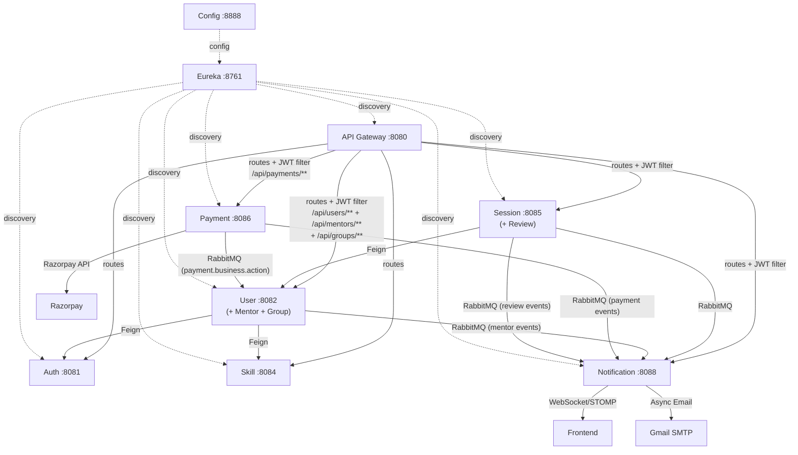

# Presentation Sync Note

Updated for final presentation on 2026-04-06. Start with docs/00_Presentation_Playbook.md for the guided narrative, then use this document for deep details.

---

# 02 System and Database Architecture

## 2026-04-11 QA Round 2 Architecture Deltas

### Session metric source of truth
- Session counts shown to learners, mentors, and admin now use completed sessions only.
- Session service is the canonical source via status-scoped aggregation (`COMPLETED`).

### Mentor metrics endpoint
- Added endpoint: `GET /api/sessions/mentor/{mentorId}/metrics`.
- Response fields:
    - `completedSessions`
    - `averageRating`
    - `totalReviews`
    - `defaultRatedSessions`
    - `newMentor`

### Default rating state model
- `sessions.sessions` includes `default_rating_applied` (boolean, non-null).
- On session completion, `default_rating_applied` becomes `true` for unrated completed sessions.
- On review submission for that session, it is switched to `false`.


---

## Content from: doc2_database_backend_design.md

# 📄 DOCUMENT 2: DATABASE + BACKEND DESIGN

> [!IMPORTANT]
> **CQRS + Redis Caching (March 2026):** All business services (User, Skill, Session, Notification) now implement the **CQRS pattern** with **Redis 7.2** distributed caching. Service layers have been split into `service.command` (write operations + cache invalidation) and `service.query` (read operations + cache-aside). See `doc6_cqrs_redis_architecture.md` for the full design.
>
> **Architecture Update (March 2026):** Mentor Service + Group Service → User Service (port 8082). Review Service → Session Service (port 8085).
>
> **Enterprise Hardening (March 2026):** Implemented a dedicated Mapper layer to decouple CQRS Command/Query services. Added tiered API Gateway Rate Limiting using resilience4j.

## SkillSync — Database & Microservices Architecture

---

## 2.1 Database Design

### Database-per-Service Strategy

Each microservice owns its dedicated PostgreSQL database. No cross-service joins — all inter-service communication happens via REST APIs or RabbitMQ events.

| Service | Database | Schema |
|---|---|---|
| Auth Service | `skillsync_auth` | `auth` |
| User Service | `skillsync_user` | `users` |
| Mentor Service | `skillsync_mentor` | `mentors` |
| Skill Service | `skillsync_skill` | `skills` |
| Session Service | `skillsync_session` | `sessions` |
| Group Service | `skillsync_group` | `groups` |
| Review Service | `skillsync_review` | `reviews` |
| Payment Service | `skillsync_payment` | `payments` |
| Notification Service | `skillsync_notification` | `notifications` |

---

### 2.1.1 Entity Reference

| Service | JPA Entities | Database Tables |
|---|---|---|
| Auth | `AuthUser`, `RefreshToken`, `OtpToken` | `auth.users`, `auth.refresh_tokens`, `auth.otp_tokens` |
| User | `Profile`, `UserSkill` | `users.profiles`, `users.user_skills` |
| Mentor | `MentorProfile`, `MentorSkill`, `AvailabilitySlot` | `mentors.mentor_profiles`, `mentors.mentor_skills`, `mentors.availability_slots` |
| Skill | `Skill`, `Category` | `skills.skills`, `skills.categories` |
| Session | `Session` | `sessions.sessions` |
| Group | `LearningGroup`, `GroupMember`, `Discussion` | `groups.learning_groups`, `groups.group_members`, `groups.discussions` |
| Review | `Review` | `reviews.reviews` |
| Notification | `Notification` | `notifications.notifications` |

> All entities use **Long (IDENTITY strategy)** primary keys, `@CreatedDate`/`@LastModifiedDate` audit fields, and Lombok annotations. Full JPA entity definitions are provided under each service's implementation plan below.

### 2.1.3 Indexing Strategy

| Index Type | Use Case | Example |
|---|---|---|
| **B-Tree (default)** | Equality & range queries | `idx_sessions_date`, `idx_mentor_profiles_rate` |
| **Composite** | Multi-column queries | `idx_sessions_mentor_date` (conflict detection) |
| **Partial** | Filtered subsets | `idx_notifications_user_unread WHERE is_read = FALSE` |
| **GIN (trigram)** | Fuzzy text search | `idx_skills_name_trgm` for skill autocomplete |
| **Unique** | Constraint enforcement | `UNIQUE(mentor_id, skill_id)` on mentor_skills |

---

## 2.2 Microservices Design

### 2.2.1 Auth Service

**Port**: 8081

**Responsibilities**: User registration, email verification, login, JWT token management, password reset.

#### API Endpoints

| Method | Path | Role | Description |
|---|---|---|---|
| POST | `/api/auth/register` | PUBLIC | Register new user |
| POST | `/api/auth/login` | PUBLIC | Login, returns JWT pair |
| POST | `/api/auth/refresh` | PUBLIC | Refresh access token |
| POST | `/api/auth/logout` | AUTHENTICATED | Invalidate refresh token |
| POST | `/api/auth/forgot-password` | PUBLIC | Send password reset email |
| POST | `/api/auth/reset-password` | PUBLIC / AUTHENTICATED | Reset password via OTP flow (forgot-password) or authenticated current-password flow |
| GET  | `/api/auth/verify/{token}` | PUBLIC | Email verification |
| GET  | `/api/auth/validate` | INTERNAL | Validate JWT (used by Gateway) |

#### DTOs

```java
// Request DTOs
public record RegisterRequest(
    @NotBlank @Email String email,
    @NotBlank @Size(min = 8, max = 100) String password,
    @NotBlank @Size(min = 2, max = 100) String firstName,
    @NotBlank @Size(min = 2, max = 100) String lastName
) {}

public record VerifyOtpRequest(
    @NotBlank @Email String email,
    @NotBlank String otp
) {}

public record ResendOtpRequest(
    @NotBlank @Email String email
) {}

public record LoginRequest(
    @NotBlank @Email String email,
    @NotBlank String password
) {}

public record RefreshTokenRequest(
    @NotBlank String refreshToken
) {}

// Response DTOs
public record AuthResponse(
    String accessToken,
    String refreshToken,
    long expiresIn,
    String tokenType,       // "Bearer"
    UserSummary user
) {}

public record UserSummary(
    Long id,
    String email,
    String role,
    String firstName,
    String lastName
) {}
```

#### Business Logic
- Password must contain: ≥8 chars, 1 uppercase, 1 lowercase, 1 digit, 1 special char
- Access token TTL: 15 minutes
- Refresh token TTL: 7 days
- Max 5 active refresh tokens per user (FIFO eviction)
- Failed login lockout: 5 attempts → 15 min lockout
- Email verification required before first login

---


#### Implementation Plan

**Maven Dependencies**
- `spring-boot-starter-web`, `spring-boot-starter-data-jpa`, `spring-boot-starter-security`
- `spring-boot-starter-validation`, `spring-boot-starter-mail`
- `jjwt-api`, `jjwt-impl`, `jjwt-jackson` (io.jsonwebtoken 0.12.x)
- `springdoc-openapi-starter-webmvc-ui` (Swagger UI)
- `postgresql`, `lombok`, `spring-cloud-starter-netflix-eureka-client`

**Package Structure**
```
com.skillsync.auth
 +-- config/          SecurityConfig, JwtConfig, CorsConfig, OpenApiConfig
 +-- controller/      AuthController
 +-- dto/             RegisterRequest, LoginRequest, AuthResponse, etc.
 +-- entity/          AuthUser, RefreshToken, OtpToken
 +-- enums/           Role (ROLE_LEARNER, ROLE_MENTOR, ROLE_ADMIN)
 +-- exception/       GlobalExceptionHandler, ResourceNotFoundException
 +-- repository/      AuthUserRepository, RefreshTokenRepository, OtpTokenRepository
 +-- security/        JwtTokenProvider, JwtAuthenticationFilter, UserDetailsServiceImpl
 +-- service/         AuthService, OtpService, EmailService
```

**JPA Entities**

```java
@Entity @Table(name = "users", schema = "auth")
@Data @Builder @NoArgsConstructor @AllArgsConstructor
public class AuthUser {
    @Id @GeneratedValue(strategy = GenerationType.IDENTITY)
    private Long id;
    @Column(nullable = false, unique = true) private String email;
    @Column(nullable = false) private String passwordHash;
    @Enumerated(EnumType.STRING) private Role role;
    private boolean isActive;
    private boolean isVerified;
    @CreatedDate private LocalDateTime createdAt;
    @LastModifiedDate private LocalDateTime updatedAt;
}

@Entity @Table(name = "refresh_tokens", schema = "auth")
public class RefreshToken {
    @Id @GeneratedValue(strategy = GenerationType.IDENTITY) private Long id;
    @ManyToOne(fetch = FetchType.LAZY) @JoinColumn(name = "user_id") private AuthUser user;
    @Column(nullable = false, unique = true) private String token;
    private LocalDateTime expiresAt;
    @CreatedDate private LocalDateTime createdAt;
}

@Entity @Table(name = "otp_tokens", schema = "auth")
public class OtpToken {
    @Id @GeneratedValue(strategy = GenerationType.IDENTITY) private Long id;
    private Long userId;
    private String otp;
    private String email;
    private LocalDateTime expiresAt;
    private boolean used;
    private int attempts;
    @CreatedDate private LocalDateTime createdAt;
}
```

**Repository Layer**

```java
public interface AuthUserRepository extends JpaRepository<AuthUser, Long> {
    Optional<AuthUser> findByEmail(String email);
    boolean existsByEmail(String email);
}
public interface RefreshTokenRepository extends JpaRepository<RefreshToken, Long> {
    Optional<RefreshToken> findByToken(String token);
    List<RefreshToken> findByUserOrderByCreatedAtAsc(AuthUser user);
    void deleteByUser(AuthUser user);
}
public interface OtpTokenRepository extends JpaRepository<OtpToken, Long> {
    Optional<OtpToken> findTopByEmailAndUsedFalseAndExpiresAtAfterOrderByCreatedAtDesc(String email, LocalDateTime now);
    void deleteByExpiresAtBefore(LocalDateTime now);
}
```

**Service Layer** — `AuthService` orchestrates: register (hash password + save user + send verification email), login (validate credentials + generate JWT pair), refresh (validate refresh token + issue new access token), logout (delete refresh token). `JwtTokenProvider` handles all JWT creation/parsing. `UserDetailsServiceImpl` implements Spring Security's `UserDetailsService`.

**Inter-Service**: Auth Service is called BY other services (via Gateway JWT validation) but does NOT call other services via Feign. The Gateway calls `GET /api/auth/validate` internally. Mentor Service calls `PUT /api/auth/users/{id}/role` to update role on approval — this is exposed as an INTERNAL endpoint.


### 2.2.2 User Service

**Port**: 8082

**Responsibilities**: Profile CRUD, user skill tagging, avatar upload, profile completeness calculation.

#### API Endpoints

| Method | Path | Role | Description |
|---|---|---|---|
| GET | `/api/users/me` | AUTHENTICATED | Get own profile |
| PUT | `/api/users/me` | AUTHENTICATED | Update own profile |
| GET | `/api/users/{id}` | AUTHENTICATED | Get user profile by ID |
| POST | `/api/users/me/avatar` | AUTHENTICATED | Upload avatar |
| DELETE | `/api/users/me/avatar` | AUTHENTICATED | Remove avatar |
| GET | `/api/users/me/skills` | AUTHENTICATED | Get user's skills |
| POST | `/api/users/me/skills` | AUTHENTICATED | Add skill to profile |
| DELETE | `/api/users/me/skills/{skillId}` | AUTHENTICATED | Remove skill |
| GET | `/api/users` | ADMIN | List all users (paginated) |
| PUT | `/api/users/{id}/status` | ADMIN | Activate/deactivate user |

#### DTOs

```java
public record UpdateProfileRequest(
    @Size(min = 2, max = 100) String firstName,
    @Size(min = 2, max = 100) String lastName,
    @Size(max = 1000) String bio,
    @Size(max = 20) String phone,
    @Size(max = 200) String location
) {}

public record ProfileResponse(
    Long id,
    Long userId,
    String firstName,
    String lastName,
    String email,
    String bio,
    String avatarUrl,
    String phone,
    String location,
    int profileCompletePct,
    List<SkillSummary> skills,
    LocalDateTime createdAt
) {}

public record AddSkillRequest(
    @NotNull Long skillId,
    @NotBlank String proficiency  // BEGINNER, INTERMEDIATE, ADVANCED
) {}
```

---


#### Implementation Plan

**Maven Dependencies**
- `spring-boot-starter-web`, `spring-boot-starter-data-jpa`, `spring-boot-starter-validation`
- `spring-cloud-starter-openfeign` (for Skill Service calls)
- `spring-cloud-starter-netflix-eureka-client`
- `springdoc-openapi-starter-webmvc-ui` (Swagger UI)
- `postgresql`, `lombok`, `spring-boot-starter-actuator`

**Package Structure**
```
com.skillsync.user
 +-- config/          JpaAuditingConfig, OpenApiConfig, RabbitMQConfig
 +-- controller/      UserController, MentorController, GroupController
 +-- dto/             UpdateProfileRequest, ProfileResponse, AddSkillRequest, SkillSummary
 +-- entity/          Profile, UserSkill, MentorProfile, MentorSkill, AvailabilitySlot,
                      LearningGroup, GroupMember, Discussion
 +-- enums/           MentorStatus
 +-- exception/       GlobalExceptionHandler, ResourceNotFoundException
 +-- feign/           SkillServiceClient, AuthServiceClient
 +-- event/           MentorApprovedEvent, MentorRejectedEvent
 +-- consumer/        PaymentEventConsumer (consumes payment.business.action events)
 +-- repository/      ProfileRepository, UserSkillRepository, MentorProfileRepository,
                      AvailabilitySlotRepository, GroupRepository, GroupMemberRepository,
                      DiscussionRepository
 +-- service/         UserService, MentorService, GroupService
```

> **Note:** Payment processing has been extracted to a dedicated **Payment Service** (port 8086). See [payment_implementation.md](file:///f:/SkillSync/docs/payment_implementation.md) for full details.

**JPA Entities**

```java
@Entity @Table(name = "profiles", schema = "users")
public class Profile {
    @Id @GeneratedValue(strategy = GenerationType.IDENTITY) private Long id;
    @Column(nullable = false, unique = true) private Long userId;
    private String firstName, lastName, bio, avatarUrl, phone, location;
    private int profileCompletePct;
    @CreatedDate private LocalDateTime createdAt;
    @LastModifiedDate private LocalDateTime updatedAt;
}

@Entity @Table(name = "user_skills", schema = "users")
public class UserSkill {
    @Id @GeneratedValue(strategy = GenerationType.IDENTITY) private Long id;
    private Long userId;
    private Long skillId;
    @Enumerated(EnumType.STRING) private Proficiency proficiency;
}
```

**OpenFeign Client**

```java
@FeignClient(name = "skill-service")
public interface SkillServiceClient {
    @GetMapping("/api/skills/{id}")
    SkillSummary getSkillById(@PathVariable Long id);
}
```

**Service Layer** -- `UserService`: getProfile (fetch profile + enrich with skills via SkillServiceClient), updateProfile (partial update + recalculate completeness %), addSkill (validate skill exists via Feign, then save UserSkill), removeSkill.

#### Event Consumption — Payment Business Actions

> **Architecture Note:** Payment processing has been extracted to a dedicated **Payment Service** (port 8086). User Service now consumes `payment.business.action` events via RabbitMQ (`PaymentEventConsumer`) to execute post-payment business logic (e.g., mentor approval). See [payment_implementation.md](file:///f:/SkillSync/docs/payment_implementation.md).


### 2.2.3 Mentor Service

**Port**: 8083

**Responsibilities**: Mentor onboarding, profile management, availability management, mentor search/discovery, admin approval workflow.

#### API Endpoints

| Method | Path | Role | Description |
|---|---|---|---|
| POST | `/api/mentors/apply` | LEARNER | Apply to become mentor |
| GET | `/api/mentors/search` | AUTHENTICATED | Search mentors with filters |
| GET | `/api/mentors/{id}` | AUTHENTICATED | Get mentor profile |
| PUT | `/api/mentors/me` | MENTOR | Update mentor profile |
| GET | `/api/mentors/me/availability` | MENTOR | Get own availability |
| POST | `/api/mentors/me/availability` | MENTOR | Add availability slot |
| DELETE | `/api/mentors/me/availability/{id}` | MENTOR | Remove availability slot |
| PUT | `/api/mentors/{id}/approve` | ADMIN | Approve mentor application |
| PUT | `/api/mentors/{id}/reject` | ADMIN | Reject mentor application |
| GET | `/api/mentors/pending` | ADMIN | List pending applications |

#### DTOs

```java
public record MentorApplicationRequest(
    @NotBlank @Size(min = 50, max = 2000) String bio,
    @Min(0) @Max(50) int experienceYears,
    @DecimalMin("5.00") @DecimalMax("500.00") BigDecimal hourlyRate,
    @NotEmpty @Size(max = 10) List<Long> skillIds
) {}

public record MentorSearchRequest(
    Long skillId,
    @Min(0) @Max(5) Double minRating,
    @Min(0) Integer minExperience,
    @Min(0) Integer maxExperience,
    @DecimalMin("0") BigDecimal minPrice,
    @DecimalMin("0") BigDecimal maxPrice,
    Integer dayOfWeek,
    @Min(0) int page,
    @Min(1) @Max(50) int size,
    String sortBy,    // "rating", "price", "experience"
    String sortDir    // "asc", "desc"
) {}

public record MentorProfileResponse(
    Long id,
    Long userId,
    String firstName,
    String lastName,
    String avatarUrl,
    String bio,
    int experienceYears,
    BigDecimal hourlyRate,
    double avgRating,
    int totalReviews,
    int totalSessions,
    String status,
    List<SkillSummary> skills,
    List<AvailabilitySlot> availability
) {}

public record AvailabilitySlotRequest(
    @Min(0) @Max(6) int dayOfWeek,
    @NotNull LocalTime startTime,
    @NotNull LocalTime endTime
) {}
```

#### Business Logic
- Only ROLE_LEARNER can apply (checked via JWT role claim)
- Application requires at least 50 character bio, at least 1 skill, hourly rate in the 5 to 500 range
- Admin sees paginated pending applications, newest first
- On approval: user role updated to ROLE_MENTOR via inter-service call to Auth Service
- On rejection: reason stored, user can re-apply after 30 days
- Search uses composite query with dynamic WHERE clauses via Spring Data Specifications

---


#### Implementation Plan

**Maven Dependencies**
- `spring-boot-starter-web`, `spring-boot-starter-data-jpa`, `spring-boot-starter-validation`
- `spring-cloud-starter-openfeign` (calls Auth Service + User Service + Skill Service)
- `spring-boot-starter-amqp` (RabbitMQ for publishing MENTOR_APPROVED/REJECTED events)
- `springdoc-openapi-starter-webmvc-ui` (Swagger UI)
- `spring-cloud-starter-netflix-eureka-client`, `postgresql`, `lombok`

**Package Structure**
```
com.skillsync.mentor
 +-- config/          RabbitMQConfig, FeignConfig, OpenApiConfig
 +-- controller/      MentorController
 +-- dto/             MentorApplicationRequest, MentorSearchRequest, MentorProfileResponse, AvailabilitySlotRequest
 +-- entity/          MentorProfile, MentorSkill, AvailabilitySlot
 +-- enums/           MentorStatus (PENDING, APPROVED, REJECTED, SUSPENDED)
 +-- event/           MentorApprovedEvent, MentorRejectedEvent
 +-- exception/       GlobalExceptionHandler, ResourceNotFoundException
 +-- feign/           AuthServiceClient, UserServiceClient, SkillServiceClient
 +-- mapper/          MentorMapper
 +-- repository/      MentorProfileRepository, MentorSkillRepository, AvailabilitySlotRepository
 +-- service/         MentorService, AvailabilityService, MentorSearchService
 +-- specification/   MentorSearchSpecification (Spring Data JPA Specifications for dynamic queries)
```

**JPA Entities**

```java
@Entity @Table(name = "mentor_profiles", schema = "mentors")
public class MentorProfile {
    @Id @GeneratedValue(strategy = GenerationType.IDENTITY) private Long id;
    @Column(nullable = false, unique = true) private Long userId;
    private String bio;
    private int experienceYears;
    private BigDecimal hourlyRate;
    private double avgRating;
    private int totalReviews, totalSessions;
    @Enumerated(EnumType.STRING) private MentorStatus status;
    private String rejectionReason;
    @OneToMany(mappedBy = "mentor", cascade = CascadeType.ALL) private List<MentorSkill> skills;
    @OneToMany(mappedBy = "mentor", cascade = CascadeType.ALL) private List<AvailabilitySlot> slots;
    @CreatedDate private LocalDateTime createdAt;
    @LastModifiedDate private LocalDateTime updatedAt;
}

@Entity @Table(name = "mentor_skills", schema = "mentors")
public class MentorSkill {
    @Id @GeneratedValue(strategy = GenerationType.IDENTITY) private Long id;
    @ManyToOne(fetch = FetchType.LAZY) @JoinColumn(name = "mentor_id") private MentorProfile mentor;
    private Long skillId;
}

@Entity @Table(name = "availability_slots", schema = "mentors")
public class AvailabilitySlot {
    @Id @GeneratedValue(strategy = GenerationType.IDENTITY) private Long id;
    @ManyToOne(fetch = FetchType.LAZY) @JoinColumn(name = "mentor_id") private MentorProfile mentor;
    private int dayOfWeek;
    private LocalTime startTime, endTime;
    private boolean isActive;
}
```

**OpenFeign Clients**

```java
@FeignClient(name = "auth-service")
public interface AuthServiceClient {
    @PutMapping("/api/auth/users/{id}/role")
    void updateUserRole(@PathVariable Long id, @RequestParam String role);
}

@FeignClient(name = "user-service")
public interface UserServiceClient {
    @GetMapping("/api/users/{id}")
    ProfileResponse getUserProfile(@PathVariable Long id);
}

@FeignClient(name = "skill-service")
public interface SkillServiceClient {
    @GetMapping("/api/skills/{id}")
    SkillSummary getSkillById(@PathVariable Long id);
}
```

**Service Layer** — `MentorService`: apply (validate role=LEARNER, validate skills via Feign, save PENDING profile), approve (update status + call AuthServiceClient to change role to ROLE_MENTOR + publish MENTOR_APPROVED event), reject (store reason + publish MENTOR_REJECTED event). `MentorSearchService`: uses `MentorSearchSpecification` to build dynamic JPA queries from filter params, enriches results with user profile data via UserServiceClient. `AvailabilityService`: CRUD for time slots with overlap validation.

**RabbitMQ Events Published**: `MENTOR_APPROVED`, `MENTOR_REJECTED` → consumed by Notification Service.


### 2.2.4 Skill Service

**Port**: 8084

**Responsibilities**: Centralized skill catalog, category management, skill search with autocomplete.

#### API Endpoints

| Method | Path | Role | Description |
|---|---|---|---|
| GET | `/api/skills` | PUBLIC | List all skills (paginated) |
| GET | `/api/skills/{id}` | PUBLIC | Get skill by ID |
| GET | `/api/skills/search` | PUBLIC | Search skills (autocomplete) |
| GET | `/api/skills/categories` | PUBLIC | List all categories |
| POST | `/api/skills` | ADMIN | Create new skill |
| PUT | `/api/skills/{id}` | ADMIN | Update skill |
| DELETE | `/api/skills/{id}` | ADMIN | Deactivate skill |
| POST | `/api/skills/categories` | ADMIN | Create category |

---


#### Implementation Plan

**Maven Dependencies**
- `spring-boot-starter-web`, `spring-boot-starter-data-jpa`, `spring-boot-starter-validation`
- `spring-cloud-starter-netflix-eureka-client`, `postgresql`, `lombok`
- `springdoc-openapi-starter-webmvc-ui` (Swagger UI)
- PostgreSQL `pg_trgm` extension (for fuzzy search via GIN index)

**Package Structure**
```
com.skillsync.skill
 +-- config/          OpenApiConfig
 +-- controller/      SkillController, CategoryController
 +-- dto/             CreateSkillRequest, SkillResponse, SkillSummary, CreateCategoryRequest, CategoryResponse
 +-- entity/          Skill, Category
 +-- exception/       GlobalExceptionHandler, ResourceNotFoundException
 +-- repository/      SkillRepository, CategoryRepository
 +-- service/         SkillService, CategoryService
```

**JPA Entities**

```java
@Entity @Table(name = "skills", schema = "skills")
public class Skill {
    @Id @GeneratedValue(strategy = GenerationType.IDENTITY) private Long id;
    @Column(nullable = false, unique = true) private String name;
    private String category, description;
    private boolean isActive;
    @CreatedDate private LocalDateTime createdAt;
}

@Entity @Table(name = "categories", schema = "skills")
public class Category {
    @Id @GeneratedValue(strategy = GenerationType.IDENTITY) private Long id;
    @Column(nullable = false, unique = true) private String name;
    @ManyToOne(fetch = FetchType.LAZY) @JoinColumn(name = "parent_id") private Category parent;
    @CreatedDate private LocalDateTime createdAt;
}
```

**Repository Layer**

```java
public interface SkillRepository extends JpaRepository<Skill, Long> {
    Page<Skill> findByIsActiveTrue(Pageable pageable);
    @Query(value = "SELECT * FROM skills.skills WHERE name ILIKE %:q% OR similarity(name, :q) > 0.3 ORDER BY similarity(name, :q) DESC", nativeQuery = true)
    List<Skill> searchByName(@Param("q") String query);
}
```

**Service Layer** — `SkillService`: CRUD operations, autocomplete search using trigram similarity. `CategoryService`: hierarchical category management. **No Feign clients** — Skill Service is a provider, called by User/Mentor/Group services.


### 2.2.5 Session Service

**Port**: 8085

**Responsibilities**: Session lifecycle management, conflict detection, state transitions, event publishing.

#### API Endpoints

| Method | Path | Role | Description |
|---|---|---|---|
| POST | `/api/sessions` | LEARNER | Request a session |
| GET | `/api/sessions/{id}` | AUTHENTICATED | Get session details |
| GET | `/api/sessions/me` | AUTHENTICATED | Get my sessions (as learner or mentor) |
| PUT | `/api/sessions/{id}/accept` | MENTOR | Accept session request |
| PUT | `/api/sessions/{id}/reject` | MENTOR | Reject session request |
| PUT | `/api/sessions/{id}/cancel` | AUTHENTICATED | Cancel session |
| PUT | `/api/sessions/{id}/complete` | MENTOR | Mark session complete |
| GET | `/api/sessions/mentor/{mentorId}` | AUTHENTICATED | Get mentor's sessions |

#### DTOs

```java
public record CreateSessionRequest(
    @NotNull Long mentorId,
    @NotBlank @Size(max = 255) String topic,
    @Size(max = 2000) String description,
    @NotNull @Future LocalDateTime sessionDate,
    @Min(15) @Max(240) int durationMinutes
) {}

public record SessionResponse(
    Long id,
    Long mentorId,
    Long learnerId,
    String mentorName,
    String learnerName,
    String topic,
    String description,
    LocalDateTime sessionDate,
    int durationMinutes,
    String meetingLink,
    String status,
    String cancelReason,
    LocalDateTime createdAt,
    LocalDateTime updatedAt
) {}

public record RejectSessionRequest(
    @NotBlank @Size(max = 500) String reason
) {}

public record SessionFilterRequest(
    String status,
    LocalDate fromDate,
    LocalDate toDate,
    @Min(0) int page,
    @Min(1) @Max(50) int size
) {}
```

#### Business Logic & Validation
- **Conflict Detection**: Before creating session → check mentor's existing ACCEPTED sessions for time overlap
- **State Machine Enforcement**:
  - `REQUESTED → ACCEPTED` (mentor only)
  - `REQUESTED → REJECTED` (mentor only)
  - `REQUESTED → CANCELLED` (learner only)
  - `ACCEPTED → COMPLETED` (mentor only, after session_date)
  - `ACCEPTED → CANCELLED` (either party)
- Invalid transitions throw `InvalidStateTransitionException`
- Session date must be ≥24 hours in the future
- Duration: 15–240 minutes
- On state change → publish event to RabbitMQ

#### Events Published

| Event | Trigger | Payload |
|---|---|---|
| `SESSION_REQUESTED` | Learner creates session | sessionId, mentorId, learnerId, date |
| `SESSION_ACCEPTED` | Mentor accepts | sessionId, mentorId, learnerId, date |
| `SESSION_REJECTED` | Mentor rejects | sessionId, mentorId, learnerId, reason |
| `SESSION_CANCELLED` | Either cancels | sessionId, cancelledBy, reason |
| `SESSION_COMPLETED` | Mentor completes | sessionId, mentorId, learnerId |

---


#### Implementation Plan

**Maven Dependencies**
- `spring-boot-starter-web`, `spring-boot-starter-data-jpa`, `spring-boot-starter-validation`
- `spring-boot-starter-amqp` (RabbitMQ event publishing)
- `spring-cloud-starter-openfeign` (calls Mentor Service)
- `springdoc-openapi-starter-webmvc-ui` (Swagger UI)
- `spring-cloud-starter-netflix-eureka-client`, `postgresql`, `lombok`

**Package Structure**
```
com.skillsync.session
 +-- config/          RabbitMQConfig, OpenApiConfig
 +-- controller/      SessionController
 +-- dto/             CreateSessionRequest, SessionResponse, RejectSessionRequest, SessionFilterRequest
 +-- entity/          Session
 +-- enums/           SessionStatus (REQUESTED, ACCEPTED, REJECTED, COMPLETED, CANCELLED)
 +-- event/           SessionEvent (with type field for each transition)
 +-- exception/       GlobalExceptionHandler, ResourceNotFoundException
 +-- feign/           MentorServiceClient, UserServiceClient
 +-- repository/      SessionRepository
 +-- service/         SessionService, SessionEventPublisher
```

**JPA Entity**

```java
@Entity @Table(name = "sessions", schema = "sessions")
public class Session {
    @Id @GeneratedValue(strategy = GenerationType.IDENTITY) private Long id;
    @Column(nullable = false) private Long mentorId;
    @Column(nullable = false) private Long learnerId;
    private String topic, description, meetingLink, cancelReason;
    private LocalDateTime sessionDate;
    private int durationMinutes;
    @Enumerated(EnumType.STRING) private SessionStatus status;
    @CreatedDate private LocalDateTime createdAt;
    @LastModifiedDate private LocalDateTime updatedAt;

    public boolean isTransitionAllowed(SessionStatus target) {
        return switch (this.status) {
            case REQUESTED -> target == ACCEPTED || target == REJECTED || target == CANCELLED;
            case ACCEPTED  -> target == COMPLETED || target == CANCELLED;
            default -> false;
        };
    }
}
```

**OpenFeign Clients**

```java
@FeignClient(name = "mentor-service")
public interface MentorServiceClient {
    @GetMapping("/api/mentors/{id}")
    MentorProfileResponse getMentorById(@PathVariable Long id);
}

@FeignClient(name = "user-service")
public interface UserServiceClient {
    @GetMapping("/api/users/{id}")
    ProfileResponse getUserProfile(@PathVariable Long id);
}
```

**Repository Layer**

```java
public interface SessionRepository extends JpaRepository<Session, Long> {
    List<Session> findByMentorIdAndStatusAndSessionDateBetween(Long mentorId, SessionStatus status, LocalDateTime start, LocalDateTime end);
    Page<Session> findByLearnerId(Long learnerId, Pageable pageable);
    Page<Session> findByMentorId(Long mentorId, Pageable pageable);
}
```

**Service Layer** — `SessionService`: create (validate mentor via Feign + conflict detection query + save REQUESTED + publish event), accept/reject/cancel/complete (validate state transition + update + publish event). `SessionEventPublisher`: publishes typed events to RabbitMQ `session.exchange`.


### 2.2.6 Group Service

**Port**: 8086

**Responsibilities**: Group CRUD, membership management, threaded discussions.

#### API Endpoints

| Method | Path | Role | Description |
|---|---|---|---|
| POST | `/api/groups` | AUTHENTICATED | Create group |
| GET | `/api/groups` | AUTHENTICATED | List groups (paginated) |
| GET | `/api/groups/{id}` | AUTHENTICATED | Get group details |
| PUT | `/api/groups/{id}` | OWNER | Update group |
| DELETE | `/api/groups/{id}` | OWNER/ADMIN | Delete group |
| POST | `/api/groups/{id}/join` | AUTHENTICATED | Join group |
| DELETE | `/api/groups/{id}/leave` | MEMBER | Leave group |
| GET | `/api/groups/{id}/members` | MEMBER | List members |
| POST | `/api/groups/{id}/discussions` | MEMBER | Post discussion |
| GET | `/api/groups/{id}/discussions` | MEMBER | Get discussions |
| DELETE | `/api/groups/{id}/discussions/{dId}` | OWNER/ADMIN | Delete discussion |

---


#### Implementation Plan

**Maven Dependencies**
- `spring-boot-starter-web`, `spring-boot-starter-data-jpa`, `spring-boot-starter-validation`
- `spring-cloud-starter-openfeign` (calls Skill Service, User Service)
- `springdoc-openapi-starter-webmvc-ui` (Swagger UI)
- `spring-cloud-starter-netflix-eureka-client`, `postgresql`, `lombok`

**Package Structure**
```
com.skillsync.group
 +-- config/          OpenApiConfig
 +-- controller/      GroupController, DiscussionController
 +-- dto/             CreateGroupRequest, GroupResponse, GroupMemberResponse, CreateDiscussionRequest, DiscussionResponse
 +-- entity/          LearningGroup, GroupMember, GroupSkill, Discussion
 +-- enums/           GroupRole (OWNER, ADMIN, MEMBER)
 +-- exception/       GlobalExceptionHandler, ResourceNotFoundException
 +-- feign/           SkillServiceClient, UserServiceClient
 +-- repository/      LearningGroupRepository, GroupMemberRepository, GroupSkillRepository, DiscussionRepository
 +-- service/         GroupService, MembershipService, DiscussionService
```

**JPA Entities**

```java
@Entity @Table(name = "learning_groups", schema = "groups")
public class LearningGroup {
    @Id @GeneratedValue(strategy = GenerationType.IDENTITY) private Long id;
    private String name, description;
    private int maxMembers;
    private Long createdBy;
    private boolean isActive;
    @OneToMany(mappedBy = "group", cascade = CascadeType.ALL) private List<GroupMember> members;
    @OneToMany(mappedBy = "group", cascade = CascadeType.ALL) private List<GroupSkill> skills;
    @CreatedDate private LocalDateTime createdAt;
    @LastModifiedDate private LocalDateTime updatedAt;
}

@Entity @Table(name = "group_members", schema = "groups")
public class GroupMember {
    @Id @GeneratedValue(strategy = GenerationType.IDENTITY) private Long id;
    @ManyToOne @JoinColumn(name = "group_id") private LearningGroup group;
    private Long userId;
    @Enumerated(EnumType.STRING) private GroupRole role;
    private LocalDateTime joinedAt;
}

@Entity @Table(name = "discussions", schema = "groups")
public class Discussion {
    @Id @GeneratedValue(strategy = GenerationType.IDENTITY) private Long id;
    @ManyToOne @JoinColumn(name = "group_id") private LearningGroup group;
    private Long userId;
    @ManyToOne @JoinColumn(name = "parent_id") private Discussion parent;
    private String content;
    @CreatedDate private LocalDateTime createdAt;
    @LastModifiedDate private LocalDateTime updatedAt;
}
```

**OpenFeign Clients**

```java
@FeignClient(name = "skill-service")
public interface SkillServiceClient {
    @GetMapping("/api/skills/{id}")
    SkillSummary getSkillById(@PathVariable Long id);
}

@FeignClient(name = "user-service")
public interface UserServiceClient {
    @GetMapping("/api/users/{id}")
    ProfileResponse getUserProfile(@PathVariable Long id);
}
```

**Service Layer** — `GroupService`: create (set creator as OWNER), update/delete (validate ownership). `MembershipService`: join (check max members + check not already member), leave (OWNER cannot leave), listMembers (enrich with user profiles via Feign). `DiscussionService`: post (validate membership), getThreaded (fetch by group, ordered by createdAt, nested by parent_id), delete (OWNER/ADMIN only).


### 2.2.7 Review Service

**Port**: 8087

**Responsibilities**: Review submission, rating aggregation, review retrieval.

#### API Endpoints

| Method | Path | Role | Description |
|---|---|---|---|
| POST | `/api/reviews` | LEARNER | Submit review for completed session |
| GET | `/api/reviews/mentor/{mentorId}` | AUTHENTICATED | Get mentor reviews |
| GET | `/api/reviews/{id}` | AUTHENTICATED | Get review by ID |
| GET | `/api/reviews/me` | AUTHENTICATED | Get my submitted reviews |
| DELETE | `/api/reviews/{id}` | ADMIN | Delete review |

#### DTOs

```java
public record CreateReviewRequest(
    @NotNull Long sessionId,
    @Min(1) @Max(5) int rating,
    @Size(min = 10, max = 2000) String comment
) {}

public record ReviewResponse(
    Long id,
    Long sessionId,
    Long mentorId,
    Long reviewerId,
    String reviewerName,
    String reviewerAvatar,
    int rating,
    String comment,
    LocalDateTime createdAt
) {}

public record MentorRatingSummary(
    Long mentorId,
    double averageRating,
    int totalReviews,
    Map<Integer, Integer> ratingDistribution  // {5: 42, 4: 28, 3: 10, 2: 5, 1: 2}
) {}
```

#### Business Logic
- Only the learner of a COMPLETED session can submit a review
- One review per session (enforced by unique constraint on session_id)
- After review submission → recalculate mentor's avg_rating via event to Mentor Service
- Rating distribution calculated on-read (or cached)

#### Events Published

| Event | Trigger | Payload |
|---|---|---|
| `REVIEW_SUBMITTED` | Learner submits review | reviewId, mentorId, rating |

---


#### Implementation Plan

**Maven Dependencies**
- `spring-boot-starter-web`, `spring-boot-starter-data-jpa`, `spring-boot-starter-validation`
- `spring-boot-starter-amqp` (RabbitMQ for REVIEW_SUBMITTED event)
- `spring-cloud-starter-openfeign` (calls Session Service, User Service)
- `spring-cloud-starter-netflix-eureka-client`, `postgresql`, `lombok`

**Package Structure**
```
com.skillsync.review
 +-- config/          RabbitMQConfig
 +-- controller/      ReviewController
 +-- dto/             CreateReviewRequest, ReviewResponse, MentorRatingSummary
 +-- entity/          Review
 +-- event/           ReviewSubmittedEvent
 +-- feign/           SessionServiceClient, UserServiceClient
 +-- mapper/          ReviewMapper
 +-- repository/      ReviewRepository
 +-- service/         ReviewService, ReviewEventPublisher
```

**JPA Entity**

```java
@Entity @Table(name = "reviews", schema = "reviews")
public class Review {
    @Id @GeneratedValue(strategy = GenerationType.IDENTITY) private Long id;
    @Column(nullable = false, unique = true) private Long sessionId;
    @Column(nullable = false) private Long mentorId;
    @Column(nullable = false) private Long reviewerId;
    private int rating;
    private String comment;
    @CreatedDate private LocalDateTime createdAt;
    @LastModifiedDate private LocalDateTime updatedAt;
}
```

**OpenFeign Clients**

```java
@FeignClient(name = "session-service")
public interface SessionServiceClient {
    @GetMapping("/api/sessions/{id}")
    SessionResponse getSessionById(@PathVariable Long id);
}

@FeignClient(name = "user-service")
public interface UserServiceClient {
    @GetMapping("/api/users/{id}")
    ProfileResponse getUserProfile(@PathVariable Long id);
}
```

**Repository Layer**

```java
public interface ReviewRepository extends JpaRepository<Review, Long> {
    Page<Review> findByMentorIdOrderByCreatedAtDesc(Long mentorId, Pageable pageable);
    Optional<Review> findBySessionId(Long sessionId);
    boolean existsBySessionId(Long sessionId);
    @Query("SELECT AVG(r.rating) FROM Review r WHERE r.mentorId = :mentorId")
    Double calculateAverageRating(@Param("mentorId") Long mentorId);
    @Query("SELECT r.rating, COUNT(r) FROM Review r WHERE r.mentorId = :mentorId GROUP BY r.rating")
    List<Object[]> getRatingDistribution(@Param("mentorId") Long mentorId);
}
```

**Service Layer** — `ReviewService`: submitReview (validate session is COMPLETED via Feign + validate reviewer is the learner + check no duplicate + save + publish REVIEW_SUBMITTED event), getMentorReviews (paginated, enriched with reviewer name/avatar via UserServiceClient), calculateRatingSummary. `ReviewEventPublisher`: publishes to `review.exchange` → consumed by Mentor Service (to update avg_rating) and Notification Service.


### 2.2.8 Notification Service

**Port**: 8088

**Responsibilities**: Consume events from RabbitMQ, persist notifications, push via WebSocket.

#### API Endpoints

| Method | Path | Role | Description |
|---|---|---|---|
| GET | `/api/notifications` | AUTHENTICATED | Get my notifications |
| GET | `/api/notifications/unread/count` | AUTHENTICATED | Get unread count |
| PUT | `/api/notifications/{id}/read` | AUTHENTICATED | Mark as read |
| PUT | `/api/notifications/read-all` | AUTHENTICATED | Mark all as read |
| DELETE | `/api/notifications/{id}` | AUTHENTICATED | Delete notification |

#### RabbitMQ Consumers

```java
@RabbitListener(queues = "session.requested.queue")
public void handleSessionRequested(SessionRequestedEvent event) {
    // Create notification for MENTOR
    Notification notification = Notification.builder()
        .userId(event.getMentorId())
        .type("SESSION_REQUESTED")
        .title("New Session Request")
        .message("You have a new session request for " + event.getTopic())
        .data(Map.of("sessionId", event.getSessionId()))
        .build();
    notificationRepository.save(notification);
    webSocketService.pushToUser(event.getMentorId(), notification);
}

@RabbitListener(queues = "mentor.approved.queue")
public void handleMentorApproved(MentorApprovedEvent event) {
    // Create notification for USER whose mentor application was approved
    Notification notification = Notification.builder()
        .userId(event.getUserId())
        .type("MENTOR_APPROVED")
        .title("Mentor Application Approved!")
        .message("Congratulations! Your mentor application has been approved.")
        .build();
    notificationRepository.save(notification);
    webSocketService.pushToUser(event.getUserId(), notification);
}
```

---


#### Implementation Plan

**Maven Dependencies**
- `spring-boot-starter-web`, `spring-boot-starter-data-jpa`, `spring-boot-starter-validation`
- `spring-boot-starter-amqp` (RabbitMQ consumer)
- `spring-boot-starter-websocket` (WebSocket push via STOMP + SockJS)
- `spring-cloud-starter-netflix-eureka-client`, `postgresql`, `lombok`

**Package Structure**
```
com.skillsync.notification
 +-- config/          RabbitMQConfig, WebSocketConfig (STOMP broker relay)
 +-- consumer/        SessionEventConsumer, MentorEventConsumer, ReviewEventConsumer
 +-- controller/      NotificationController
 +-- dto/             NotificationResponse
 +-- entity/          Notification
 +-- repository/      NotificationRepository
 +-- service/         NotificationService, WebSocketService
```

**JPA Entity**

```java
@Entity @Table(name = "notifications", schema = "notifications")
public class Notification {
    @Id @GeneratedValue(strategy = GenerationType.IDENTITY) private Long id;
    @Column(nullable = false) private Long userId;
    private String type, title, message;
    @Column(columnDefinition = "jsonb") @Convert(converter = JsonbConverter.class)
    private Map<String, Object> data;
    private boolean isRead;
    @CreatedDate private LocalDateTime createdAt;
}
```

**Repository Layer**

```java
public interface NotificationRepository extends JpaRepository<Notification, Long> {
    Page<Notification> findByUserIdOrderByCreatedAtDesc(Long userId, Pageable pageable);
    long countByUserIdAndIsReadFalse(Long userId);
    @Modifying @Query("UPDATE Notification n SET n.isRead = true WHERE n.userId = :userId")
    void markAllAsRead(@Param("userId") Long userId);
}
```

**Service Layer** — `NotificationService`: getNotifications (paginated), getUnreadCount, markAsRead, markAllAsRead, deleteNotification, createNotification (called by consumers). `WebSocketService`: pushToUser (sends notification via STOMP to `/user/{userId}/queue/notifications`).

**RabbitMQ Consumers** — `SessionEventConsumer`: listens on session.*.queue, creates notifications for:
- SESSION_REQUESTED → notify mentor
- SESSION_ACCEPTED/REJECTED → notify learner
- SESSION_CANCELLED → notify other party
- SESSION_COMPLETED → notify learner (prompt for review)

`MentorEventConsumer`: listens on mentor.*.queue → MENTOR_APPROVED/REJECTED → notify applicant.
`ReviewEventConsumer`: listens on review.submitted.queue → notify mentor of new review.

**No OpenFeign Clients** — Notification Service is purely event-driven, receives all data it needs via event payloads.


## 2.3 CQRS + Redis Caching Layer

### 2.3.1 CQRS Service Architecture

All business services follow the **Command Query Responsibility Segregation** pattern. The traditional monolithic `Service` class has been split:

```
Traditional:                       CQRS:
  Controller                        Controller
      │                                 │
      ▼                            ┌────┴────┐
   Service                         │         │
      │                            ▼         ▼
      â–¼                      CommandService  QueryService
  Repository                  │    │          │    │
      │                       │    ▼          │    ▼
      ▼                       │  Repository   │  Redis Cache
  PostgreSQL                  │    │          │    │ (miss)
                              │    ▼          │    ▼
                              │  PostgreSQL   │  Repository
                              │               │    │
                              │  evict cache  │    ▼
                              └──► Redis      │  PostgreSQL
                                              │    │
                                              │  store in cache
                                              └──► Redis
```

### 2.3.2 Redis Configuration

Each service contains a `cache/` package with:

```java
// RedisConfig.java — Shared across all cached services
@Configuration
public class RedisConfig {
    @Bean
    public RedisTemplate<String, Object> redisTemplate(RedisConnectionFactory factory) {
        RedisTemplate<String, Object> template = new RedisTemplate<>();
        template.setConnectionFactory(factory);
        template.setKeySerializer(new StringRedisSerializer());
        template.setValueSerializer(new GenericJackson2JsonRedisSerializer());
        template.setHashKeySerializer(new StringRedisSerializer());
        template.setHashValueSerializer(new GenericJackson2JsonRedisSerializer());
        return template;
    }
}

// CacheService.java — Generic cache wrapper with graceful degradation
@Service
public class CacheService {
    private final RedisTemplate<String, Object> redisTemplate;

    public <T> T get(String key, Class<T> type) {
        try {
            Object value = redisTemplate.opsForValue().get(key);
            return type.cast(value);
        } catch (Exception e) {
            log.warn("Redis GET failed: {}", e.getMessage());
            return null;  // Falls back to DB in QueryService
        }
    }

    public void put(String key, Object value, long ttlSeconds) {
        try {
            redisTemplate.opsForValue().set(key, value, ttlSeconds, TimeUnit.SECONDS);
        } catch (Exception e) {
            log.warn("Redis PUT failed: {}", e.getMessage());
        }
    }

    public void evict(String key) { /* ... */ }
    public void evictByPattern(String pattern) { /* ... */ }
}
```

### 2.3.3 Cache Key Namespace & TTL

| Service | Domain | Key Pattern | TTL | Rationale |
|---------|--------|------------|-----|----------|
| User | Profile | `user:profile:{userId}` | 10 min | Moderate change frequency |
| User | Mentor | `user:mentor:{mentorId}` | 10 min | Discovery queries frequent |
| User | Group | `user:group:{groupId}` | 10 min | Group details rarely change |
| Skill | Skill | `skill:{skillId}` | 1 hour | Skills almost never change |
| Session | Session | `session:{sessionId}` | 5 min | State transitions frequent |
| Session | Review | `review:{reviewId}` | 5 min | Immutable after submission |
| Notification | Unread | `notification:unread:{userId}` | 2 min | High-frequency frontend polling |

> [!NOTE]
> **Auth Service is explicitly EXCLUDED** from Redis caching. Passwords, OTPs, JWT tokens, and refresh tokens are never cached.

### 2.3.4 Event-Driven Cache Invalidation

Cross-service cache consistency is maintained via RabbitMQ events:

```
Session Service → review.submitted event → User Service (ReviewEventCacheSyncConsumer)
                                            │
                                            ├─ Update mentor avgRating in DB
                                            └─ Evict user:mentor:{mentorId} from Redis
```

---

## 2.4 UML Diagrams

### 2.4.1 Class Diagram — Session Entity

```
┌──────────────────────────────────────────────┐
│                  Session                      │
├──────────────────────────────────────────────┤
│ - id: Long                                    │
│ - mentorId: Long                              │
│ - learnerId: Long                             │
│ - topic: String                               │
│ - description: String                         │
│ - sessionDate: LocalDateTime                  │
│ - durationMinutes: int                        │
│ - meetingLink: String                         │
│ - status: SessionStatus                       │
│ - cancelReason: String                        │
│ - createdAt: LocalDateTime                    │
│ - updatedAt: LocalDateTime                    │
├──────────────────────────────────────────────┤
│ + requestSession(dto): Session                │
│ + accept(): void                              │
│ + reject(reason: String): void                │
│ + cancel(reason: String): void                │
│ + complete(): void                            │
│ + isTransitionAllowed(target): boolean        │
├──────────────────────────────────────────────┤
│ «enum» SessionStatus                         │
│   REQUESTED, ACCEPTED, REJECTED,              │
│   COMPLETED, CANCELLED                        │
└──────────────────────────────────────────────┘
           │                        │
           │ uses                   │ uses
           â–¼                        â–¼
┌──────────────────┐    ┌───────────────────────┐
│ SessionService   │    │ SessionRepository     │
├──────────────────┤    ├───────────────────────┤
│ + create()       │    │ + findById()          │
│ + accept()       │    │ + findByMentorId()    │
│ + reject()       │    │ + findByLearnerId()   │
│ + cancel()       │    │ + findConflicting()   │
│ + complete()     │    │ + findByStatus()      │
│ + getById()      │    └───────────────────────┘
│ + getMySession() │
└──────────────────┘
           │
           │ publishes events
           â–¼
┌──────────────────────────┐
│ SessionEventPublisher    │
├──────────────────────────┤
│ + publishRequested()     │
│ + publishAccepted()      │
│ + publishRejected()      │
│ + publishCancelled()     │
│ + publishCompleted()     │
└──────────────────────────┘
```

### 2.3.2 Class Diagram — Review Flow

```
┌─────────────────────────────┐
│      ReviewController       │
├─────────────────────────────┤
│ + submitReview()            │
│ + getMentorReviews()        │
│ + getMyReviews()            │
└────────────┬────────────────┘
             │
             â–¼
┌─────────────────────────────┐    ┌───────────────────────┐
│      ReviewService          │───▶│ SessionServiceClient  │
├─────────────────────────────┤    │ (Feign / RestTemplate)│
│ + submitReview()            │    ├───────────────────────┤
│   - validate session exists │    │ + getSession(id)      │
│   - validate COMPLETED      │    │ + validateLearner()   │
│   - check duplicate         │    └───────────────────────┘
│   - save review             │
│   - publish event           │    ┌───────────────────────┐
│ + getMentorReviews()        │───▶│ ReviewRepository      │
│ + calculateAvgRating()      │    ├───────────────────────┤
│ + getRatingDistribution()   │    │ + findByMentorId()    │
└────────────┬────────────────┘    │ + findBySessionId()   │
             │                     │ + avgRatingByMentor() │
             │ publishes           └───────────────────────┘
             â–¼
┌─────────────────────────────┐
│  ReviewEventPublisher       │
├─────────────────────────────┤
│ + publishReviewSubmitted()  │──── ▶ RabbitMQ
└─────────────────────────────┘       │
                                      â–¼
                             ┌─────────────────────┐
                             │ Mentor Service       │
                             │ (Consumer)           │
                             │ - updateAvgRating()  │
                             └─────────────────────┘
```

### 2.3.3 Sequence Diagram — Session Booking Flow

```
 Learner          Gateway         SessionService       MentorService        RabbitMQ       NotificationSvc
   │                 │                  │                    │                  │                │
   │ POST /sessions  │                  │                    │                  │                │
   │ {mentorId,date} │                  │                    │                  │                │
   │────────────────▶│                  │                    │                  │                │
   │                 │ validate JWT     │                    │                  │                │
   │                 │ extract userId   │                    │                  │                │
   │                 │─────────────────▶│                    │                  │                │
   │                 │                  │                    │                  │                │
   │                 │                  │ GET /mentors/{id}  │                  │                │
   │                 │                  │───────────────────▶│                  │                │
   │                 │                  │                    │                  │                │
   │                 │                  │ MentorProfile      │                  │                │
   │                 │                  │◀───────────────────│                  │                │
   │                 │                  │                    │                  │                │
   │                 │                  │ validate:                             │                │
   │                 │                  │  - mentor APPROVED                    │                │
   │                 │                  │  - date ≥ 24h future                 │                │
   │                 │                  │  - no time conflict                  │                │
   │                 │                  │  - learner ≠ mentor                  │                │
   │                 │                  │                    │                  │                │
   │                 │                  │ save(REQUESTED)    │                  │                │
   │                 │                  │                    │                  │                │
   │                 │                  │ publish SESSION_REQUESTED             │                │
   │                 │                  │─────────────────────────────────────▶│                │
   │                 │                  │                    │                  │                │
   │                 │  201 Created     │                    │                  │ consume event  │
   │◀────────────────│◀─────────────────│                    │                  │───────────────▶│
   │                 │                  │                    │                  │                │
   │                 │                  │                    │                  │   push to      │
   │                 │                  │                    │                  │   mentor via   │
   │                 │                  │                    │                  │   WebSocket    │
```

### 2.3.4 Sequence Diagram — Mentor Approval Flow

```
 User            Gateway         MentorService        AuthService         RabbitMQ       NotificationSvc
   │                │                  │                    │                  │                │
   │ POST /mentors  │                  │                    │                  │                │
   │ /apply         │                  │                    │                  │                │
   │───────────────▶│                  │                    │                  │                │
   │                │ validate JWT     │                    │                  │                │
   │                │ role=LEARNER     │                    │                  │                │
   │                │─────────────────▶│                    │                  │                │
   │                │                  │ validate DTO       │                  │                │
   │                │                  │ save(PENDING)      │                  │                │
   │                │  202 Accepted    │                    │                  │                │
   │◀───────────────│◀─────────────────│                    │                  │                │
   │                │                  │                    │                  │                │

 Admin           Gateway         MentorService        AuthService         RabbitMQ       NotificationSvc
   │                │                  │                    │                  │                │
   │ PUT /mentors   │                  │                    │                  │                │
   │ /{id}/approve  │                  │                    │                  │                │
   │───────────────▶│                  │                    │                  │                │
   │                │ validate JWT     │                    │                  │                │
   │                │ role=ADMIN       │                    │                  │                │
   │                │─────────────────▶│                    │                  │                │
   │                │                  │ update(APPROVED)   │                  │                │
   │                │                  │                    │                  │                │
   │                │                  │ PUT /auth/users    │                  │                │
   │                │                  │ /{id}/role=MENTOR  │                  │                │
   │                │                  │───────────────────▶│                  │                │
   │                │                  │◀───────────────────│                  │                │
   │                │                  │                    │                  │                │
   │                │                  │ publish MENTOR_APPROVED               │                │
   │                │                  │─────────────────────────────────────▶│                │
   │                │                  │                    │                  │  notify user   │
   │                │  200 OK          │                    │                  │───────────────▶│
   │◀───────────────│◀─────────────────│                    │                  │                │
```

---

## 2.4 Exception Handling

### 2.4.1 Standard API Error Response

All error responses follow this structure:

```java
public record ApiErrorResponse(
    @JsonFormat(shape = JsonFormat.Shape.STRING, pattern = "yyyy-MM-dd'T'HH:mm:ss.SSS'Z'")
    LocalDateTime timestamp,
    int status,
    String error,           // Error code (machine-readable)
    String message,         // Human-readable message
    String path,            // Request URI
    Map<String, String> details  // Optional: field-level errors
) {}
```

**Example Responses**:

```json
// Validation Error
{
  "timestamp": "2026-03-17T06:00:00.000Z",
  "status": 400,
  "error": "VALIDATION_ERROR",
  "message": "Request validation failed",
  "path": "/api/sessions",
  "details": {
    "sessionDate": "Session date must be in the future",
    "topic": "Topic must not be blank"
  }
}

// Authentication Failure
{
  "timestamp": "2026-03-17T06:00:00.000Z",
  "status": 401,
  "error": "AUTH_TOKEN_EXPIRED",
  "message": "Access token has expired",
  "path": "/api/users/me",
  "details": null
}

// Business Logic Error
{
  "timestamp": "2026-03-17T06:00:00.000Z",
  "status": 409,
  "error": "SESSION_CONFLICT",
  "message": "Mentor already has a session booked during this time slot",
  "path": "/api/sessions",
  "details": {
    "conflictingSessionId": "abc-123"
  }
}
```

### 2.4.2 Custom Exception Classes

```java
// Base exception
public abstract class SkillSyncException extends RuntimeException {
    private final String errorCode;
    private final HttpStatus httpStatus;
    private final Map<String, String> details;

    protected SkillSyncException(String message, String errorCode, 
                                  HttpStatus httpStatus, Map<String, String> details) {
        super(message);
        this.errorCode = errorCode;
        this.httpStatus = httpStatus;
        this.details = details;
    }
    // getters
}

// Specific exceptions
public class ResourceNotFoundException extends SkillSyncException {
    public ResourceNotFoundException(String resource, String field, Object value) {
        super(
            String.format("%s not found with %s: %s", resource, field, value),
            "RESOURCE_NOT_FOUND",
            HttpStatus.NOT_FOUND,
            Map.of("resource", resource, "field", field, "value", value.toString())
        );
    }
}

public class DuplicateResourceException extends SkillSyncException {
    public DuplicateResourceException(String resource, String field, Object value) {
        super(
            String.format("%s already exists with %s: %s", resource, field, value),
            "DUPLICATE_RESOURCE",
            HttpStatus.CONFLICT,
            Map.of("resource", resource, "field", field)
        );
    }
}

public class InvalidStateTransitionException extends SkillSyncException {
    public InvalidStateTransitionException(String currentState, String targetState) {
        super(
            String.format("Cannot transition from %s to %s", currentState, targetState),
            "INVALID_STATE_TRANSITION",
            HttpStatus.UNPROCESSABLE_ENTITY,
            Map.of("currentState", currentState, "targetState", targetState)
        );
    }
}

public class UnauthorizedAccessException extends SkillSyncException { ... }
public class AuthTokenExpiredException extends SkillSyncException { ... }
public class AuthTokenInvalidException extends SkillSyncException { ... }
public class AccountLockedException extends SkillSyncException { ... }
public class SessionConflictException extends SkillSyncException { ... }
public class MentorNotApprovedException extends SkillSyncException { ... }
public class MaxMembersExceededException extends SkillSyncException { ... }
public class AlreadyReviewedException extends SkillSyncException { ... }
public class ServiceCommunicationException extends SkillSyncException { ... }
public class MessagePublishException extends SkillSyncException { ... }
public class RateLimitExceededException extends SkillSyncException { ... }
public class FileUploadException extends SkillSyncException { ... }
```

### 2.4.3 Global Exception Handler

```java
@RestControllerAdvice
@Slf4j
public class GlobalExceptionHandler {

    // Handle all custom SkillSync exceptions
    @ExceptionHandler(SkillSyncException.class)
    public ResponseEntity<ApiErrorResponse> handleSkillSyncException(
            SkillSyncException ex, HttpServletRequest request) {
        log.warn("Business exception: {} - {}", ex.getErrorCode(), ex.getMessage());
        
        ApiErrorResponse error = new ApiErrorResponse(
            LocalDateTime.now(ZoneOffset.UTC),
            ex.getHttpStatus().value(),
            ex.getErrorCode(),
            ex.getMessage(),
            request.getRequestURI(),
            ex.getDetails()
        );
        return new ResponseEntity<>(error, ex.getHttpStatus());
    }

    // Handle Jakarta Bean Validation errors
    @ExceptionHandler(MethodArgumentNotValidException.class)
    public ResponseEntity<ApiErrorResponse> handleValidationErrors(
            MethodArgumentNotValidException ex, HttpServletRequest request) {
        
        Map<String, String> fieldErrors = new HashMap<>();
        ex.getBindingResult().getFieldErrors().forEach(error ->
            fieldErrors.put(error.getField(), error.getDefaultMessage())
        );

        log.warn("Validation failed: {}", fieldErrors);

        ApiErrorResponse error = new ApiErrorResponse(
            LocalDateTime.now(ZoneOffset.UTC),
            HttpStatus.BAD_REQUEST.value(),
            "VALIDATION_ERROR",
            "Request validation failed",
            request.getRequestURI(),
            fieldErrors
        );
        return new ResponseEntity<>(error, HttpStatus.BAD_REQUEST);
    }

    // Handle constraint violations (path params, query params)
    @ExceptionHandler(ConstraintViolationException.class)
    public ResponseEntity<ApiErrorResponse> handleConstraintViolation(
            ConstraintViolationException ex, HttpServletRequest request) {
        
        Map<String, String> violations = new HashMap<>();
        ex.getConstraintViolations().forEach(v ->
            violations.put(v.getPropertyPath().toString(), v.getMessage())
        );

        ApiErrorResponse error = new ApiErrorResponse(
            LocalDateTime.now(ZoneOffset.UTC),
            HttpStatus.BAD_REQUEST.value(),
            "CONSTRAINT_VIOLATION",
            "Request constraint violation",
            request.getRequestURI(),
            violations
        );
        return new ResponseEntity<>(error, HttpStatus.BAD_REQUEST);
    }

    // Handle Spring Security authentication exceptions
    @ExceptionHandler(AuthenticationException.class)
    public ResponseEntity<ApiErrorResponse> handleAuthenticationException(
            AuthenticationException ex, HttpServletRequest request) {
        
        ApiErrorResponse error = new ApiErrorResponse(
            LocalDateTime.now(ZoneOffset.UTC),
            HttpStatus.UNAUTHORIZED.value(),
            "AUTHENTICATION_FAILED",
            "Authentication failed: " + ex.getMessage(),
            request.getRequestURI(),
            null
        );
        return new ResponseEntity<>(error, HttpStatus.UNAUTHORIZED);
    }

    // Handle access denied (insufficient role)
    @ExceptionHandler(AccessDeniedException.class)
    public ResponseEntity<ApiErrorResponse> handleAccessDenied(
            AccessDeniedException ex, HttpServletRequest request) {
        
        ApiErrorResponse error = new ApiErrorResponse(
            LocalDateTime.now(ZoneOffset.UTC),
            HttpStatus.FORBIDDEN.value(),
            "ACCESS_DENIED",
            "You do not have permission to perform this action",
            request.getRequestURI(),
            null
        );
        return new ResponseEntity<>(error, HttpStatus.FORBIDDEN);
    }

    // Handle inter-service communication failures
    @ExceptionHandler({FeignException.class, RestClientException.class})
    public ResponseEntity<ApiErrorResponse> handleServiceCommunicationError(
            Exception ex, HttpServletRequest request) {
        
        log.error("Service communication failed: {}", ex.getMessage(), ex);
        
        ApiErrorResponse error = new ApiErrorResponse(
            LocalDateTime.now(ZoneOffset.UTC),
            HttpStatus.SERVICE_UNAVAILABLE.value(),
            "SERVICE_UNAVAILABLE",
            "A dependent service is temporarily unavailable. Please retry.",
            request.getRequestURI(),
            null
        );
        return new ResponseEntity<>(error, HttpStatus.SERVICE_UNAVAILABLE);
    }

    // Handle RabbitMQ publish failures
    @ExceptionHandler(AmqpException.class)
    public ResponseEntity<ApiErrorResponse> handleRabbitMQError(
            AmqpException ex, HttpServletRequest request) {
        
        log.error("RabbitMQ error: {}", ex.getMessage(), ex);

        // Note: The primary operation (e.g., session creation) should still succeed
        // Notification failure is logged and retried asynchronously
        ApiErrorResponse error = new ApiErrorResponse(
            LocalDateTime.now(ZoneOffset.UTC),
            HttpStatus.ACCEPTED.value(),
            "EVENT_PUBLISH_WARNING",
            "Operation completed but notification delivery may be delayed",
            request.getRequestURI(),
            null
        );
        return new ResponseEntity<>(error, HttpStatus.ACCEPTED);
    }

    // Catch-all for unexpected exceptions
    @ExceptionHandler(Exception.class)
    public ResponseEntity<ApiErrorResponse> handleGenericException(
            Exception ex, HttpServletRequest request) {
        
        log.error("Unexpected error: {}", ex.getMessage(), ex);

        ApiErrorResponse error = new ApiErrorResponse(
            LocalDateTime.now(ZoneOffset.UTC),
            HttpStatus.INTERNAL_SERVER_ERROR.value(),
            "INTERNAL_ERROR",
            "An unexpected error occurred. Please try again later.",
            request.getRequestURI(),
            null
        );
        return new ResponseEntity<>(error, HttpStatus.INTERNAL_SERVER_ERROR);
    }
}
```

### 2.4.4 Error Code Reference

| Error Code | HTTP Status | Scenario |
|---|---|---|
| `VALIDATION_ERROR` | 400 | Request body validation failed |
| `CONSTRAINT_VIOLATION` | 400 | Path/query param constraint violated |
| `AUTHENTICATION_FAILED` | 401 | Invalid credentials |
| `AUTH_TOKEN_EXPIRED` | 401 | JWT access token expired |
| `AUTH_TOKEN_INVALID` | 401 | Malformed or tampered JWT |
| `ACCESS_DENIED` | 403 | Insufficient role/permissions |
| `ACCOUNT_LOCKED` | 403 | Too many failed login attempts |
| `RESOURCE_NOT_FOUND` | 404 | Entity not found |
| `DUPLICATE_RESOURCE` | 409 | Unique constraint violation |
| `SESSION_CONFLICT` | 409 | Time slot already booked |
| `INVALID_STATE_TRANSITION` | 422 | Invalid session state change |
| `MENTOR_NOT_APPROVED` | 422 | Mentor profile not yet approved |
| `MAX_MEMBERS_EXCEEDED` | 422 | Group is full |
| `ALREADY_REVIEWED` | 422 | Session already has a review |
| `PAYMENT_ERROR` | 400 | Generic Razorpay payment error |
| `DUPLICATE_PAYMENT` | 400 | User already paid for this type successfully |
| `ORDER_NOT_FOUND` | 400 | Razorpay order ID not found |
| `SIGNATURE_INVALID` | 400 | Razorpay signature verification failed |
| `AMOUNT_MISMATCH` | 400 | Payment amount doesn't match expected |
| `UNAUTHORIZED_PAYMENT` | 400 | User attempting to verify another user's payment |
| `PAYMENT_ALREADY_FAILED` | 400 | Cannot re-verify a failed payment |
| `RATE_LIMIT_EXCEEDED` | 429 | Too many requests |
| `SERVICE_UNAVAILABLE` | 503 | Inter-service call failed |
| `EVENT_PUBLISH_WARNING` | 202 | RabbitMQ publish failed (non-critical) |
| `INTERNAL_ERROR` | 500 | Unexpected server error |

---

## 2.5 RabbitMQ Configuration

### Exchange & Queue Topology

```java
@Configuration
public class RabbitMQConfig {

    // Exchanges
    public static final String SESSION_EXCHANGE = "session.exchange";
    public static final String MENTOR_EXCHANGE = "mentor.exchange";
    public static final String REVIEW_EXCHANGE = "review.exchange";

    // Queues
    public static final String SESSION_REQUESTED_QUEUE = "session.requested.queue";
    public static final String SESSION_ACCEPTED_QUEUE = "session.accepted.queue";
    public static final String SESSION_REJECTED_QUEUE = "session.rejected.queue";
    public static final String SESSION_CANCELLED_QUEUE = "session.cancelled.queue";
    public static final String SESSION_COMPLETED_QUEUE = "session.completed.queue";
    public static final String MENTOR_APPROVED_QUEUE = "mentor.approved.queue";
    public static final String MENTOR_REJECTED_QUEUE = "mentor.rejected.queue";
    public static final String REVIEW_SUBMITTED_QUEUE = "review.submitted.queue";

    @Bean
    public TopicExchange sessionExchange() {
        return new TopicExchange(SESSION_EXCHANGE, true, false);
    }

    @Bean
    public Queue sessionRequestedQueue() {
        return QueueBuilder.durable(SESSION_REQUESTED_QUEUE)
            .withArgument("x-dead-letter-exchange", "dlx.exchange")
            .withArgument("x-dead-letter-routing-key", "dlx.session.requested")
            .build();
    }

    @Bean
    public Binding sessionRequestedBinding() {
        return BindingBuilder.bind(sessionRequestedQueue())
            .to(sessionExchange())
            .with("session.requested");
    }

    // ... similar for other queues

    // Dead Letter Queue for failed messages
    @Bean
    public Queue deadLetterQueue() {
        return QueueBuilder.durable("dlx.queue")
            .withArgument("x-message-ttl", 300000) // 5 min retry delay
            .build();
    }
}
```

### RabbitMQ Error Handling

```java
@Configuration
public class RabbitMQErrorConfig {

    @Bean
    public SimpleRabbitListenerContainerFactory rabbitListenerContainerFactory(
            ConnectionFactory connectionFactory) {
        
        SimpleRabbitListenerContainerFactory factory = new SimpleRabbitListenerContainerFactory();
        factory.setConnectionFactory(connectionFactory);
        factory.setDefaultRequeueRejected(false); // Don't requeue failed messages
        factory.setAdviceChain(RetryInterceptorBuilder.stateless()
            .maxAttempts(3)
            .backOffOptions(1000, 2.0, 10000) // initial=1s, multiplier=2x, max=10s
            .recoverer(new RejectAndDontRequeueRecoverer()) // Send to DLQ after max retries
            .build());
        return factory;
    }
}
```

---

## 2.6 Logging Strategy

### Structured Logging with MDC

```java
@Component
public class CorrelationIdFilter extends OncePerRequestFilter {

    @Override
    protected void doFilterInternal(HttpServletRequest request,
                                     HttpServletResponse response,
                                     FilterChain chain) throws ServletException, IOException {
        String correlationId = request.getHeader("X-Correlation-ID");
        if (correlationId == null) {
            correlationId = UUID.randomUUID().toString();
        }
        
        MDC.put("correlationId", correlationId);
        MDC.put("service", "session-service"); // Set per service
        MDC.put("userId", extractUserIdFromJwt(request));
        
        response.setHeader("X-Correlation-ID", correlationId);
        
        try {
            chain.doFilter(request, response);
        } finally {
            MDC.clear();
        }
    }
}
```

### Log Format (logback-spring.xml)

```xml
<configuration>
    <appender name="JSON" class="ch.qos.logback.core.ConsoleAppender">
        <encoder class="net.logstash.logback.encoder.LogstashEncoder">
            <includeMdcKeyName>correlationId</includeMdcKeyName>
            <includeMdcKeyName>service</includeMdcKeyName>
            <includeMdcKeyName>userId</includeMdcKeyName>
        </encoder>
    </appender>

    <root level="INFO">
        <appender-ref ref="JSON" />
    </root>

    <!-- Service-specific overrides -->
    <logger name="com.skillsync" level="DEBUG" />
    <logger name="org.springframework.security" level="WARN" />
    <logger name="org.hibernate.SQL" level="DEBUG" />
</configuration>
```

### Log Levels

| Level | Usage |
|---|---|
| `ERROR` | Unrecoverable failures, service down, data corruption |
| `WARN` | Business exceptions, validation failures, degraded performance |
| `INFO` | Request/response logs, state changes, key business events |
| `DEBUG` | SQL queries, method entry/exit, detailed flow tracing |
| `TRACE` | Full request/response bodies (development only) |

### Centralized Log Aggregation

```
Services → JSON stdout → Docker → ELK Stack (Elasticsearch + Logstash + Kibana)
```

Each log entry includes:
- `timestamp`
- `correlationId` (for tracing across services)
- `service` name
- `userId`
- `level`
- `message`
- `exception` (stack trace if applicable)

---

> [!NOTE]
> All microservices share a common `skillsync-common` library containing:
> - `ApiErrorResponse` DTO
> - All custom exception classes
> - `GlobalExceptionHandler`
> - `CorrelationIdFilter`
> - Common DTOs and utilities


---

## Content from: service_architecture_summary.md

# SkillSync Backend — Service Architecture Summary

> **Branch:** `trail1` | **Base Package:** `com.skillsync` | **ID Type:** Long (all services)
> **Note:** mentor-service and group-service have been **merged into user-service** (March 2026).
> **Payment Extraction:** Payment logic has been **extracted from user-service into a dedicated payment-service** (port 8086) with event-driven Saga orchestration (March 2026).
> **CQRS + Redis:** All business services implement **Command/Query separation** with **Redis 7.2** distributed caching (March 2026).

## ✅ 9 Active Services (after merges + payment extraction)

| # | Service | Port | Package | Key Features |
|---|---------|------|---------|-------------|
| 1 | **Eureka Server** | 8761 | `com.skillsync.eurekaserver` | Service discovery, self-preservation disabled for dev |
| 2 | **Config Server** | 8888 | `com.skillsync.configserver` | Git-backed config (`SkillSync-config` repo), Eureka registered |
| 3 | **API Gateway** | 8080 | `com.skillsync.apigateway` | JWT validation filter, CORS, routes to all microservices |
| 4 | **Auth Service** | 8081 | `com.skillsync.auth` | Registration with **OTP rollback**, **Password Reset (OTP)**, **Google OAuth**, JWT (access + refresh), Redis cache invalidation, role management, BCrypt |
| 5 | **User Service** | 8082 | `com.skillsync.user` | Profile CRUD, skill tagging, **mentor onboarding/approval**, **peer learning groups**, consumes `payment.business.action` events for mentor approval, Feign → Skill/Auth, Redis cache-aside (CQRS) |
| 6 | **Payment Service** | 8086 | `com.skillsync.payment` | **Razorpay payment processing**, Saga orchestration, publishes `payment.business.action` events, payment lifecycle management |
| 7 | **Skill Service** | 8084 | `com.skillsync.skill` | Skill catalog CRUD, category management, search |
| 8 | **Session Service** | 8085 | `com.skillsync.session` | Booking lifecycle, conflict detection, **review submission & rating**, RabbitMQ events |
| 9 | **Notification Service** | 8088 | `com.skillsync.notification` | RabbitMQ consumers, **WebSocket push + Asynchronous Email**, Thymeleaf templates |

> ~~**Mentor Service** (8083)~~ — Merged into User Service
> ~~**Group Service** (8086)~~ — Merged into User Service (port 8086 now used by Payment Service)
> ~~**Review Service** (8087)~~ — Merged into Session Service

## Architecture Layers (per service)

```
controller/      → REST endpoints with validation
dto/             → Records (request/response DTOs)
entity/          → JPA entities with Long IDs + auditing
enums/           → Status and role enums
repository/      → Spring Data JPA repositories
service/
  command/       → Write operations + cache invalidation (CQRS)
  query/         → Read operations + cache-aside (CQRS)
cache/           → RedisConfig + CacheService (Redis wrapper)
config/          → Security, RabbitMQ, WebSocket configs
feign/           → OpenFeign inter-service clients
event/           → RabbitMQ event DTOs
consumer/        → RabbitMQ listeners (Notification Service)
exception/       → Global exception handlers
security/        → JWT filter, token provider (Auth Service)
```

## Inter-Service Communication



## RabbitMQ Event Topology

| Exchange | Routing Key | Producer | Consumer |
|----------|------------|----------|----------|
| `session.exchange` | `session.requested` | Session Service | Notification Service |
| `session.exchange` | `session.accepted` | Session Service | Notification Service |
| `session.exchange` | `session.rejected` | Session Service | Notification Service |
| `session.exchange` | `session.cancelled` | Session Service | Notification Service |
| `session.exchange` | `session.completed` | Session Service | Notification Service |
| `mentor.exchange` | `mentor.approved` | User Service (mentor module) | Notification Service |
| `mentor.exchange` | `mentor.rejected` | User Service (mentor module) | Notification Service |
| `payment.exchange` | `payment.business.action` | Payment Service (saga orchestrator) | User Service (PaymentEventConsumer) |
| `payment.exchange` | `payment.success` | Payment Service (saga orchestrator) | Notification Service |
| `payment.exchange` | `payment.failed` | Payment Service (payment service) | Notification Service |
| `payment.exchange` | `payment.compensated` | Payment Service (saga orchestrator) | Notification Service |
| `review.exchange` | `review.submitted` | Session Service (review module) | Notification Service, User Service (mentor rating cache sync) |

## Database Strategy (per service)

| Service | Database | Schema(s) |
|---------|----------|--------|
| Auth | `skillsync_auth` | `auth` |
| User (+ Mentor + Group) | `skillsync_user` | `users`, `mentors`, `groups` |
| Payment | `skillsync_payment` | `payments` |
| Skill | `skillsync_skill` | `skills` |
| Session (+ Review) | `skillsync_session` | `sessions`, `reviews` |
| Notification | `skillsync_notification` | `notifications` |

## Git Commits (trail1 branch)

| Commit | Service |
|--------|---------|
| `ee1d2da` | Eureka Server |
| `f0cf5ca` | Config Server |
| `354dff9` | API Gateway |
| `5a67ea6` | Auth Service |
| `5b1736b` | User Service |
| `91d2fbe` | Mentor Service |
| `1aad983` | Skill Service |
| `8f94edb` | Session Service |
| `fb79231` | Group Service |
| `d67d3ce` | Review Service |
| `40d1c3a` | Notification Service |

## Tech Stack

- **Spring Boot** 3.4.4 + **Spring Cloud** 2024.0.1
- **Java** 17
- **PostgreSQL** (database-per-service, source of truth)
- **Redis** 7.2 (distributed cache, Cache-Aside pattern)
- **CQRS** (Command/Query Responsibility Segregation)
- **RabbitMQ** (event-driven messaging + cross-service cache sync)
- **Razorpay** Java SDK 1.4.8 (payment gateway integration)
- **WebSocket/STOMP + SockJS** (real-time notifications)
- **Spring Mail + Thymeleaf** (asynchronous HTML emails)
- **Google OAuth 2.0** (identity provider integration)
- **JWT** (jjwt 0.12.6) for authentication
- **OpenFeign** for inter-service REST calls
- **Lombok** for boilerplate reduction
- All config uses [application.properties](file:///f:/SkillSync/api-gateway/src/main/resources/application.properties) format

