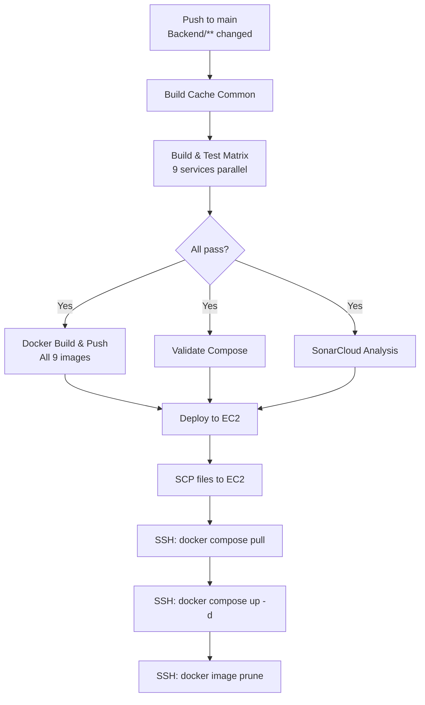
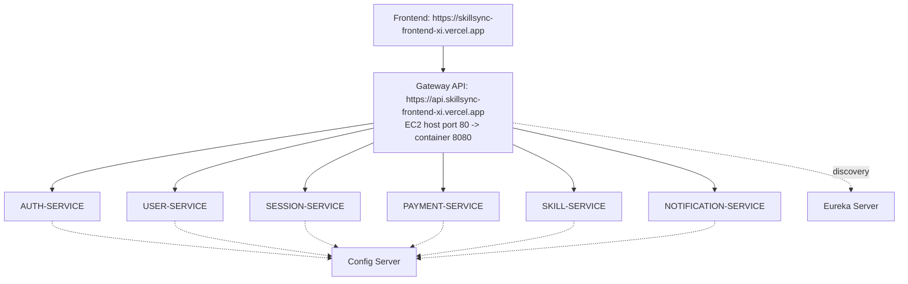

# Presentation Sync Note

Updated for final presentation on 2026-04-06. Start with docs/00_Presentation_Playbook.md for the guided narrative, then use this document for deep details.

---

# 06 Deployment DevOps and Infrastructure


---

## Content from: doc5_deployment_devops.md

# 📄 DOCUMENT 5: DEPLOYMENT + DEVOPS

> [!IMPORTANT]
> **Architecture Update (March 2026):** The following services have been merged and are removed from deployment topologies:
> - **Mentor Service + Group Service → User Service** (port 8082)
> - **Review Service → Session Service** (port 8085)
>
> **Payment Extraction (March 2026):** Payment has been extracted from User Service into a dedicated **Payment Service** (port 8086) with its own database (`skillsync_payment`).
>
> **CQRS + Redis Caching (March 2026):** All business services now require a **Redis 7.2** instance for distributed caching. The `docker-compose.yml` includes Redis as a service dependency with AOF persistence. See `doc6_cqrs_redis_architecture.md` for details.
>
> **EC2 Incident Fix (April 2026):** Gateway and NGINX health/routing stabilization is documented in `doc9_ec2_gateway_nginx_incident_fix.md` with exact diagnosis and validation commands.
>
> **Production API/CORS/OAuth Fix (April 2026):** End-to-end domain routing, Swagger, gateway compatibility routes, and CORS remediation is documented in `production_debugging_cors_fix_guide.md`.
>
> **Architecture Simplification (April 2026):** NGINX has been removed from the active runtime topology. API Gateway is now the single public ingress (`80:8080`). See `architecture_simplification_removal_of_nginx_and_direct_gateway_routing.md`.
>
> The original deployment diagrams below reflect the initial 11-service architecture. Real deployments use the current 9-service topology.

Runtime naming convention for container DNS:
- Prefer explicit `skillsync-*` hostnames for cross-container calls.
- Keep Compose network aliases for both logical service names and `skillsync-*` names.
- Use `skillsync-gateway:8080` for internal service-to-gateway calls when needed.
- Public ingress is direct to API Gateway via host mapping `80:8080`.

## SkillSync — Infrastructure, Deployment & Operations

---

## 5.1 Production Architecture

```
                            ┌──────────────────────────┐
                            │      DNS / CDN           │
                            │   (CloudFlare / AWS CF)  │
                            └────────────┬─────────────┘
                                         │
                                         │ HTTPS (443)
                                         ▼
                            ┌──────────────────────────┐
                            │       Nginx              │
                            │   Reverse Proxy          │
                            │   (SSL Termination)      │
                            │                          │
                            │  /           → React SPA │
                            │  /api/*      → Gateway   │
                            │  /ws/*       → WebSocket │
                            └──────┬─────────┬─────────┘
                                   │         │
                      ┌────────────┘         └────────────┐
                      │                                    │
                      ▼                                    ▼
         ┌──────────────────────┐            ┌──────────────────────┐
         │    React Frontend    │            │  Spring Cloud Gateway │
         │    (Static Files)    │            │       :8080           │
         │    Served by Nginx   │            │  ┌────────────────┐  │
         └──────────────────────┘            │  │ JWT Filter     │  │
                                             │  │ Rate Limiter   │  │
                                             │  │ Circuit Breaker│  │
                                             │  │ Load Balancer  │  │
                                             │  └────────────────┘  │
                                             └──────────┬───────────┘
                                                        │
                              ┌──────────────────────────┼──────────────────────────┐
                              │                          │                          │
                    ┌─────────┴─────────┐    ┌───────────┴─────────┐    ┌──────────┴──────────┐
                    │                   │    │                     │    │                     │
                    │  Auth Service     │    │  User Service       │    │  Mentor Service     │
                    │  :8081 (×2)       │    │  :8082 (×2)         │    │  :8083 (×2)         │
                    │                   │    │                     │    │                     │
                    └─────────┬─────────┘    └───────────┬─────────┘    └──────────┬──────────┘
                              │                          │                          │
                    ┌─────────┴─────────┐    ┌───────────┴─────────┐    ┌──────────┴──────────┐
                    │                   │    │                     │    │                     │
                    │  Skill Service    │    │  Session Service    │    │  Group Service      │
                    │  :8084 (×1)       │    │  :8085 (×2)         │    │  :8086 (×1)         │
                    │                   │    │                     │    │                     │
                    └─────────┬─────────┘    └───────────┬─────────┘    └──────────┬──────────┘
                              │                          │                          │
                    ┌─────────┴─────────┐    ┌───────────┴─────────┐               │
                    │                   │    │                     │               │
                    │  Review Service   │    │ Notification Service│               │
                    │  :8087 (×1)       │    │  :8088 (×2)         │               │
                    │                   │    │                     │               │
                    └───────────────────┘    └─────────────────────┘               │
                                                                                   │
                          ┌──────────────────────────────────────────────────────────┘
                          │
          ┌───────────────┼───────────────┐
          │               │               │
          ▼               ▼               ▼
    ┌─────────────┐ ┌─────────────┐ ┌─────────────┐ ┌─────────────┐
   │ PostgreSQL  │ │  RabbitMQ   │ │   Eureka    │ │   Redis     │
   │ Cluster     │ │  Cluster    │ │   Server    │ │   7.2       │
   │ (Primary +  │ │ (Mirrored)  │ │   :8761     │ │   :6379     │
   │  Replica)   │ │             │ │             │ │ (AOF+LRU)   │
   └─────────────┘ └─────────────┘ └─────────────┘ └─────────────┘
```

**Scaling annotations** (×N) show the recommended minimum replica count for production.

---

## 5.2 Docker Setup

### 5.2.1 Dockerfile — Microservice Strategy

SkillSync uses standardized multi-stage Dockerfiles. Key requirements include:
- **Build Context:** Services depending on `skillsync-cache-common` use `./Backend` as the context to copy shared resources.
- **Image Strategy:** Unified repository (`anshul94122/skillsync`) using service-specific tags with versioning (latest/SHA).

```dockerfile
# Example from auth-service/Dockerfile
FROM maven:3.9-eclipse-temurin-17-alpine AS build
WORKDIR /app
COPY skillsync-cache-common ./skillsync-cache-common
RUN mvn -f skillsync-cache-common/pom.xml clean install -DskipTests
COPY auth-service/pom.xml ./auth-service/
COPY auth-service/src ./auth-service/src
RUN mvn -f auth-service/pom.xml package -DskipTests
...
```

### 5.2.2 Dockerfile — React Frontend (Multi-stage)

```dockerfile
# Dockerfile.frontend
# Stage 1: Build
FROM node:20-alpine AS builder

WORKDIR /app

# Copy package files first (layer caching)
COPY package.json package-lock.json ./
RUN npm ci --prefer-offline

# Copy source and build
COPY . .

ARG VITE_API_BASE_URL
ARG VITE_WS_URL
ENV VITE_API_BASE_URL=${VITE_API_BASE_URL}
ENV VITE_WS_URL=${VITE_WS_URL}

RUN npm run build

# Stage 2: Serve with Nginx
FROM nginx:1.25-alpine

# Remove default Nginx config
RUN rm /etc/nginx/conf.d/default.conf

# Copy custom Nginx config
COPY nginx/nginx.conf /etc/nginx/conf.d/

# Copy built React app
COPY --from=builder /app/dist /usr/share/nginx/html

# Security headers script
RUN chown -R nginx:nginx /usr/share/nginx/html

EXPOSE 80

HEALTHCHECK --interval=30s --timeout=5s --retries=3 \
    CMD wget -qO- http://localhost:80/health || exit 1

CMD ["nginx", "-g", "daemon off;"]
```

### 5.2.3 Nginx Configuration

```nginx
# nginx/nginx.conf
server {
    listen 80;
    server_name localhost;

    # Security headers
    add_header X-Frame-Options "SAMEORIGIN" always;
    add_header X-Content-Type-Options "nosniff" always;
    add_header X-XSS-Protection "1; mode=block" always;
    add_header Referrer-Policy "strict-origin-when-cross-origin" always;
    add_header Content-Security-Policy "default-src 'self'; script-src 'self'; style-src 'self' 'unsafe-inline' https://fonts.googleapis.com; font-src 'self' https://fonts.gstatic.com; img-src 'self' data: https:; connect-src 'self' ws: wss: http://api-gateway:8080;" always;

    # Gzip compression
    gzip on;
    gzip_vary on;
    gzip_min_length 1024;
    gzip_types text/plain text/css application/json application/javascript text/xml application/xml text/javascript image/svg+xml;

    # Serve React SPA
    location / {
        root /usr/share/nginx/html;
        index index.html;
        try_files $uri $uri/ /index.html;  # SPA fallback routing

        # Cache static assets aggressively
        location ~* \.(js|css|png|jpg|jpeg|gif|ico|svg|woff|woff2)$ {
            expires 1y;
            add_header Cache-Control "public, immutable";
        }
    }

    # Proxy API requests to Spring Cloud Gateway
    location /api/ {
        proxy_pass http://api-gateway:8080;
        proxy_http_version 1.1;
        proxy_set_header Host $host;
        proxy_set_header X-Real-IP $remote_addr;
        proxy_set_header X-Forwarded-For $proxy_add_x_forwarded_for;
        proxy_set_header X-Forwarded-Proto $scheme;

        # Timeouts
        proxy_connect_timeout 10s;
        proxy_send_timeout 30s;
        proxy_read_timeout 30s;

        # Error handling
        proxy_intercept_errors on;
        error_page 502 503 504 /50x.html;
    }

    # WebSocket proxy
    location /ws/ {
        proxy_pass http://notification-service:8088;
        proxy_http_version 1.1;
        proxy_set_header Upgrade $http_upgrade;
        proxy_set_header Connection "upgrade";
        proxy_set_header Host $host;
        proxy_set_header X-Real-IP $remote_addr;
        proxy_read_timeout 86400s; # 24h for WebSocket connections
    }

    # Health check endpoint
    location /health {
        access_log off;
        return 200 "healthy";
        add_header Content-Type text/plain;
    }

    # Custom error pages
    location = /50x.html {
        root /usr/share/nginx/html;
        internal;
    }
}
```

### 5.2.4 Docker Compose — Full Stack

```yaml
# docker-compose.yml
version: '3.9'

services:
  # ============================================
  # INFRASTRUCTURE
  # ============================================

  postgres:
    image: postgres:16-alpine
    container_name: skillsync-postgres
    environment:
      POSTGRES_USER: skillsync
      POSTGRES_PASSWORD: ${DB_PASSWORD:-skillsync_dev}
      POSTGRES_MULTIPLE_DATABASES: >
        skillsync_auth,
        skillsync_user,
        skillsync_payment,
        skillsync_skill,
        skillsync_session,
        skillsync_notification
    volumes:
      - postgres_data:/var/lib/postgresql/data
      - ./infrastructure/postgres/init-multiple-dbs.sh:/docker-entrypoint-initdb.d/init-multiple-dbs.sh
    ports:
      - "5432:5432"
    healthcheck:
      test: ["CMD-SHELL", "pg_isready -U skillsync"]
      interval: 10s
      timeout: 5s
      retries: 5
    networks:
      - skillsync-network

  rabbitmq:
    image: rabbitmq:3.12-management-alpine
    container_name: skillsync-rabbitmq
    environment:
      RABBITMQ_DEFAULT_USER: ${RABBITMQ_USER:-skillsync}
      RABBITMQ_DEFAULT_PASS: ${RABBITMQ_PASS:-skillsync_dev}
    volumes:
      - rabbitmq_data:/var/lib/rabbitmq
    ports:
      - "5672:5672"    # AMQP
      - "15672:15672"  # Management UI
    healthcheck:
      test: ["CMD", "rabbitmq-diagnostics", "check_running"]
      interval: 30s
      timeout: 10s
      retries: 5
    networks:
      - skillsync-network

  # ============================================
  # SERVICE DISCOVERY
  # ============================================

  eureka-server:
    build:
      context: .
      dockerfile: Dockerfile.service
      args:
        SERVICE_NAME: eureka-server
    container_name: skillsync-eureka
    environment:
      SERVER_PORT: 8761
      SPRING_PROFILES_ACTIVE: docker
    ports:
      - "8761:8761"
    healthcheck:
      test: ["CMD", "wget", "-qO-", "http://localhost:8761/actuator/health"]
      interval: 30s
      timeout: 5s
      start_period: 60s
      retries: 3
    networks:
      - skillsync-network

  # ============================================
  # API GATEWAY
  # ============================================

  api-gateway:
    build:
      context: .
      dockerfile: Dockerfile.service
      args:
        SERVICE_NAME: api-gateway
    container_name: skillsync-gateway
    environment:
      SERVER_PORT: 8080
      SPRING_PROFILES_ACTIVE: docker
      EUREKA_CLIENT_SERVICEURL_DEFAULTZONE: http://eureka-server:8761/eureka
      JWT_SECRET: ${JWT_SECRET}
    ports:
      - "8080:8080"
    depends_on:
      eureka-server:
        condition: service_healthy
    networks:
      - skillsync-network

  # ============================================
  # MICROSERVICES
  # ============================================

  auth-service:
    build:
      context: .
      dockerfile: Dockerfile.service
      args:
        SERVICE_NAME: auth-service
    container_name: skillsync-auth
    environment:
      SERVER_PORT: 8081
      SPRING_PROFILES_ACTIVE: docker
      SPRING_DATASOURCE_URL: jdbc:postgresql://postgres:5432/skillsync_auth
      SPRING_DATASOURCE_USERNAME: skillsync
      SPRING_DATASOURCE_PASSWORD: ${DB_PASSWORD:-skillsync_dev}
      EUREKA_CLIENT_SERVICEURL_DEFAULTZONE: http://eureka-server:8761/eureka
      JWT_SECRET: ${JWT_SECRET}
      JWT_ACCESS_EXPIRATION: 900000
      JWT_REFRESH_EXPIRATION: 604800000
    depends_on:
      postgres:
        condition: service_healthy
      eureka-server:
        condition: service_healthy
    networks:
      - skillsync-network

  user-service:
    build:
      context: .
      dockerfile: Dockerfile.service
      args:
        SERVICE_NAME: user-service
    container_name: skillsync-user
    environment:
      SERVER_PORT: 8082
      SPRING_PROFILES_ACTIVE: docker
      SPRING_DATASOURCE_URL: jdbc:postgresql://postgres:5432/skillsync_user
      SPRING_DATASOURCE_USERNAME: skillsync
      SPRING_DATASOURCE_PASSWORD: ${DB_PASSWORD:-skillsync_dev}
      SPRING_RABBITMQ_HOST: rabbitmq
      SPRING_RABBITMQ_PORT: 5672
      SPRING_RABBITMQ_USERNAME: ${RABBITMQ_USER:-skillsync}
      SPRING_RABBITMQ_PASSWORD: ${RABBITMQ_PASS:-skillsync_dev}
      EUREKA_CLIENT_SERVICEURL_DEFAULTZONE: http://eureka-server:8761/eureka
    depends_on:
      postgres:
        condition: service_healthy
      rabbitmq:
        condition: service_healthy
      eureka-server:
        condition: service_healthy
    networks:
      - skillsync-network

  payment-service:
    build:
      context: .
      dockerfile: Dockerfile.service
      args:
        SERVICE_NAME: payment-service
    container_name: skillsync-payment
    environment:
      SERVER_PORT: 8086
      SPRING_PROFILES_ACTIVE: docker
      SPRING_DATASOURCE_URL: jdbc:postgresql://postgres:5432/skillsync_payment
      SPRING_DATASOURCE_USERNAME: skillsync
      SPRING_DATASOURCE_PASSWORD: ${DB_PASSWORD:-skillsync_dev}
      SPRING_RABBITMQ_HOST: rabbitmq
      SPRING_RABBITMQ_PORT: 5672
      SPRING_RABBITMQ_USERNAME: ${RABBITMQ_USER:-skillsync}
      SPRING_RABBITMQ_PASSWORD: ${RABBITMQ_PASS:-skillsync_dev}
      EUREKA_CLIENT_SERVICEURL_DEFAULTZONE: http://eureka-server:8761/eureka
      RAZORPAY_API_KEY: ${RAZORPAY_API_KEY}
      RAZORPAY_API_SECRET: ${RAZORPAY_API_SECRET}
    depends_on:
      postgres:
        condition: service_healthy
      rabbitmq:
        condition: service_healthy
      eureka-server:
        condition: service_healthy
    networks:
      - skillsync-network

  skill-service:
    build:
      context: .
      dockerfile: Dockerfile.service
      args:
        SERVICE_NAME: skill-service
    container_name: skillsync-skill
    environment:
      SERVER_PORT: 8084
      SPRING_PROFILES_ACTIVE: docker
      SPRING_DATASOURCE_URL: jdbc:postgresql://postgres:5432/skillsync_skill
      SPRING_DATASOURCE_USERNAME: skillsync
      SPRING_DATASOURCE_PASSWORD: ${DB_PASSWORD:-skillsync_dev}
      EUREKA_CLIENT_SERVICEURL_DEFAULTZONE: http://eureka-server:8761/eureka
    depends_on:
      postgres:
        condition: service_healthy
      eureka-server:
        condition: service_healthy
    networks:
      - skillsync-network

  session-service:
    build:
      context: .
      dockerfile: Dockerfile.service
      args:
        SERVICE_NAME: session-service
    container_name: skillsync-session
    environment:
      SERVER_PORT: 8085
      SPRING_PROFILES_ACTIVE: docker
      SPRING_DATASOURCE_URL: jdbc:postgresql://postgres:5432/skillsync_session
      SPRING_DATASOURCE_USERNAME: skillsync
      SPRING_DATASOURCE_PASSWORD: ${DB_PASSWORD:-skillsync_dev}
      SPRING_RABBITMQ_HOST: rabbitmq
      SPRING_RABBITMQ_PORT: 5672
      SPRING_RABBITMQ_USERNAME: ${RABBITMQ_USER:-skillsync}
      SPRING_RABBITMQ_PASSWORD: ${RABBITMQ_PASS:-skillsync_dev}
      EUREKA_CLIENT_SERVICEURL_DEFAULTZONE: http://eureka-server:8761/eureka
    depends_on:
      postgres:
        condition: service_healthy
      rabbitmq:
        condition: service_healthy
      eureka-server:
        condition: service_healthy
    networks:
      - skillsync-network

  notification-service:
    build:
      context: .
      dockerfile: Dockerfile.service
      args:
        SERVICE_NAME: notification-service
    container_name: skillsync-notification
    environment:
      SERVER_PORT: 8088
      SPRING_PROFILES_ACTIVE: docker
      SPRING_DATASOURCE_URL: jdbc:postgresql://postgres:5432/skillsync_notification
      SPRING_DATASOURCE_USERNAME: skillsync
      SPRING_DATASOURCE_PASSWORD: ${DB_PASSWORD:-skillsync_dev}
      SPRING_RABBITMQ_HOST: rabbitmq
      SPRING_RABBITMQ_PORT: 5672
      SPRING_RABBITMQ_USERNAME: ${RABBITMQ_USER:-skillsync}
      SPRING_RABBITMQ_PASSWORD: ${RABBITMQ_PASS:-skillsync_dev}
      EUREKA_CLIENT_SERVICEURL_DEFAULTZONE: http://eureka-server:8761/eureka
    depends_on:
      postgres:
        condition: service_healthy
      rabbitmq:
        condition: service_healthy
      eureka-server:
        condition: service_healthy
    networks:
      - skillsync-network

  # ============================================
  # FRONTEND
  # ============================================

  frontend:
    build:
      context: ./frontend
      dockerfile: Dockerfile.frontend
      args:
        VITE_API_BASE_URL: http://localhost:8080
        VITE_WS_URL: http://localhost:8088/ws
    container_name: skillsync-frontend
    ports:
      - "3000:80"
    depends_on:
      - api-gateway
    networks:
      - skillsync-network

# ============================================
# VOLUMES & NETWORKS
# ============================================

volumes:
  postgres_data:
    driver: local
  rabbitmq_data:
    driver: local

networks:
  skillsync-network:
    driver: bridge
```

### 5.2.5 PostgreSQL Multi-DB Init Script

```bash
#!/bin/bash
# infrastructure/postgres/init-multiple-dbs.sh
set -e
set -u

function create_user_and_database() {
    local database=$1
    echo "Creating database '$database'"
    psql -v ON_ERROR_STOP=1 --username "$POSTGRES_USER" <<-EOSQL
        CREATE DATABASE $database;
        GRANT ALL PRIVILEGES ON DATABASE $database TO $POSTGRES_USER;
EOSQL
}

if [ -n "$POSTGRES_MULTIPLE_DATABASES" ]; then
    echo "Multiple database creation requested: $POSTGRES_MULTIPLE_DATABASES"
    for db in $(echo $POSTGRES_MULTIPLE_DATABASES | tr ',' ' '); do
        db=$(echo $db | xargs)  # trim whitespace
        create_user_and_database $db
    done
    echo "Multiple databases created"
fi
```

---

## 5.3 CI/CD Pipeline (GitHub Actions)

### 5.3.1 Pipeline Overview

The SkillSync pipeline (`.github/workflows/ci-cd.yml`) automates the full build → test → containerize → deploy lifecycle.

```
┌──────────────┐    ┌──────────────────┐    ┌──────────────────┐    ┌──────────────────┐    ┌────────────────┐    ┌──────────────┐
│  Stage 1     │    │  Stage 2         │    │  Stage 3         │    │  Stage 4         │    │  Stage 5       │    │  Stage 6     │
│  Build       │───▶│  Build & Test    │───▶│  Docker Build    │───▶│  Compose         │───▶│  Code Quality  │───▶│  Deploy      │
│  Cache       │    │  All 9 Services  │    │  & Push to       │    │  Validation      │    │  SonarCloud    │    │  to EC2      │
│  Common      │    │  (Matrix)        │    │  Docker Hub      │    │                  │    │  (Conditional) │    │  via SSH     │
└──────────────┘    └──────────────────┘    └──────────────────┘    └──────────────────┘    └────────────────┘    └──────────────┘
```

**Key Features:**
- **Path-Filtered Triggers:** Only runs when `Backend/**` or `.github/workflows/**` files change — ignores Frontend, docs, and root-level edits.
- **Matrix Parallelism:** Builds and tests all 9 services concurrently using GitHub Actions matrix strategy.
- **Docker Hub Push:** Uses a bash loop to build all images in a single job with dual tagging.
- **EC2 Auto-Deploy:** Copies compose files via SCP, then pulls/restarts via SSH.
- **SonarCloud Integration:** Conditional code quality analysis (safe when token is not configured).
- **Secrets Safety:** All `secrets.*` references are wrapped in `${{ }}` expressions to avoid GitHub Actions parse errors.

### 5.3.2 Trigger Configuration (Path-Filtered)

> [!IMPORTANT]
> **Monorepo Path Filtering (April 2026):** The CI/CD pipeline now uses path-based triggers to avoid unnecessary runs when only `Frontend/`, `docs/`, or root-level files change. Only changes inside `Backend/**` or `.github/workflows/**` will trigger the pipeline.

```yaml
on:
  push:
    branches: [main]
    paths:
      - 'Backend/**'             # Any backend service change
      - '.github/workflows/**'   # Workflow definition changes
  pull_request:
    branches: [main]
    paths:
      - 'Backend/**'
      - '.github/workflows/**'
  workflow_dispatch:              # Manual trigger via GitHub UI
```

**Trigger Behavior:**

| Change Location | CI/CD Triggered? | Reason |
|---|---|---|
| `Backend/**` | ✅ Yes | Backend service code — must build, test, deploy |
| `.github/workflows/**` | ✅ Yes | Workflow changes must be validated |
| `Frontend/**` | ❌ No | Frontend is deployed on Vercel separately |
| `docs/**`, `README.md` | ❌ No | Documentation-only changes, no build needed |
| Root-level files (`.gitignore`, etc.) | ❌ No | No impact on backend services |
| Manual (`workflow_dispatch`) | ✅ Yes | Always available via GitHub UI |

### 5.3.3 Docker Tagging Strategy

All images are pushed to the unified Docker Hub repository `anshul94122/skillsync` with service-specific tag prefixes:

| Service | Docker Tag (latest) | Docker Tag (SHA) |
|---|---|---|
| eureka-server | `anshul94122/skillsync:eureka` | `anshul94122/skillsync:eureka-<sha>` |
| config-server | `anshul94122/skillsync:config` | `anshul94122/skillsync:config-<sha>` |
| api-gateway | `anshul94122/skillsync:gateway` | `anshul94122/skillsync:gateway-<sha>` |
| auth-service | `anshul94122/skillsync:auth` | `anshul94122/skillsync:auth-<sha>` |
| user-service | `anshul94122/skillsync:user` | `anshul94122/skillsync:user-<sha>` |
| skill-service | `anshul94122/skillsync:skill` | `anshul94122/skillsync:skill-<sha>` |
| session-service | `anshul94122/skillsync:session` | `anshul94122/skillsync:session-<sha>` |
| payment-service | `anshul94122/skillsync:payment` | `anshul94122/skillsync:payment-<sha>` |
| notification-service | `anshul94122/skillsync:notification` | `anshul94122/skillsync:notification-<sha>` |

**Why dual tags?**
- `:tag` (e.g., `:auth`) — always points to the latest main-branch build; used by `docker compose pull` on EC2.
- `:tag-<sha>` — immutable; enables rollback to any specific commit.

> [!CAUTION]
> **CI/CD ↔ docker-compose Tag Sync (Critical)**
> The `docker-compose.yml` image tags **must exactly match** what the CI/CD pipeline pushes. A previous mismatch caused production failures:
> - CI/CD pushed: `skillsync:session` ← correct
> - docker-compose used: `skillsync:session-latest` ← **wrong, image not found on EC2**
>
> **Rule:** Never append `-latest` to the service tag. The CI/CD pushes bare tags (`:auth`, `:eureka`, etc.) which already represent the latest build. If you need to pin a version, use the SHA tag (`:auth-a1b2c3d`).

### 5.3.4 Secrets Handling (Critical Fix)

> [!WARNING]
> GitHub Actions does **not** allow bare `secrets.*` references in `if:` conditionals.
> Using `if: secrets.SONAR_TOKEN != ''` causes: **"Unrecognized named-value: 'secrets'"**

**Correct pattern:**
```yaml
# 1. Map the secret to a job-level env var
env:
  SONAR_TOKEN: ${{ secrets.SONAR_TOKEN }}

# 2. Use the env var in conditionals (wrapped in ${{ }})
steps:
  - name: SonarCloud Scan
    if: ${{ env.SONAR_TOKEN != '' }}   # ✅ Safe
    run: mvn sonar:sonar ...
```

### 5.3.5 Required GitHub Secrets

| Secret | Purpose |
|---|---|
| `DOCKER_USERNAME` | Docker Hub login username |
| `DOCKER_PASSWORD` | Docker Hub login password/token |
| `EC2_HOST` | EC2 instance public IP or hostname |
| `EC2_SSH_KEY` | Private SSH key for EC2 access |
| `SONAR_TOKEN` | SonarCloud authentication (optional) |
| `VITE_GOOGLE_CLIENT_ID` | Google OAuth client ID for frontend |

### 5.3.6 EC2 Deployment Steps

The deploy job runs **only** on pushes to `main` after Docker images are pushed:

```bash
# 1. SCP: Copy latest compose/config files to EC2
scp Backend/docker-compose.yml Backend/nginx/ Backend/.env.example → ~/SkillSync/

# 2. SSH: Pull and restart
cd ~/SkillSync/Backend
git pull origin main                    # Get latest compose config
docker compose pull                     # Pull new images from Docker Hub
docker compose up -d --remove-orphans   # Restart with new images
docker image prune -f                   # Cleanup old images
```

---

## 5.4 Environment Configuration

### 5.4.1 Spring Profiles

```yaml
# application.yml (shared/base)
spring:
  application:
    name: ${SERVICE_NAME}
  jpa:
    hibernate:
      ddl-auto: validate
    open-in-view: false
    properties:
      hibernate:
        default_schema: ${DB_SCHEMA:public}
        jdbc:
          batch_size: 20
        order_inserts: true
        order_updates: true

server:
  port: ${SERVER_PORT:8080}
  shutdown: graceful

management:
  endpoints:
    web:
      exposure:
        include: health, info, metrics, prometheus
  endpoint:
    health:
      show-details: always
      probes:
        enabled: true
  health:
    db:
      enabled: true
    rabbit:
      enabled: true

eureka:
  client:
    service-url:
      defaultZone: ${EUREKA_CLIENT_SERVICEURL_DEFAULTZONE:http://localhost:8761/eureka}
  instance:
    prefer-ip-address: true
    instance-id: ${spring.application.name}:${random.uuid}
```

```yaml
# application-dev.yml
spring:
  jpa:
    hibernate:
      ddl-auto: update
    show-sql: true
  datasource:
    url: jdbc:postgresql://localhost:5432/${DB_NAME}
    username: skillsync
    password: skillsync_dev

logging:
  level:
    com.skillsync: DEBUG
    org.hibernate.SQL: DEBUG
```

```yaml
# application-docker.yml
spring:
  datasource:
    url: ${SPRING_DATASOURCE_URL}
    username: ${SPRING_DATASOURCE_USERNAME}
    password: ${SPRING_DATASOURCE_PASSWORD}
  rabbitmq:
    host: ${SPRING_RABBITMQ_HOST:rabbitmq}
    port: ${SPRING_RABBITMQ_PORT:5672}
    username: ${SPRING_RABBITMQ_USERNAME:skillsync}
    password: ${SPRING_RABBITMQ_PASSWORD:skillsync_dev}

logging:
  level:
    com.skillsync: INFO
```

```yaml
# application-prod.yml
spring:
  jpa:
    hibernate:
      ddl-auto: validate  # NEVER auto-update in prod
    show-sql: false
  datasource:
    url: ${SPRING_DATASOURCE_URL}
    username: ${SPRING_DATASOURCE_USERNAME}
    password: ${SPRING_DATASOURCE_PASSWORD}
    hikari:
      maximum-pool-size: 20
      minimum-idle: 5
      idle-timeout: 300000
      connection-timeout: 20000

logging:
  level:
    root: WARN
    com.skillsync: INFO
```

### 5.4.2 Environment Variables Reference

```bash
# .env.example (copy to .env and fill in values)

# ============ DATABASE ============
DB_PASSWORD=your_strong_password_here

# ============ RABBITMQ ============
RABBITMQ_USER=skillsync
RABBITMQ_PASS=your_strong_password_here

# ============ JWT ============
JWT_SECRET=your-256-bit-secret-key-here-must-be-at-least-32-chars
JWT_ACCESS_EXPIRATION=900000         # 15 minutes
JWT_REFRESH_EXPIRATION=604800000     # 7 days

# ============ RAZORPAY (Payments) ============
RAZORPAY_API_KEY=rzp_test_your_key_here
RAZORPAY_API_SECRET=your_razorpay_secret_here

# ============ FRONTEND ============
VITE_API_BASE_URL=http://localhost:8080
VITE_WS_URL=http://localhost:8088/ws

# ============ DEPLOYMENT ============
DEPLOY_HOST=your-server-ip
DEPLOY_USER=deploy
```

---

## 5.5 Scaling Strategy

### 5.5.1 Horizontal Scaling Matrix

| Service | Min Replicas | Max Replicas | Scale Trigger | Priority |
|---|---|---|---|---|
| API Gateway | 2 | 4 | CPU > 70% | Critical |
| Auth Service | 2 | 6 | RPS > 500 | Critical |
| User Service | 2 | 4 | CPU > 70% | High |
| Mentor Service | 2 | 4 | CPU > 70% | High |
| Skill Service | 1 | 2 | Memory > 80% | Low |
| Session Service | 2 | 6 | RPS > 300 | Critical |
| Group Service | 1 | 3 | CPU > 70% | Medium |
| Review Service | 1 | 3 | CPU > 70% | Medium |
| Notification Service | 2 | 4 | Queue depth > 1000 | High |
| Observability Stack | 1 | 1 | N/A (Stateful) | Infrastructure |

### 5.5.2 Database Scaling

```
                    ┌─────────────────┐
                    │   Primary       │
                    │   (Read/Write)  │
                    └────────┬────────┘
                             │
                    ┌────────┴────────┐
                    │  Streaming      │
                    │  Replication    │
                    ├────────┬────────┤
                    │        │        │
               ┌────┴───┐  ┌┴────────┴───┐
               │Replica │  │  Replica    │
               │(Read)  │  │  (Read)     │
               └────────┘  └─────────────┘
```

- **Read replicas** for Session Service and Mentor Service (high read load)
- **Connection pooling** via HikariCP (20 connections per service)
- **Indexes** on all foreign keys and frequently queried columns
- **Partitioning** on `sessions` table by `session_date` (future)

### 5.5.3 Caching Strategy

```
Request → API Gateway → Service → Check Redis Cache → DB (if cache miss)
                                        │
                                  Cache Hit → Return cached data
```

| Data | Cache TTL | Invalidation |
|---|---|---|
| Skill catalog | 1 hour | On admin update |
| Mentor search results | 30 seconds | On profile update |
| User profile | 5 minutes | On profile edit |
| Notification count | 10 seconds | On new notification |

---

## 5.6 Monitoring & Observability

### 5.6.1 Health Checks

```java
// Custom health indicator
@Component
public class RabbitMQHealthIndicator extends AbstractHealthIndicator {

    private final RabbitTemplate rabbitTemplate;

    @Override
    protected void doHealthCheck(Health.Builder builder) {
        try {
            rabbitTemplate.execute(channel -> {
                channel.queueDeclarePassive("session.requested.queue");
                return null;
            });
            builder.up()
                .withDetail("rabbitMQ", "Connected")
                .withDetail("queues", "Accessible");
        } catch (Exception e) {
            builder.down()
                .withDetail("rabbitMQ", "Connection failed")
                .withException(e);
        }
    }
}
```

### 5.6.2 Metrics (Prometheus + Grafana)

```yaml
# prometheus.yml
global:
  scrape_interval: 15s

scrape_configs:
  - job_name: 'skillsync-services'
    metrics_path: '/actuator/prometheus'
    eureka_sd_configs:
      - server: 'http://eureka-server:8761/eureka'
    relabel_configs:
      - source_labels: [__meta_eureka_app_name]
        target_label: service
```

### Key Dashboards

| Dashboard | Metrics |
|---|---|
| **Service Health** | Up/down status, JVM memory, GC pauses, thread count |
| **API Performance** | Request rate, p50/p95/p99 latency, error rate by endpoint |
| **Business Metrics** | Sessions created/day, new users/day, reviews/day |
| **RabbitMQ** | Queue depth, publish/consume rate, dead letter count |
| **Database** | Connection pool usage, slow queries, replication lag |

### 5.6.3 Alerting Rules

```yaml
# alert-rules.yml
groups:
  - name: skillsync-alerts
    rules:
      - alert: ServiceDown
        expr: up == 0
        for: 1m
        labels:
          severity: critical
        annotations:
          summary: "{{ $labels.service }} is down"

      - alert: HighErrorRate
        expr: rate(http_server_requests_seconds_count{status=~"5.."}[5m]) > 0.05
        for: 5m
        labels:
          severity: warning
        annotations:
          summary: "High error rate on {{ $labels.service }}"

      - alert: HighLatency
        expr: histogram_quantile(0.95, rate(http_server_requests_seconds_bucket[5m])) > 0.5
        for: 5m
        labels:
          severity: warning
        annotations:
          summary: "p95 latency > 500ms on {{ $labels.service }}"

      - alert: RabbitMQQueueBacklog
        expr: rabbitmq_queue_messages > 10000
        for: 5m
        labels:
          severity: warning
        annotations:
          summary: "Queue backlog > 10k messages"

      - alert: DatabaseConnectionPoolExhausted
        expr: hikaricp_connections_active / hikaricp_connections_max > 0.9
        for: 2m
        labels:
          severity: critical
        annotations:
          summary: "DB connection pool > 90% on {{ $labels.service }}"
```

---

> [!IMPORTANT]
> **Production Checklist** (before going live):
> - [ ] All environment variables set in production `.env`
> - [ ] JWT secret is ≥256 bits and securely stored
> - [ ] Database passwords are strong and rotated
> - [ ] Razorpay Production API Key/Secret configured
> - [ ] SSL certificates configured on Nginx
> - [ ] Rate limiting enabled on API Gateway
> - [ ] Health checks pass for all services
> - [ ] Monitoring dashboards configured
> - [ ] Alert rules configured and tested
> - [ ] Database backups scheduled (daily)
> - [ ] Log rotation configured
> - [ ] Firewall rules: only ports 80/443 exposed publicly


---

## Content from: doc11_deployment_architecture.md

# Document 11: Deployment Architecture & Flow

> Version: 1.0 | Date: 2026-04-01 | Status: Post-Audit

## 1. Infrastructure Overview

| Component | Platform | URL | Notes |
|-----------|----------|-----|-------|
| Frontend | Vercel | `https://skillsync-frontend-xi.vercel.app` | React SPA (Vite + TailwindCSS) |
| Backend API | AWS EC2 | `https://api.skillsync-frontend-xi.vercel.app` | Docker Compose, 9 services |
| DNS | Cloudflare | `3.217.114.102.nip.io` zone | Proxy mode (orange cloud) |
| SSL | Cloudflare | Edge SSL | **No origin SSL (Certbot not configured)** |
| Container Registry | Docker Hub | `anshul94122/skillsync` | Tags: eureka, config, gateway, auth, user, skill, session, payment, notification |

## 2. DNS Configuration

```
skillsync-frontend-xi.vercel.app      → Vercel (CNAME to cname.vercel-dns.com)
api.skillsync-frontend-xi.vercel.app  → EC2 Public IP (A record, Cloudflare proxied)
```

> ⚠️ Cloudflare SSL mode MUST be "Full" (not "Full Strict") unless Certbot is configured on EC2 origin.

## 3. CI/CD Pipeline



### Trigger Conditions
- `push` to `main` branch with changes in `Backend/**` or `.github/workflows/**`
- `pull_request` to `main` (build + test only, no deploy)
- `workflow_dispatch` (manual trigger)

### Deploy Stage Requirements
- Only runs on `push` to `main` (not PRs)
- Depends on: `docker` (images pushed), `validate-compose`, `code-quality`

## 4. Docker Compose Architecture

### Service Startup Order

```
postgres, rabbitmq, redis → eureka-server → config-server → microservices → api-gateway
```

### Container Resource Limits

| Service | Memory Limit | Exposed Ports |
|---------|-------------|---------------|
| PostgreSQL | 512M | None (internal) |
| RabbitMQ | 512M | 5672, 15672 |
| Redis | 256M | 6379 |
| Eureka | 384M | 8761 |
| Config Server | 384M | None |
| API Gateway | 384M | 80, 8080 |
| Auth Service | 448M | None |
| User Service | 448M | None |
| Skill Service | 448M | None |
| Session Service | 448M | None |
| Notification Service | 448M | None |
| Payment Service | 448M | None |
| Prometheus | 384M | 9090 |
| Grafana | 256M | 3000 |
| Loki | 256M | 3100 |
| Zipkin | 384M | 9411 |

**Total estimated memory:** ~6.5 GB minimum

### JVM Settings
All Java services: `-Xms256m -Xmx512m -XX:+UseG1GC -XX:+UseContainerSupport`

## 5. Deployment Procedure (Manual)

### First-Time Setup
```bash
# On EC2 instance
cd ~/SkillSync/Backend
cp .env.example .env
# Edit .env with production secrets
nano .env

# Start all services
docker compose pull
docker compose up -d

# Verify
docker compose ps
curl http://localhost/health
```

### Rolling Update (CI/CD Automated)
```bash
cd ~/SkillSync/Backend
git pull origin main
docker compose pull          # Pull new images
docker compose up -d --remove-orphans  # Replace containers
docker image prune -f        # Clean old images
```

### Rollback
```bash
# Use a specific commit SHA tag
docker compose pull anshul94122/skillsync:gateway-<previous-sha>
docker compose up -d api-gateway
```

## 6. Health Checks

| Endpoint | Expected | Timeout | Check |
|----------|----------|---------|-------|
| `https://api.skillsync-frontend-xi.vercel.app/health` | `{"status":"UP"}` | 5s | Application health |
| `https://api.skillsync-frontend-xi.vercel.app/actuator/health` | `{"status":"UP"}` | 10s | Spring Boot health |
| `http://localhost:8761` (EC2 only) | Eureka dashboard | 10s | Service discovery |
| `http://localhost:9090` (EC2 only) | Prometheus UI | 5s | Metrics collection |

## 7. Monitoring Stack

| Tool | Purpose | URL (EC2 internal) |
|------|---------|-------------------|
| Prometheus | Metrics scraping | `http://localhost:9090` |
| Grafana | Dashboards | `http://localhost:3000` (admin/skillsync) |
| Loki | Log aggregation | `http://localhost:3100` |
| Zipkin | Distributed tracing | `http://localhost:9411` |

## 8. Known Issues

1. **No origin SSL** — EC2 relies entirely on Cloudflare proxy for HTTPS
2. **Debug ports exposed** — Monitoring UIs accessible from internet if security groups allow
3. **No auto-scaling** — Single EC2 instance, no load balancer
4. **No post-deploy health check** — CI/CD doesn't verify deployment success
5. **Backend currently returning 502** — Containers may be down (as of audit date)


---

## Content from: doc9_ec2_gateway_nginx_incident_fix.md

# Document 9: EC2 Gateway and NGINX Incident Fix Runbook

> [!WARNING]
> Legacy runbook: this document reflects the pre-simplification architecture that included NGINX. Current production topology uses direct API Gateway ingress (no NGINX). See `docs/architecture_simplification_removal_of_nginx_and_direct_gateway_routing.md`.

> For the complete production-level diagnosis and fixes that include domain routing, CORS, Swagger server URL alignment, and OAuth checks, see `docs/production_debugging_cors_fix_guide.md`.

## Incident Summary

Observed production symptoms on AWS EC2:
- Containers running, but gateway remained in health state starting.
- NGINX marked unhealthy.
- Swagger and monitoring UIs reachable, but auth data flow (register and login) not reliably working end-to-end.

## Root Causes Identified

1. Healthcheck fragility in minimal containers
- Gateway and NGINX healthchecks depended on single binaries only.
- In slim images, utility availability can differ by tag, causing false negative health states even when the process is up.
- This blocked readiness gating and made ingress behavior inconsistent.

2. DNS naming inconsistency across ingress and observability
- NGINX upstream and Prometheus targets were not consistently aligned to a single naming convention.
- Mixed service-name and container-name usage increased the risk of DNS lookup mismatch in containerized runtime.

3. Missing explicit network aliases for critical components
- While Docker Compose often resolves service names automatically, explicit aliases were missing.
- This made behavior depend on implicit DNS behavior and deployment mode details.

## Fixes Applied

### 1. NGINX upstream alignment

Updated NGINX upstream target to gateway container DNS name.

File changed:
- Backend/nginx/nginx.conf

Change:
- upstream api_gateway now points to skillsync-gateway:8080

### 2. Docker Compose healthcheck hardening

Updated gateway and NGINX healthchecks to use fallback probes instead of one utility only.

File changed:
- Backend/docker-compose.yml

Change:
- Gateway healthcheck now tries readiness endpoint via wget, then curl, then TCP probe.
- NGINX healthcheck now tries local health endpoint via wget, then curl, then TCP probe.
- Gateway start period increased to 140s to avoid early flapping during dependent startup.

### 3. Explicit network aliases for deterministic DNS

Added explicit aliases on skillsync-net for key services.

File changed:
- Backend/docker-compose.yml

Aliases added for:
- eureka-server and skillsync-eureka
- config-server and skillsync-config
- api-gateway and skillsync-gateway
- auth-service and skillsync-auth
- user-service and skillsync-user
- skill-service and skillsync-skill
- session-service and skillsync-session
- notification-service and skillsync-notification
- payment-service and skillsync-payment
- skillsync-nginx

### 4. Prometheus target alignment

Standardized scrape targets to explicit container DNS names.

File changed:
- Backend/monitoring/prometheus/prometheus.yml

Updated targets:
- skillsync-gateway:8080
- skillsync-auth:8081
- skillsync-user:8082
- skillsync-skill:8084
- skillsync-session:8085
- skillsync-notification:8088
- skillsync-payment:8086
- skillsync-eureka:8761
- skillsync-config:8888

## Mandatory Debug Commands Used

Run these on EC2 from the Backend directory.

```bash
docker compose ps
docker logs skillsync-gateway --tail 300
docker logs skillsync-nginx --tail 300
curl -sS http://localhost:8761 | head
curl -sS http://localhost:8080/actuator/health
curl -sS http://localhost/actuator/health
```

Deep network and route checks:

```bash
docker exec -it skillsync-gateway sh -lc "wget -qO- http://localhost:8080/actuator/health || true"
docker exec -it skillsync-nginx sh -lc "nginx -t"
docker exec -it skillsync-nginx sh -lc "wget -qO- http://skillsync-gateway:8080/actuator/health || true"
docker exec -it skillsync-gateway sh -lc "wget -qO- http://skillsync-auth:8081/actuator/health || true"
```

Eureka registration checks:

```bash
curl -sS http://localhost:8761/eureka/apps | grep -E "AUTH-SERVICE|USER-SERVICE|SESSION-SERVICE|SKILL-SERVICE|PAYMENT-SERVICE|NOTIFICATION-SERVICE|API-GATEWAY|CONFIG-SERVER"
```

Auth flow checks via ingress:

```bash
curl -i -X POST http://localhost/api/auth/register \
  -H "Content-Type: application/json" \
  -d '{"fullName":"EC2 Test","email":"ec2test@example.com","password":"P@ssword123"}'

curl -i -X POST http://localhost/api/auth/login \
  -H "Content-Type: application/json" \
  -d '{"email":"ec2test@example.com","password":"P@ssword123"}'
```

Prometheus target checks:

```bash
curl -sS http://localhost:9090/api/v1/targets | grep -E "skillsync-(gateway|auth|user|skill|session|payment|notification|config|eureka)"
```

## Controlled Redeploy Procedure

Do not restart blindly. Redeploy with these exact steps after config changes:

```bash
docker compose config > /tmp/skillsync.compose.resolved.yml
docker compose up -d --force-recreate api-gateway nginx prometheus
docker compose ps
```

If service images are rebuilt in CI:

```bash
docker compose pull
docker compose up -d
```

## Final Validation Checklist

1. docker compose ps shows gateway and nginx as healthy.
2. Eureka dashboard shows all required services as UP.
3. Login and register requests return success via NGINX endpoint.
4. Gateway Swagger remains accessible and functional.
5. Prometheus targets are UP for gateway and business services.
6. Grafana dashboards show live metrics and no empty panels for core services.

## Architecture Notes After Fix

Ingress path:
- Client -> NGINX (80) -> skillsync-gateway (8080) -> service discovery -> business services -> Postgres

Discovery and config path:
- Services -> skillsync-eureka (8761)
- Services and gateway -> skillsync-config (8888)

Observability path:
- Prometheus -> service /actuator/prometheus endpoints
- Grafana -> Prometheus datasource
- Zipkin receives traces from services and gateway


---

## Content from: architecture_simplification_removal_of_nginx_and_direct_gateway_routing.md

# Architecture Simplification: Removal of NGINX and Direct Gateway Routing

Date: 2026-04-01

## 1. Executive Summary

SkillSync production ingress has been simplified from:

Client -> NGINX -> API Gateway -> Microservices

to:

Client (skillsync-frontend-xi.vercel.app) -> API Gateway (api.skillsync-frontend-xi.vercel.app, port 80 -> container 8080) -> Microservices

This change removes an extra hop, reduces DNS/upstream mismatch risk, and makes troubleshooting simpler while preserving service discovery, routing, CORS, Swagger, and OAuth behavior.

## 2. Root Cause of Previous Instability

The prior model had two ingress layers (Vercel path rewrites and NGINX reverse proxy) in front of the gateway. That introduced multiple failure modes:

- Domain/API path mismatch between Vercel and EC2 ingress.
- Intermittent upstream routing failures after container restarts due to extra proxy dependency.
- Operational drift between docs, compose config, and runtime path contracts.

Simplifying to direct gateway ingress removes that class of failures.

## 3. Target Architecture



## 4. Config Changes Applied

### 4.1 Docker Compose

File: `Backend/docker-compose.yml`

Changes:

- Removed `nginx` service completely.
- Exposed gateway as single ingress:
  - `80:8080` (public)
  - `8080:8080` (debug/local checks)
- Updated header comments to reflect direct gateway architecture.

### 4.2 Service Discovery and Config Defaults

Files:

- `Backend/api-gateway/src/main/resources/application.properties`
- `Backend/auth-service/src/main/resources/application.properties`
- `Backend/user-service/src/main/resources/application.properties`
- `Backend/skill-service/src/main/resources/application.properties`
- `Backend/session-service/src/main/resources/application.properties`
- `Backend/notification-service/src/main/resources/application.properties`
- `Backend/payment-service/src/main/resources/application.properties`
- `Backend/config-server/src/main/resources/application.properties`

Changes:

- `spring.config.import` defaults to `http://${CONFIG_SERVER_HOST:skillsync-config}:8888`.
- `eureka.client.service-url.defaultZone` defaults to `http://${EUREKA_HOST:skillsync-eureka}:8761/eureka`.

Why:

- Prevents silent fallback to `localhost` inside containers.
- Reduces partial registration scenarios where some services run but are not discoverable.

### 4.3 Gateway CORS

Files:

- `Backend/api-gateway/src/main/resources/application.properties`
- `Backend/api-gateway/src/main/java/com/skillsync/apigateway/config/CorsConfig.java`

Changes:

- Default allowed origin set to `https://skillsync-frontend-xi.vercel.app`.
- Credentials enabled.
- Allowed methods include GET, POST, PUT, DELETE, OPTIONS, PATCH.
- Allowed headers include all headers (`*`).
- Removed implicit localhost wildcard origin patterns from code defaults.

Why:

- CORS policy is now gateway-owned and production-first.

### 4.4 Swagger/OpenAPI Public Server URL

Files:

- `Backend/auth-service/src/main/java/com/skillsync/auth/config/OpenApiConfig.java`
- `Backend/user-service/src/main/java/com/skillsync/user/config/OpenApiConfig.java`
- `Backend/skill-service/src/main/java/com/skillsync/skill/config/OpenApiConfig.java`
- `Backend/session-service/src/main/java/com/skillsync/session/config/OpenApiConfig.java`
- `Backend/notification-service/src/main/java/com/skillsync/notification/config/OpenApiConfig.java`
- `Backend/payment-service/src/main/java/com/skillsync/payment/config/OpenApiConfig.java`

Changes:

- OpenAPI `servers` now use `${APP_PUBLIC_BASE_URL:https://api.skillsync-frontend-xi.vercel.app}`.

Why:

- Swagger "Try it out" always targets public production ingress, not container/private URLs.

### 4.5 Frontend API/Domain Alignment

Files:

- `Frontend/src/services/axios.ts`
- `Frontend/src/pages/LandingPage.tsx`
- `Frontend/vercel.json`

Changes:

- Axios default base URL set to `https://api.skillsync-frontend-xi.vercel.app` via `VITE_API_URL` fallback.
- Token refresh now uses the same configured API client/base URL.
- Monitoring defaults switched from raw EC2 IP to production domain.
- Removed Vercel backend API rewrites (`rewrites: []`) to avoid proxying APIs through Vercel.

## 5. Service Discovery Verification Checklist

Expected Eureka service IDs:

- AUTH-SERVICE
- USER-SERVICE
- SESSION-SERVICE
- PAYMENT-SERVICE
- SKILL-SERVICE
- NOTIFICATION-SERVICE

Verification commands (run on EC2):

```bash
cd ~/SkillSync/Backend
docker compose ps
docker logs skillsync-eureka --tail 200
docker logs skillsync-gateway --tail 200
docker logs skillsync-auth --tail 200
docker logs skillsync-user --tail 200
docker logs skillsync-session --tail 200
docker logs skillsync-payment --tail 200
docker logs skillsync-skill --tail 200
docker logs skillsync-notification --tail 200
```

## 6. Deployment Procedure

```bash
cd ~/SkillSync/Backend
docker compose down
docker compose up -d --build
```

Post-deploy checks:

```bash
# No nginx container should exist
docker ps --format '{{.Names}}' | grep nginx || true

# Gateway ingress should be reachable on host port 80
curl -i http://localhost/actuator/health
curl -i http://localhost:8080/actuator/health
```

## 7. End-to-End Validation

```bash
# Public gateway health
curl -i https://api.skillsync-frontend-xi.vercel.app/actuator/health

# Auth path compatibility
curl -i https://api.skillsync-frontend-xi.vercel.app/auth/actuator/health

# API path
curl -i -X POST https://api.skillsync-frontend-xi.vercel.app/auth/register

# Swagger config
curl -i https://api.skillsync-frontend-xi.vercel.app/v3/api-docs/swagger-config
```

Manual tests:

- Swagger UI at `https://api.skillsync-frontend-xi.vercel.app/swagger-ui.html` executes API requests successfully.
- Frontend login/register works against production domain APIs.
- Google OAuth login starts and returns to frontend callback without CORS or redirect errors.

## 8. Rollback Plan

If regression occurs:

1. Re-deploy previous known-good compose and gateway/service images.
2. Restore NGINX service and config only if direct gateway ingress cannot be stabilized quickly.
3. Keep Eureka/config host defaults (`skillsync-*`) to avoid localhost fallback regressions.

## 9. Operational Learnings

- In containerized production, localhost fallbacks are unsafe defaults for service discovery.
- One ingress layer is easier to secure, observe, and debug than chained proxies.
- Swagger server metadata must always point to a browser-reachable public URL.
- Keep documentation synchronized with active topology to prevent runbook drift.

