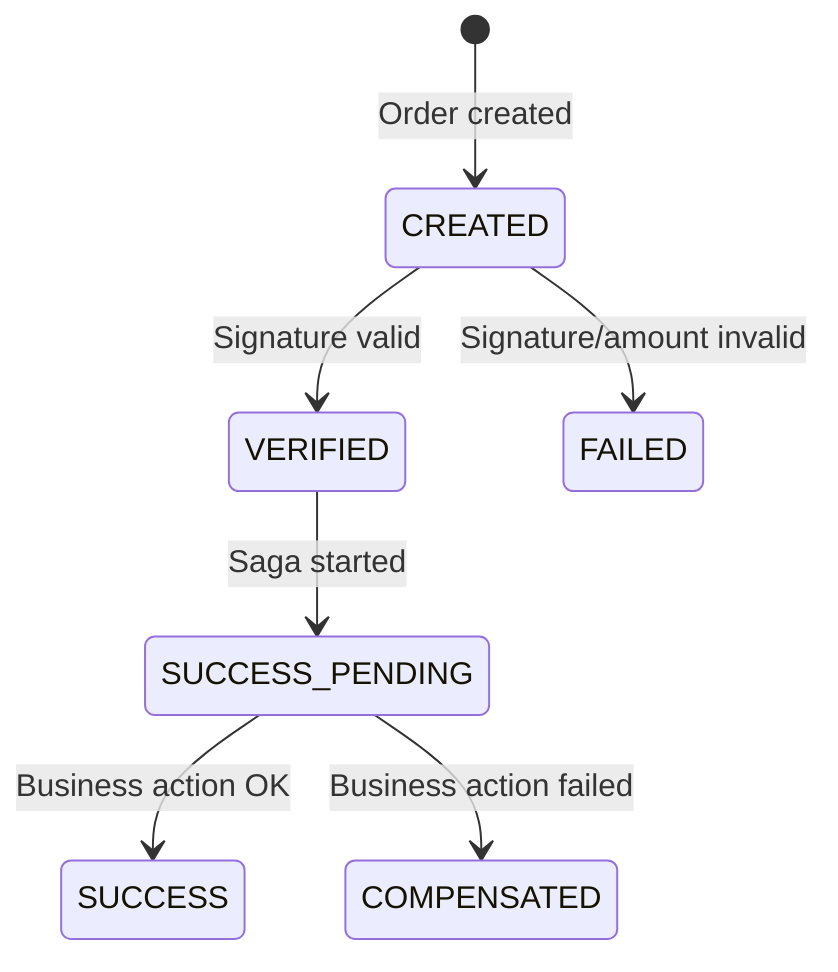
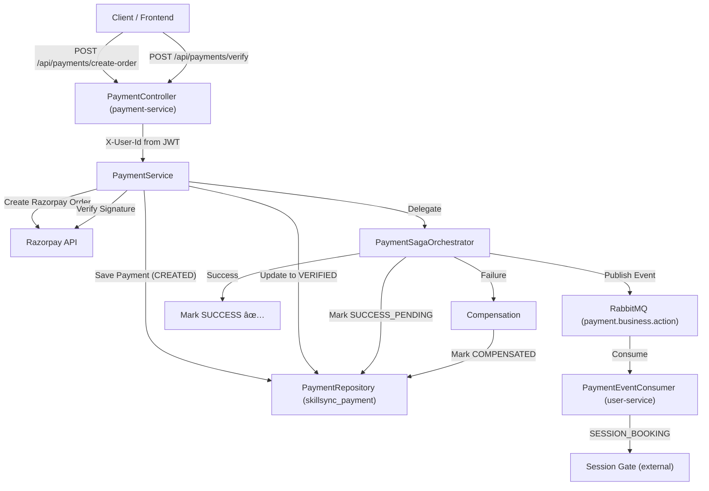

# Presentation Sync Note

Updated for final presentation on 2026-04-06. Start with docs/00_Presentation_Playbook.md for the guided narrative, then use this document for deep details.

---

# 09 Payment Implementation Guide


---

## Content from: payment_implementation.md

# 💰 Payment Service — Standalone Microservice Implementation

> [!IMPORTANT]
> **Extraction (March 2026):** Payment has been **extracted from User Service** into a dedicated **Payment Service** (port 8086, package `com.skillsync.payment`). The Saga is now **event-driven** — the orchestrator publishes `payment.business.action.v1` events to RabbitMQ via the **Outbox Pattern**, consumed by User Service's `PaymentEventConsumer` (with **idempotency check**) to execute business actions (mentor approval, etc.).
>
> **Production Hardening (March 2026):** Outbox Pattern for reliable event delivery, Dead Letter Queues (DLQ), Event Versioning (v1), Saga State Persistence, Resilience4j Circuit Breaker, Payment Rate Limiting (10 req/min), Consumer Idempotency (processed_events table), Database Indexes.

## Architecture

```
Payment Service (port 8086)                               User Service (port 8082)
┌─────────────────────────────────────────┐                ┌──────────────────────────────────┐
│ PaymentController                       │                │ PaymentEventConsumer             │
│ DlqReplayController (/internal/dlq)     │                │  ├→ idempotency (processed_events)│
│ PaymentService                          │                │  └→ MentorCommandService          │
│ PaymentSagaOrchestrator                 │                │      .approveMentor()             │
│  └→ writes to outbox_events (same TX)   │                └──────────────────────────────────┘
│ OutboxPublisher (2s scheduler)          │
│  └→ FOR UPDATE SKIP LOCKED ────────────┼──MQ(v1)──→─┘
│  └→ Publisher Confirms (ACK/NACK)       │                Dead Letter Queues
│ DlqConsumer → failed_events table       │                ┌─────────────────────┐
│ DlqReplayService → safe replay          │                │ payment.*.dlq       │
│ SagaRecoveryScheduler (5min)            │                └─────────────────────┘
│ Circuit Breaker (Resilience4j)          │
│                                         │
│ Tables: payments, outbox_events,        │
│         saga_state, failed_events        │
│ Database: skillsync_payment              │
└─────────────────────────────────────────┘
```

**Database:** `skillsync_payment` | **Schema:** `payments`

---

## Files (Payment Service)

### Core
| File | Purpose |
|------|---------|
| [PaymentServiceApplication.java](file:///f:/SkillSync/payment-service/src/main/java/com/skillsync/payment/PaymentServiceApplication.java) | `@SpringBootApplication` + `@EnableFeignClients` + `@EnableScheduling` |
| [pom.xml](file:///f:/SkillSync/payment-service/pom.xml) | Maven dependencies (Razorpay SDK, Spring AMQP, JPA, Resilience4j, Micrometer Tracing) |
| [application.properties](file:///f:/SkillSync/payment-service/src/main/resources/application.properties) | Port 8086, DB config, RabbitMQ retry/DLQ, Razorpay, Resilience4j CircuitBreaker, Eureka |
| [Dockerfile](file:///f:/SkillSync/payment-service/Dockerfile) | Multi-stage build |

### Enums
| File | Purpose |
|------|---------|
| [PaymentType.java](file:///f:/SkillSync/payment-service/src/main/java/com/skillsync/payment/enums/PaymentType.java) | `SESSION_BOOKING` |
| [PaymentStatus.java](file:///f:/SkillSync/payment-service/src/main/java/com/skillsync/payment/enums/PaymentStatus.java) | `CREATED`, `VERIFIED`, `SUCCESS_PENDING`, `SUCCESS`, `FAILED`, `COMPENSATED` |
| [ReferenceType.java](file:///f:/SkillSync/payment-service/src/main/java/com/skillsync/payment/enums/ReferenceType.java) | `SESSION_BOOKING` |

### Entity & Repository
| File | Purpose |
|------|---------|
| [Payment.java](file:///f:/SkillSync/payment-service/src/main/java/com/skillsync/payment/entity/Payment.java) | JPA entity — `payments` schema (with DB indexes) |
| [OutboxEvent.java](file:///f:/SkillSync/payment-service/src/main/java/com/skillsync/payment/entity/OutboxEvent.java) | Transactional Outbox entity (PENDING → PROCESSING → SENT / FAILED) |
| [SagaState.java](file:///f:/SkillSync/payment-service/src/main/java/com/skillsync/payment/entity/SagaState.java) | Saga state persistence for recovery on restart |
| [FailedEvent.java](file:///f:/SkillSync/payment-service/src/main/java/com/skillsync/payment/entity/FailedEvent.java) | DLQ event persistence for admin review & replay |
| [PaymentRepository.java](file:///f:/SkillSync/payment-service/src/main/java/com/skillsync/payment/repository/PaymentRepository.java) | Idempotency queries, reference-based duplicate checks, user history |
| [OutboxEventRepository.java](file:///f:/SkillSync/payment-service/src/main/java/com/skillsync/payment/repository/OutboxEventRepository.java) | FOR UPDATE SKIP LOCKED queries, stale PROCESSING recovery |
| [SagaStateRepository.java](file:///f:/SkillSync/payment-service/src/main/java/com/skillsync/payment/repository/SagaStateRepository.java) | Find by paymentId, find stale sagas for recovery |
| [FailedEventRepository.java](file:///f:/SkillSync/payment-service/src/main/java/com/skillsync/payment/repository/FailedEventRepository.java) | DLQ replay queries (find by eventId, status) |

### DTOs & Mapper
| File | Purpose |
|------|---------|
| [CreateOrderRequest.java](file:///f:/SkillSync/payment-service/src/main/java/com/skillsync/payment/dto/CreateOrderRequest.java) | Input: type + referenceId + referenceType |
| [CreateOrderResponse.java](file:///f:/SkillSync/payment-service/src/main/java/com/skillsync/payment/dto/CreateOrderResponse.java) | Output: orderId, amount, currency, Razorpay key |
| [VerifyPaymentRequest.java](file:///f:/SkillSync/payment-service/src/main/java/com/skillsync/payment/dto/VerifyPaymentRequest.java) | Input: orderId + paymentId + signature |
| [PaymentResponse.java](file:///f:/SkillSync/payment-service/src/main/java/com/skillsync/payment/dto/PaymentResponse.java) | Response: includes referenceType + compensationReason |
| [PaymentMapper.java](file:///f:/SkillSync/payment-service/src/main/java/com/skillsync/payment/mapper/PaymentMapper.java) | Pure static mapping (CQRS-compliant) |

### Service, Saga & Outbox
| File | Purpose |
|------|---------|
| [PaymentService.java](file:///f:/SkillSync/payment-service/src/main/java/com/skillsync/payment/service/PaymentService.java) | Order creation, verification, delegates to saga (uses OutboxEventService) |
| [PaymentSagaOrchestrator.java](file:///f:/SkillSync/payment-service/src/main/java/com/skillsync/payment/service/PaymentSagaOrchestrator.java) | **Event-driven Saga** with state persistence — writes events to outbox |
| [OutboxEventService.java](file:///f:/SkillSync/payment-service/src/main/java/com/skillsync/payment/service/OutboxEventService.java) | Atomically writes events to outbox table (Propagation.MANDATORY) |
| [OutboxPublisher.java](file:///f:/SkillSync/payment-service/src/main/java/com/skillsync/payment/service/OutboxPublisher.java) | Publisher Confirms + FOR UPDATE SKIP LOCKED, PROCESSING state, metrics |
| [SagaRecoveryScheduler.java](file:///f:/SkillSync/payment-service/src/main/java/com/skillsync/payment/service/SagaRecoveryScheduler.java) | Detects stuck sagas, retries or compensates automatically |
| [DlqReplayService.java](file:///f:/SkillSync/payment-service/src/main/java/com/skillsync/payment/service/DlqReplayService.java) | Safe DLQ replay — preserves original eventId for idempotency |
| [DlqConsumer.java](file:///f:/SkillSync/payment-service/src/main/java/com/skillsync/payment/consumer/DlqConsumer.java) | Persists DLQ events to failed_events table for admin review |

### Controller, Events & Config
| File | Purpose |
|------|---------|
| [PaymentController.java](file:///f:/SkillSync/payment-service/src/main/java/com/skillsync/payment/controller/PaymentController.java) | 5 REST endpoints (all secured via X-User-Id header) |
| [DlqReplayController.java](file:///f:/SkillSync/payment-service/src/main/java/com/skillsync/payment/controller/DlqReplayController.java) | Internal admin endpoints for DLQ replay/skip/list (/internal/dlq/*) |
| [PaymentCompletedEvent.java](file:///f:/SkillSync/payment-service/src/main/java/com/skillsync/payment/event/PaymentCompletedEvent.java) | Versioned RabbitMQ event DTO (@JsonIgnoreProperties for schema evolution) |
| [PaymentException.java](file:///f:/SkillSync/payment-service/src/main/java/com/skillsync/payment/exception/PaymentException.java) | Custom exception with error codes + HTTP status |
| [GlobalExceptionHandler.java](file:///f:/SkillSync/payment-service/src/main/java/com/skillsync/payment/exception/GlobalExceptionHandler.java) | Payment-specific error handling + MissingRequestHeader → 401 |
| [RazorpayConfig.java](file:///f:/SkillSync/payment-service/src/main/java/com/skillsync/payment/config/RazorpayConfig.java) | `RazorpayClient` bean from env vars |
| [RabbitMQConfig.java](file:///f:/SkillSync/payment-service/src/main/java/com/skillsync/payment/config/RabbitMQConfig.java) | Versioned exchanges, queues, DLQ bindings, schema-safe converter |
| [OpenApiConfig.java](file:///f:/SkillSync/payment-service/src/main/java/com/skillsync/payment/config/OpenApiConfig.java) | Swagger/OpenAPI config |

### Tests (27 unit tests — all pass ✅)
| File | Tests |
|------|-------|
| [PaymentMapperTest.java](file:///f:/SkillSync/payment-service/src/test/java/com/skillsync/payment/mapper/PaymentMapperTest.java) | 3 tests — pure function mapping |
| [PaymentSagaOrchestratorTest.java](file:///f:/SkillSync/payment-service/src/test/java/com/skillsync/payment/service/PaymentSagaOrchestratorTest.java) | 5 tests — saga transitions, outbox event writing, compensation, state validation |
| [PaymentServiceTest.java](file:///f:/SkillSync/payment-service/src/test/java/com/skillsync/payment/service/PaymentServiceTest.java) | 5 tests — queries, ownership validation |
| [OutboxPublisherTest.java](file:///f:/SkillSync/payment-service/src/test/java/com/skillsync/payment/service/OutboxPublisherTest.java) | 4 tests — publisher confirms ACK/NACK, crash recovery, empty batch |
| [DlqReplayServiceTest.java](file:///f:/SkillSync/payment-service/src/test/java/com/skillsync/payment/service/DlqReplayServiceTest.java) | 4 tests — replay, skip, already-replayed, not-found |
| [SagaRecoverySchedulerTest.java](file:///f:/SkillSync/payment-service/src/test/java/com/skillsync/payment/service/SagaRecoverySchedulerTest.java) | 3 tests — stale saga retry, max retries compensation, empty |
| [PaymentCompletedEventSchemaTest.java](file:///f:/SkillSync/payment-service/src/test/java/com/skillsync/payment/event/PaymentCompletedEventSchemaTest.java) | 3 tests — forward/backward compatibility, roundtrip |

---

## User Service Changes

### New/Updated Files
| File | Purpose |
|------|---------|
| [PaymentEventConsumer.java](file:///f:/SkillSync/user-service/src/main/java/com/skillsync/user/consumer/PaymentEventConsumer.java) | Consumes `payment.business.action.v1` events with **idempotency check** → triggers `MentorCommandService.approveMentor()` |
| [ProcessedEvent.java](file:///f:/SkillSync/user-service/src/main/java/com/skillsync/user/entity/ProcessedEvent.java) | Tracks processed eventIds for consumer-level idempotency |
| [ProcessedEventRepository.java](file:///f:/SkillSync/user-service/src/main/java/com/skillsync/user/repository/ProcessedEventRepository.java) | `existsByEventId()` for dedup check |

### Removed from User Service
- `PaymentController`, `PaymentService`, `PaymentSagaOrchestrator`
- `Payment` entity, `PaymentRepository`
- `PaymentType`, `PaymentStatus`, `ReferenceType` enums
- `CreateOrderRequest`, `CreateOrderResponse`, `VerifyPaymentRequest`, `PaymentResponse` DTOs
- `PaymentCompletedEvent`, `PaymentException`, `PaymentMapper`
- `RazorpayConfig`, Razorpay SDK dependency
- `PaymentException` handler from `GlobalExceptionHandler`

---

## API Endpoints (via API Gateway)

```
POST   /api/payments/create-order     — Create Razorpay order (X-User-Id header, mandatory referenceId + referenceType)
POST   /api/payments/verify           — Verify payment → Saga orchestration → notifications
GET    /api/payments/my-payments      — User's payment history (X-User-Id header)
GET    /api/payments/order/{orderId}  — Lookup by orderId (ownership validated)
GET    /api/payments/check?type=      — Inter-service payment check (X-User-Id header)
```

> [!WARNING]
> **Security:** All endpoints use `X-User-Id` header from JWT (set by API Gateway). No endpoint accepts userId via request params or body.

---

## Payment Flow (Event-Driven Saga with Outbox)

```mermaid
sequenceDiagram
    participant FE as Frontend
    participant GW as API Gateway
    participant PS as Payment Service
    participant RZ as Razorpay
    participant OB as Outbox Table
    participant SCHED as OutboxPublisher
    participant MQ as RabbitMQ
    participant US as User Service
    participant NS as Notification Service

    FE->>GW: POST /api/payments/create-order
    GW->>PS: Forward (with X-User-Id from JWT)
    PS->>RZ: Create Order (₹9 / 900 paise)
    RZ-->>PS: orderId
    PS-->>FE: {orderId, amount, keyId}

    FE->>RZ: Razorpay Checkout (frontend SDK)
    RZ-->>FE: {orderId, paymentId, signature}

    FE->>GW: POST /api/payments/verify
    GW->>PS: Forward
    PS->>PS: Verify HMAC-SHA256 signature
    PS->>PS: Mark VERIFIED → SUCCESS_PENDING (saga_state)
    PS->>OB: Write business.action.v1 event (same TX)
    PS->>PS: Mark SUCCESS
    PS->>OB: Write payment.success.v1 event (same TX)
    PS-->>FE: PaymentResponse

    Note over SCHED: Polls every 2s
    SCHED->>OB: Poll PENDING events
    SCHED->>MQ: Publish to RabbitMQ
    SCHED->>OB: Mark SENT

    MQ->>US: PaymentEventConsumer (idempotent)
    US->>US: Check processed_events → execute
    MQ->>NS: Push SUCCESS notification
```



---

## Payment Status State Machine



---

## RabbitMQ Event Topology (Versioned + DLQ)

| Exchange | Routing Key | Queue | DLQ | Consumer | Purpose |
|----------|------------|-------|-----|----------|---------|
| `payment.exchange` | `payment.business.action.v1` | `payment.business.action.v1.queue` | `payment.business.action.dlq` | User Service | Triggers business actions |
| `payment.exchange` | `payment.success.v1` | `payment.success.v1.queue` | `payment.success.dlq` | Notification Service | Success notification |
| `payment.exchange` | `payment.failed.v1` | `payment.failed.v1.queue` | `payment.failed.dlq` | Notification Service | Failure notification |
| `payment.exchange` | `payment.compensated.v1` | `payment.compensated.v1.queue` | — | Notification Service | Compensation notification |
| `payment.dlx.exchange` | (DLQ routing keys) | DLQ queues | — | DlqConsumer | Logs failed events |

---

## Edge Cases Handled

| Edge Case | Handling |
|-----------|----------|
| Duplicate reference payment | Blocked — checks for active (CREATED/VERIFIED/SUCCESS_PENDING) payments on same reference |
| Duplicate verification request | Idempotent — returns existing state for SUCCESS/COMPENSATED/SUCCESS_PENDING |
| Invalid signature | Marks FAILED, publishes payment.failed event, returns `SIGNATURE_INVALID` |
| Re-verifying failed payment | Blocked — must create a new order |
| Business action fails after payment | Compensation triggered — marks COMPENSATED, reverts business effects, publishes event |
| Amount mismatch | Marks FAILED, returns `AMOUNT_MISMATCH` |
| Order ID not found | Returns `ORDER_NOT_FOUND` (404) |
| Wrong user tries to verify | Returns `UNAUTHORIZED_ACCESS` (403) |
| Missing X-User-Id header | Returns `MISSING_AUTH_HEADER` (401) |
| PaymentType/ReferenceType mismatch | Returns `INVALID_REFERENCE` (400) |
| Duplicate event consumed | Silently skipped via `processed_events` table |
| RabbitMQ down during publish | Event stays in outbox as PENDING, retried by OutboxPublisher |
| Consumer fails after retries | Message routed to DLQ for manual review |
| Razorpay API timeout | Circuit breaker opens after 50% failure rate (5+ calls) |

---

## 🏗️ Advanced Reliability Mechanisms

### 1. Outbox Confirmation Flow (Safe Publishing)
To prevent duplicate publishing completely, the Outbox pattern must be crash-safe.
* **FOR UPDATE SKIP LOCKED:** The `OutboxPublisher` uses distributed database locks when claiming `PENDING` events. Multiple service instances can poll the outbox table simultaneously without processing the same event.
* **Publisher Confirms:** When an event is published, the status is changed to `PROCESSING`. The publisher **waits for a broker ACK** (`CorrelationData.Confirm`) within a timeout (5s) before marking the row as `SENT`. 
* **Crash Recovery:** If the publisher crashes while a row is `PROCESSING` (broker ACK pending), the `SagaRecoveryScheduler` detects the stale row via `lastAttemptAt` timestamp and automatically transitions it to `FAILED` for retry.

### 2. DLQ Replay Architecture
Failed RabbitMQ events are no longer just logged; they are dynamically persisted and replayed.
* **Persistence:** `DlqConsumer` listens to DLX queues (`*.dlq`) and persists failures into the `failed_events` DB table (stores `eventId`, full payload, original routing key, and error reason).
* **Safe Replay Strategy:** The `DlqReplayController` provides internal admin endpoints (`/internal/dlq/replay/{eventId}`).
* **Idempotency Guarantee:** When replayed, the event is re-published with its **original `eventId`**. If the consumer already processed it (but failed to ACK properly), the `processed_events` dedup check automatically drops it safely.

### 3. Saga Timeout & Recovery Design
Solves the issue of sagas getting "stuck" in intermediate states (e.g., `SUCCESS_PENDING` forever).
* **Scheduler Detection:** `SagaRecoveryScheduler` runs every 5 minutes and detects `SagaState` rows stuck in `SUCCESS_PENDING` past their timeout threshold.
* **Auto-Recovery:** It automatically re-publishes the business action event via the outbox to retry completing the saga.
* **Compensation on Max Retries:** If recovery attempts exceed `saga.recovery.max-retries` (default: 3), the payment is automatically demoted to `COMPENSATED` and a rollback event is published.

### 4. Event Versioning & Schema Evolution
To ensure future enhancements do not break existing consumers:
* **Headers:** All RabbitMQ events include `x-event-version` (currently `1`) and publish to versioned routing keys (e.g., `payment.success.v1`).
* **Additive Changes Only:** New fields to `PaymentCompletedEvent` must be strictly optional.
* **Consumer Safety:** Consumers use Jackson `@JsonIgnoreProperties(ignoreUnknown = true)` and `DeserializationFeature.FAIL_ON_UNKNOWN_PROPERTIES = false`. Unknown properties in newer event versions are safely ignored by older consumers.

---
## Razorpay Credentials

```properties
# Env vars (for Docker / production)
RAZORPAY_API_KEY=rzp_test_SUxK0KnvPwKuAT
RAZORPAY_API_SECRET=p0fqspCZHi7jVd24czBGwbf8

# Defaults already in application.properties for local dev
```

> [!WARNING]
> These are **test credentials**. Replace with production keys before deploying.


---

## Content from: payment_upgrade_summary.md

# Payment System Upgrade — Dedicated Microservice with Event-Driven Saga

> [!IMPORTANT]
> **Extraction (March 2026):** Payment has been extracted from User Service into a dedicated **Payment Service** (port 8086, `com.skillsync.payment`) with event-driven Saga orchestration via RabbitMQ. All changes compile and test successfully. ✅ Build verified: 12 payment-service tests pass, 16 user-service tests pass.

---

## Architecture Overview



---

## Payment Status State Machine


| Status | Description |
|--------|-------------|
| `CREATED` | Razorpay order created, awaiting frontend checkout |
| `VERIFIED` | Razorpay signature verified successfully |
| `SUCCESS_PENDING` | Business action (saga step) in progress |
| `SUCCESS` | Payment fully completed — business action succeeded |
| `FAILED` | Payment verification failed |
| `COMPENSATED` | Payment verified but business action failed — compensation applied |

---

## Files Changed

### New Files

| File | Purpose |
|------|---------|
| [PaymentServiceApplication.java](file:///f:/SkillSync/payment-service/src/main/java/com/skillsync/payment/PaymentServiceApplication.java) | Spring Boot entry point for payment-service |
| [PaymentSagaOrchestrator.java](file:///f:/SkillSync/payment-service/src/main/java/com/skillsync/payment/service/PaymentSagaOrchestrator.java) | Event-driven Saga orchestration — publishes `payment.business.action` to RabbitMQ |
| [PaymentEventConsumer.java](file:///f:/SkillSync/user-service/src/main/java/com/skillsync/user/consumer/PaymentEventConsumer.java) | User Service consumer — handles `payment.business.action` events → triggers mentor approval |
| [PaymentCompletedEvent.java](file:///f:/SkillSync/payment-service/src/main/java/com/skillsync/payment/event/PaymentCompletedEvent.java) | RabbitMQ event DTO for payment lifecycle notifications |

### Modified Files

````carousel
#### PaymentStatus.java
```diff
 CREATED,
+VERIFIED,
+SUCCESS_PENDING,
 SUCCESS,
 FAILED,
+COMPENSATED
```
Added 3 new states to support saga lifecycle.
<!-- slide -->
#### Payment.java (Entity)
```diff
-@Column(nullable = false, length = 10)
+@Column(nullable = false, length = 20)
 private PaymentStatus status;

+@Column(nullable = false)
 private Long referenceId;

+@Enumerated(EnumType.STRING)
+@Column(nullable = false, length = 30)
+private ReferenceType referenceType;

+@Column(length = 500)
+private String compensationReason;
```
- `referenceId` now **non-nullable** — every payment must be linked to a business entity
- Added `referenceType` enum for traceability
- Added `compensationReason` for debugging failed sagas
<!-- slide -->
#### CreateOrderRequest.java (DTO)
```diff
+@NotNull(message = "Reference ID is required")
 Long referenceId,
+
+@NotNull(message = "Reference type is required")
+ReferenceType referenceType
```
Both fields are now **mandatory** — no payment without context.
<!-- slide -->
#### PaymentResponse.java (DTO)
```diff
 Long referenceId,
+String referenceType,
+String compensationReason,
 LocalDateTime createdAt,
```
API responses now include full reference mapping and compensation info.
<!-- slide -->
#### PaymentController.java
```diff
 @GetMapping("/check")
 public ResponseEntity<Boolean> checkPaymentStatus(
-        @RequestParam Long userId,
+        @RequestHeader("X-User-Id") Long userId,
         @RequestParam PaymentType type)
```
- **Security fix**: Removed `userId` from `@RequestParam` — all endpoints now use `X-User-Id` header
- `getPaymentByOrderId` now validates ownership
<!-- slide -->
#### PaymentService.java
Key changes:
- Verification now transitions: `CREATED → VERIFIED → (saga)`
- Delegates post-payment logic to `PaymentSagaOrchestrator`
- Added `validateReferenceMapping()` — ensures PaymentType/ReferenceType consistency
- Added `preventDuplicatePayment()` — checks active payments on same reference
- `getPaymentByOrderId()` now requires userId for ownership validation
- Enhanced idempotency: returns current state for `SUCCESS`, `COMPENSATED`, `SUCCESS_PENDING`
<!-- slide -->
#### MentorService.java
```diff
+@Transactional
+public void revertMentorApproval(Long mentorId) {
+    // Reverts status APPROVED → PENDING
+    // Reverts role ROLE_MENTOR → ROLE_USER
+}
```
Compensation method for saga rollback.
<!-- slide -->
#### GlobalExceptionHandler.java
- `PaymentException` now uses **dynamic HTTP status** from the exception
- Added `MissingRequestHeaderException` handler → returns `401` for missing `X-User-Id`
- Extracted `buildResponse()` helper with `LinkedHashMap` for consistent key ordering
<!-- slide -->
#### PaymentException.java
```diff
+private final HttpStatus httpStatus;
+
+public PaymentException(String errorCode, String message, HttpStatus httpStatus)
```
Supports per-error HTTP status codes (400, 401, 403, 404, 409, 500).
````

---

## Key Design Decisions

### 1. Saga Orchestration Pattern
- **Why not @Transactional for everything?** Business actions (mentor approval, auth-service calls) involve external services and message queues. A single transaction would hold DB locks too long and can't span services.
- **REQUIRES_NEW propagation** on saga state transitions ensures each step is independently committed, making the system resilient to partial failures.

### 2. Compensation over Rollback
- Razorpay payments **cannot be reversed** once confirmed. The system records the compensation reason and reverts internal state.
- Mentor approval revert is **best-effort** for the auth-service role change — if it fails, the mentor status is still reverted.

### 3. Reference Mapping
- **Every payment must have a `referenceId` + `referenceType`** — this is enforced at the DTO level with `@NotNull`.
- Enables: traceability, duplicate prevention, and debugging.

### 4. Security
- **No endpoint accepts userId from request params or body** — always from `X-User-Id` header (set by API Gateway from JWT).
- Missing header returns `401 UNAUTHORIZED`.
- Cross-user access attempts return `403 FORBIDDEN`.

### 5. Event-Driven Decoupling
- Payment Service **does not import or depend on** User Service — all coordination is via RabbitMQ `payment.business.action` events.
- `PaymentSagaOrchestrator` publishes events; `PaymentEventConsumer` in User Service consumes them.
- Business actions are modular — easy to add new payment types.
- This replaces the old direct method call coupling (`MentorService.approveMentor()`) with message-based coordination.

### 6. Payment Notifications
- Payment events (`payment.success`, `payment.failed`, `payment.compensated`) are published to RabbitMQ `payment.exchange`.
- Notification Service consumes these events and pushes user-friendly notifications via WebSocket.
- Notification failure does NOT affect payment flow — it is best-effort.

---

## Error Code Reference

| Error Code | HTTP Status | Description |
|------------|-------------|-------------|
| `ORDER_NOT_FOUND` | 404 | Payment order doesn't exist |
| `UNAUTHORIZED_ACCESS` | 403 | Payment doesn't belong to user |
| `SIGNATURE_INVALID` | 400 | Razorpay signature verification failed |
| `AMOUNT_MISMATCH` | 400 | Server-side amount doesn't match |
| `DUPLICATE_PAYMENT` | 409 | Payment already exists for this reference |
| `INVALID_REFERENCE` | 400 | PaymentType/ReferenceType mismatch |
| `PAYMENT_ALREADY_FAILED` | 400 | Cannot re-process failed payment |
| `ORDER_CREATION_FAILED` | 400 | Razorpay API failure |
| `PAYMENT_ERROR` | 400 | Generic payment error |

---

## Database Note

> [!WARNING]
> The `payments` table now lives in a **dedicated database** (`skillsync_payment`, schema: `payments`). The old `users.payments` table in `skillsync_user` is no longer used and should be dropped after data migration.
> `spring.jpa.hibernate.ddl-auto=update` is configured, so Hibernate will auto-create the table in the new database.

