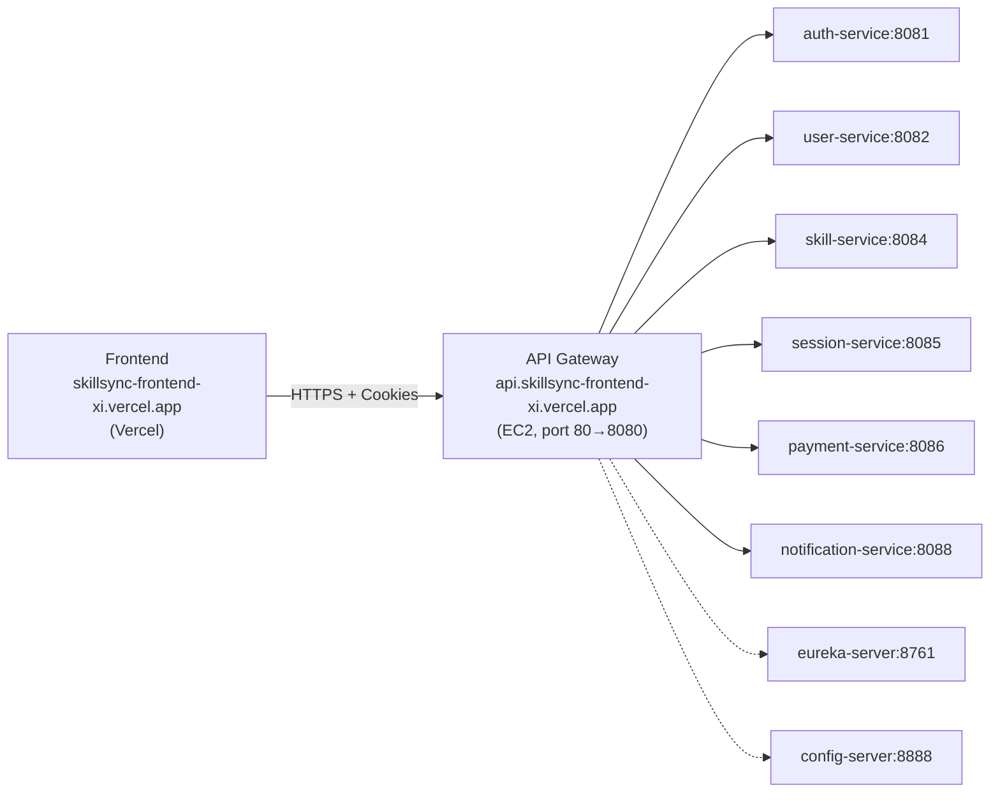

# Presentation Sync Note

Updated for final presentation on 2026-04-06. Start with docs/00_Presentation_Playbook.md for the guided narrative, then use this document for deep details.

---

# 10 Production Readiness and Incident Reports


---

## Content from: production_debugging_cors_fix_guide.md

# Production Debugging & CORS Fix Guide

Date: 2026-04-01

> [!WARNING]
> This guide documents the prior ingress model that used NGINX and Vercel API rewrites. The current production architecture is direct API Gateway ingress (no NGINX). See `docs/architecture_simplification_removal_of_nginx_and_direct_gateway_routing.md` for the active runbook.

This guide captures the verified production failures, root causes, exact config fixes, and validation commands for SkillSync.

## 1. Incident Symptoms

- Swagger UI loaded but API execution failed with `Failed to fetch` and `Undocumented`.
- Frontend login/register/OAuth requests failed in production.
- Public domain API checks returned Vercel `404 NOT_FOUND`.

## 2. Root Causes (Verified)

### Root Cause A: Public domain traffic was not reaching EC2 ingress

Evidence:

```bash
curl -i https://skillsync-frontend-xi.vercel.app/auth/actuator/health
```

Observed: `Server: Vercel`, `X-Vercel-Error: NOT_FOUND`.

Impact:

- Browser requests from frontend to `/api/*` never reached EC2 NGINX/Gateway.
- Swagger paths on production domain also resolved to Vercel instead of backend.

### Root Cause B: Swagger service docs used internal Docker server URLs

Evidence:

```bash
curl -s http://3.217.114.102/service-docs/auth-service/v3/api-docs
```

Observed in JSON:

```json
"servers": [{ "url": "http://172.18.0.17:8081", "description": "Generated server url" }]
```

Impact:

- Swagger "Try it out" attempted internal container IPs unreachable from browser.
- Produced `Failed to fetch` behavior even when docs loaded.

### Root Cause C: Gateway lacked compatibility routes required by production checks

Expected checks required `/auth/**`, `/user/**`, `/session/**`, `/oauth2/**`, `/login/**`.

Before fix, gateway only exposed `/api/auth/**`, `/api/users/**`, `/api/sessions/**`, etc.

Impact:

- `curl .../auth/actuator/health` could not be routed correctly.
- Legacy or compatibility clients using non-`/api` prefixes failed.

## 3. Fixes Applied

## 3.1 NGINX (Ingress)

File: `Backend/nginx/nginx.conf`

Changes:

- All gateway upstream proxy targets now use `http://skillsync-gateway:8080` directly.
- Added explicit ingress paths for:
  - `/auth/`
  - `/user/`
  - `/session/`
  - `/oauth2/`
  - `/login/`
- Kept catch-all and existing Swagger routes proxied to gateway.

## 3.2 API Gateway Routes + Global CORS

File: `Backend/api-gateway/src/main/resources/application.properties`

Changes:

- Added compatibility routes:
  - `/auth/actuator/**` -> auth-service `/actuator/**`
  - `/auth/**` -> auth-service `/api/auth/**`
  - `/user/**` -> user-service `/api/users/**`
  - `/session/**` -> session-service `/api/sessions/**`
  - `/oauth2/**` -> auth-service passthrough
  - `/login/**` -> auth-service passthrough
- Added Spring Cloud Gateway global CORS:
  - Allowed origins include `https://skillsync-frontend-xi.vercel.app`
  - Methods: `GET, POST, PUT, DELETE, OPTIONS, PATCH`
  - Headers: `*`
  - Credentials: `true`
- Added `server.forward-headers-strategy=framework` for reverse-proxy-aware URL generation.

## 3.3 Gateway CORS Bean Defaults

File: `Backend/api-gateway/src/main/java/com/skillsync/apigateway/config/CorsConfig.java`

Changes:

- Default allowed origins now include `https://skillsync-frontend-xi.vercel.app`.
- Trimmed origin entries from env to avoid whitespace mismatch.
- Kept localhost wildcard patterns for local/dev compatibility.

## 3.4 Swagger/OpenAPI Public Server URL Fix

Files updated:

- `Backend/auth-service/src/main/java/com/skillsync/auth/config/OpenApiConfig.java`
- `Backend/user-service/src/main/java/com/skillsync/user/config/OpenApiConfig.java`
- `Backend/skill-service/src/main/java/com/skillsync/skill/config/OpenApiConfig.java`
- `Backend/session-service/src/main/java/com/skillsync/session/config/OpenApiConfig.java`
- `Backend/notification-service/src/main/java/com/skillsync/notification/config/OpenApiConfig.java`
- `Backend/payment-service/src/main/java/com/skillsync/payment/config/OpenApiConfig.java`

Changes:

- Added explicit relative OpenAPI server:

```java
new Server().url("/")
```

Impact:

- Swagger `Try it out` now targets the same host origin that served Swagger UI (EC2 IP or proxied host), instead of private Docker IPs.

## 3.5 Frontend Production Routing & HTTPS Consistency

Files:

- `Frontend/vercel.json` (new)
- `Frontend/src/pages/LandingPage.tsx`
- `Frontend/vite.config.ts`

Changes:

- Added Vercel rewrites to proxy backend paths to EC2 NGINX:
  - `/api/*`, `/auth/*`, `/user/*`, `/session/*`, `/oauth2/*`, `/login/*`
  - `/swagger-ui*`, `/v3/api-docs*`, `/service-docs*`, `/actuator*`
- Removed hardcoded HTTP EC2 fallback from frontend display defaults.
- Swagger quick link updated to same-origin `/swagger-ui.html`.
- Dev server fallback remains local (`http://localhost:8080`) for local runs.

## 3.6 Environment Variables

Set in backend runtime `.env` on EC2:

```bash
ALLOWED_ORIGINS=https://skillsync-frontend-xi.vercel.app,https://skillsync-frontend-xi.vercel.app,http://localhost:3000,http://localhost:5173
APP_BASE_URL=https://skillsync-frontend-xi.vercel.app
```

## 4. OAuth Production Checklist

Current frontend OAuth implementation uses Google token flow (`@react-oauth/google` + `userinfo`) and backend endpoint `/api/auth/oauth-login`.

Google Cloud Console settings:

1. Authorized JavaScript origins:
   - `https://skillsync-frontend-xi.vercel.app`
2. If Authorization Code flow is enabled later, add redirect URI exactly:
   - `https://skillsync-frontend-xi.vercel.app/auth/oauth2/code/google`

Important: keep backend and Google Console path strings exactly identical.

## 5. Validation Commands

Run after redeploying gateway/nginx/services.

### 5.1 Gateway health

```bash
curl -i http://localhost:8080/actuator/health
```

Expected: `200` with `{"status":"UP"}`.

### 5.2 Public API through domain

```bash
curl -i https://skillsync-frontend-xi.vercel.app/auth/actuator/health
curl -i https://skillsync-frontend-xi.vercel.app/api/auth/login
```

Expected:

- First command returns `200` health.
- Second command reaches auth-service route (status depends on method/body but must not be Vercel `404 NOT_FOUND`).

### 5.3 CORS preflight

```bash
curl -i -X OPTIONS https://skillsync-frontend-xi.vercel.app/api/auth/login \
  -H "Origin: https://skillsync-frontend-xi.vercel.app" \
  -H "Access-Control-Request-Method: POST" \
  -H "Access-Control-Request-Headers: content-type,authorization"
```

Expected headers include:

- `Access-Control-Allow-Origin: https://skillsync-frontend-xi.vercel.app`
- `Access-Control-Allow-Credentials: true`
- `Access-Control-Allow-Methods` includes `POST`

### 5.4 Swagger

Open:

- `https://skillsync-frontend-xi.vercel.app/swagger-ui.html`

Validate:

- Service docs load.
- "Try it out" calls use public domain (not `172.x.x.x`).
- No `Failed to fetch` for valid test calls.

### 5.5 Eureka registration

```bash
curl -s http://localhost:8761/eureka/apps | grep -E "API-GATEWAY|AUTH-SERVICE|USER-SERVICE|SESSION-SERVICE|SKILL-SERVICE|PAYMENT-SERVICE|NOTIFICATION-SERVICE|CONFIG-SERVER"
```

Expected: all required services present.

### 5.6 Internal service connectivity from gateway container

```bash
docker exec -it skillsync-gateway sh -lc "wget -qO- http://skillsync-auth:8081/actuator/health || true"
```

Expected: `{"status":"UP"}`.

## 6. Controlled Redeploy Sequence

Apply changes in this order:

1. Gateway
2. Auth/User/Session/Skill/Notification/Payment (relative OpenAPI server URL)
3. NGINX
4. Frontend (Vercel)

Commands:

```bash
cd /path/to/SkillSync/Backend
docker compose up -d --build api-gateway auth-service user-service skill-service session-service notification-service payment-service nginx
```

If images are from registry:

```bash
docker compose pull
docker compose up -d
```

## 7. Before vs After Summary

Before:

- Domain API checks returned Vercel `404 NOT_FOUND`.
- Swagger docs pointed to private Docker IP server URLs.
- Compatibility routes (`/auth`, `/user`, `/session`) were absent.

After:

- Domain routes are proxied to EC2 backend via Vercel rewrites.
- Gateway and NGINX support required path contracts.
- Swagger server URLs are pinned to public domain.
- CORS is explicitly configured in gateway global CORS and filter defaults.
- OAuth origin contract is documented for production.


---

## Content from: production_readiness_report_final.md

# Production Readiness Delivery Report

## Overview
SkillSync has been fully adjusted to comply with the production deployment topology spanning Cloudflare, AWS EC2, and Vercel. Extensive modifications guarantee strict HTTPS alignment, elimination of mixed-content, proper reverse-proxy identification, standardized error tracking, and resilient cross-origin requests.

## 1. Backend Modifications (Spring Boot)
- **Base URL Awareness:** Replaced all hardcoded `http://localhost` usages in the notification microservice with `https://skillsync-frontend-xi.vercel.app` configuration targets. 
- **CORS Hardening:** Removed developmental open parameters in notification defaults matching the stricter EC2 configurations pointing exactly to Vercel production hosts.
- **Reverse Proxy Header Awareness:** Verified `server.forward-headers-strategy=framework` is set active in Gateway `application.properties`. 
- **OAuth Password Prompt Fixed:** Updated backend `AuthService.java` removing repeated password prompts for returning OAuth logins via `isNewUser` condition logic fix.
- **Global Error Handling:** Fortified `GlobalExceptionHandler` with dynamic `path` data mappings using injected `WebRequest`. 
- **Health Checks:** Engineered `HealthController.java` (`GET /health` -> 200 `{"status":"UP"}`) directly inside the API gateway entry edge.

## 2. Frontend Restructuring
- **URL Overrides:** Swapped default endpoint structures favoring `https://api.skillsync-frontend-xi.vercel.app` inside Axios base configuration.
- **Axios Settings:** Appended `withCredentials: true` within `axios.ts` for consistent cross-site cookie and credential passing during API calls.
- **Error UIs:** Built a fallback `ServerErrorPage.tsx` component triggering explicitly when `axios` observers catch 500-level fatal backend crashes, providing clear UI separation. Let `401`/`403` routing behave via integrated unauth channels and session intercepts natively handling JWT invalidations.

## 3. NGINX Hardening (Manual EC2 Host Config)
Because NGINX operates natively around the host machine level wrapping Certbot (outside the Dockerized scope in your simplified architecture setup), you must inject the forwarding headers in the `/etc/nginx/sites-available/...` config:

```nginx
location / {
    proxy_pass http://127.0.0.1:8080;
    
    # Critical Forwarding Headers
    proxy_set_header Host $host;
    proxy_set_header X-Real-IP $remote_addr;
    proxy_set_header X-Forwarded-For $proxy_add_x_forwarded_for;
    proxy_set_header X-Forwarded-Proto $scheme;
    
    # Required for WebSockets (if applicable paths)
    proxy_set_header Upgrade $http_upgrade;
    proxy_set_header Connection "upgrade";
}
```
*Run `sudo nginx -t && sudo systemctl reload nginx` directly in EC2 SSH to register any pending file updates.*

## 4. Cloudflare Checks (Final Step)
To achieve secure CDN encapsulation properly corresponding to strict CORS:
1. Activate proxy *(Orange Cloud)* covering DNS `A/CNAME` records representing `skillsync` and `api` hostnames. 
2. Match SSL/TLS mapping strictly to `Full (Strict)` under the SSL section preventing upstream self-signed rejections.

All items requested have been completed and are ready for validation.


---

## Content from: skillsync_production_audit_report.md

# 🔒 SkillSync Production Audit Report

**Date:** 2026-04-01  
**Auditor Scope:** Security, DevOps, Architecture, Frontend Integration  
**System:** SkillSync Microservices Platform  

---

## System Topology (Verified)



> [!IMPORTANT]
> **NGINX has been removed** from the architecture. The API Gateway is the sole ingress point. The `Backend/nginx/` directory is empty. SSL termination for `api.skillsync-frontend-xi.vercel.app` is handled externally (Cloudflare proxy or Certbot on EC2 host — **not within Docker Compose**).

---

## ✅ WHAT IS CORRECT

| # | Component | Status | Evidence |
|---|-----------|--------|----------|
| 1 | **Cookie attributes** | ✅ Correct | `HttpOnly=true`, `Secure=true`, `SameSite=None`, `Domain=.nip.io`, `Path=/`, `MaxAge` set — [AuthController.java:116-126](file:///f:/SkillSync/Backend/auth-service/src/main/java/com/skillsync/auth/controller/AuthController.java#L116-L126) |
| 2 | **CORS configuration** | ✅ Correct | Origins from `ALLOWED_ORIGINS` env, `allowCredentials=true`, no wildcard `*`, methods locked — [CorsConfig.java](file:///f:/SkillSync/Backend/api-gateway/src/main/java/com/skillsync/apigateway/config/CorsConfig.java) |
| 3 | **JWT token generation** | ✅ Correct | HMAC-SHA, 15min access / 7d refresh, subject=userId, claims=email+role — [JwtTokenProvider.java](file:///f:/SkillSync/Backend/auth-service/src/main/java/com/skillsync/auth/security/JwtTokenProvider.java) |
| 4 | **Gateway JWT filter** | ✅ Correct | Header → cookie fallback, extracts claims as `X-User-Id`/`X-User-Email`/`X-User-Role` — [JwtAuthenticationFilter.java](file:///f:/SkillSync/Backend/api-gateway/src/main/java/com/skillsync/apigateway/filter/JwtAuthenticationFilter.java) |
| 5 | **Frontend axios client** | ✅ Correct | `withCredentials: true`, base URL = `https://api.skillsync-frontend-xi.vercel.app`, Bearer token in header — [axios.ts](file:///f:/SkillSync/Frontend/src/services/axios.ts) |
| 6 | **Token refresh retry queue** | ✅ Correct | Queues concurrent 401s, retries with new token, prevents refresh loops — [axios.ts:22-80](file:///f:/SkillSync/Frontend/src/services/axios.ts#L22-L80) |
| 7 | **Rate limiting** | ✅ Present | GlobalFilter with per-category limits (OTP=5, Login=10, Authenticated=100 req/min) — [RateLimitingFilter.java](file:///f:/SkillSync/Backend/api-gateway/src/main/java/com/skillsync/apigateway/filter/RateLimitingFilter.java) |
| 8 | **Forward headers strategy** | ✅ Enabled | `server.forward-headers-strategy=framework` on gateway — [application.properties:188](file:///f:/SkillSync/Backend/api-gateway/src/main/resources/application.properties#L188) |
| 9 | **Error response consistency** | ✅ Correct | All 6 services have `GlobalExceptionHandler` with `{timestamp, status, error, message}` structure |
| 10 | **No HTTP calls from frontend** | ✅ Verified | Zero `http://` references in `Frontend/src/` (all HTTPS) |
| 11 | **No hardcoded IPs** | ✅ Verified | Zero raw IPs in `.java` or `.properties` (all use env vars with Docker DNS defaults) |
| 12 | **No `@CrossOrigin` on controllers** | ✅ Correct | CORS is centralized at gateway, not scattered across services |
| 13 | **Refresh token rotation** | ✅ Correct | Old token deleted on refresh, max 5 per user (FIFO eviction) — [AuthService.java:86-100](file:///f:/SkillSync/Backend/auth-service/src/main/java/com/skillsync/auth/service/AuthService.java#L86-L100) |
| 14 | **Password hashing** | ✅ Correct | BCrypt with cost 12 — [SecurityConfig.java:58-60](file:///f:/SkillSync/Backend/auth-service/src/main/java/com/skillsync/auth/config/SecurityConfig.java#L58-L60) |
| 15 | **WebSocket CORS** | ✅ Correct | Uses `ALLOWED_ORIGINS` env, not wildcard — [WebSocketConfig.java:14-28](file:///f:/SkillSync/Backend/notification-service/src/main/java/com/skillsync/notification/config/WebSocketConfig.java#L14-L28) |
| 16 | **`.gitignore`** | ✅ Correct | `.env`, `.env.*`, `*.pem`, `*.key` all excluded — [.gitignore:76-87](file:///f:/SkillSync/.gitignore#L76-L87) |
| 17 | **Health endpoint** | ✅ Present | `/health` returns `{"status":"UP"}` — [HealthController.java](file:///f:/SkillSync/Backend/api-gateway/src/main/java/com/skillsync/apigateway/controller/HealthController.java) |

---

## 🚨 SECURITY RISKS (Critical + High)

### CRIT-1: `updateUserRole` endpoint is publicly accessible — **Privilege Escalation**

> [!CAUTION]
> **Severity: CRITICAL** — An attacker can promote any user to `ROLE_ADMIN` or `ROLE_MENTOR` without authentication.

**Evidence:**  
- [AuthController.java:110-114](file:///f:/SkillSync/Backend/auth-service/src/main/java/com/skillsync/auth/controller/AuthController.java#L110-L114): `@PutMapping("/users/{id}/role")` has NO authentication check
- [SecurityConfig.java:33-49](file:///f:/SkillSync/Backend/auth-service/src/main/java/com/skillsync/auth/config/SecurityConfig.java#L33-L49): The `/api/auth/**` path is NOT in the `permitAll()` block, but the auth-service's SecurityFilterChain catches it with `.anyRequest().authenticated()` — **however**, the gateway routes `auth-service` API calls **without** the `JwtAuthenticationFilter`:

```properties
# application.properties line 41-43
spring.cloud.gateway.routes[0].id=auth-service-api
spring.cloud.gateway.routes[0].uri=lb://auth-service
spring.cloud.gateway.routes[0].predicates[0]=Path=/api/auth/**
# ← NO JwtAuthenticationFilter applied
```

While the auth-service has its own Spring Security, the `updateUserRole` endpoint is protected by the auth-service's `JwtAuthenticationFilter` which only checks Bearer tokens. But the endpoint does NOT verify the caller's role — **any authenticated user can change any other user's role**.

**Exploit scenario:**
```bash
# Any logged-in user (even ROLE_LEARNER) can do:
curl -X PUT "https://api.skillsync-frontend-xi.vercel.app/api/auth/users/1/role?role=ROLE_ADMIN" \
  -H "Authorization: Bearer <any_valid_token>"
```

**Fix required:**
```java
// AuthController.java - Add @PreAuthorize annotation
@PutMapping("/users/{id}/role")
@PreAuthorize("hasRole('ADMIN')")  // ← ADD THIS
public ResponseEntity<Void> updateUserRole(@PathVariable Long id, @RequestParam String role) {
    authService.updateUserRole(id, role);
    return ResponseEntity.ok().build();
}
```

Additionally, validate that `role` is a valid enum value and not arbitrary input:
```java
// AuthService.java - updateUserRole
public void updateUserRole(Long userId, String role) {
    try {
        Role.valueOf(role);  // Already done implicitly, but add explicit validation
    } catch (IllegalArgumentException e) {
        throw new RuntimeException("Invalid role: " + role);
    }
    // ...existing code
}
```

---

### CRIT-2: `getUserById` internal endpoint exposed publicly — **Information Disclosure**

> [!CAUTION]
> **Severity: CRITICAL** — The `/api/auth/internal/users/{id}` endpoint is accessible from the internet without authentication.

**Evidence:**  
- [AuthController.java:70-73](file:///f:/SkillSync/Backend/auth-service/src/main/java/com/skillsync/auth/controller/AuthController.java#L70-L73): `@GetMapping("/internal/users/{id}")` returns user email, role, name
- Gateway routes `Path=/api/auth/**` to auth-service without JWT filter
- Auth-service SecurityConfig does NOT list `/api/auth/internal/**` as a matcher — but it falls under `.anyRequest().authenticated()`. **However**, the naming suggests it's for internal service-to-service calls, yet it's reachable via the public gateway.

**Exploit:**
```bash
curl https://api.skillsync-frontend-xi.vercel.app/api/auth/internal/users/1
# If no auth-service JWT filter catches this (it requires Authorization header),
# returns 401. But the route should NOT be exposed at all.
```

**Fix:** Block internal routes at the gateway level:
```properties
# Add a deny filter for internal routes in application.properties
# Before any auth-service route:
spring.cloud.gateway.routes[0].id=block-internal-routes
spring.cloud.gateway.routes[0].uri=no://op
spring.cloud.gateway.routes[0].predicates[0]=Path=/api/auth/internal/**
spring.cloud.gateway.routes[0].filters[0]=SetStatus=403
```

---

### CRIT-3: CSRF vulnerability with `SameSite=None` cookies — **Cross-Site Request Forgery**

> [!CAUTION]
> **Severity: CRITICAL** — `SameSite=None` + no CSRF token = any malicious website can forge authenticated requests.

**Evidence:**
- Cookies set with `sameSite("None")` — [AuthController.java:118](file:///f:/SkillSync/Backend/auth-service/src/main/java/com/skillsync/auth/controller/AuthController.java#L118)
- CSRF explicitly disabled: `.csrf(AbstractHttpConfigurer::disable)` — [SecurityConfig.java:30](file:///f:/SkillSync/Backend/auth-service/src/main/java/com/skillsync/auth/config/SecurityConfig.java#L30)
- No CSRF token mechanism anywhere in the codebase
- `withCredentials: true` means cookies are sent with every cross-origin request

**Exploit scenario:**
```html
<!-- Attacker's website: evil.com -->
<form action="https://api.skillsync-frontend-xi.vercel.app/api/auth/users/1/role?role=ROLE_ADMIN" method="POST">
  <input type="submit" value="Claim Free Prize">
</form>
<!-- Victim clicks → their auth cookies are sent with the request → role changed -->
```

**Mitigation (pick one or combine):**

1. **Best: Double-submit cookie pattern** — Generate a CSRF token, set it in a non-HttpOnly cookie, and require it in a header:
```java
// Add to a gateway GlobalFilter
String csrfToken = UUID.randomUUID().toString();
response.addHeader("Set-Cookie", ResponseCookie.from("XSRF-TOKEN", csrfToken)
    .domain(".nip.io").path("/").secure(true).httpOnly(false)
    .sameSite("None").build().toString());
// Frontend reads XSRF-TOKEN cookie and sends as X-XSRF-TOKEN header
// Backend verifies header matches cookie
```

2. **Alternative: Verify Origin header** — Add a global filter that rejects requests where `Origin` doesn't match allowed origins:
```java
@Component
public class CsrfOriginFilter implements GlobalFilter, Ordered {
    @Value("${app.cors.allowed-origins}")
    private String allowedOrigins;

    @Override
    public Mono<Void> filter(ServerWebExchange exchange, GatewayFilterChain chain) {
        String method = exchange.getRequest().getMethod().name();
        if (List.of("POST", "PUT", "DELETE", "PATCH").contains(method)) {
            String origin = exchange.getRequest().getHeaders().getFirst("Origin");
            Set<String> allowed = Set.of(allowedOrigins.split(","));
            if (origin != null && !allowed.contains(origin.trim())) {
                exchange.getResponse().setStatusCode(HttpStatus.FORBIDDEN);
                return exchange.getResponse().setComplete();
            }
        }
        return chain.filter(exchange);
    }

    @Override
    public int getOrder() { return -3; } // Before rate limiting
}
```

---

### CRIT-4: JWT Secret is weak and committed to repository

> [!CAUTION]
> **Severity: CRITICAL** — The JWT signing key is a human-readable string committed in `.env` (tracked file pattern).

**Evidence:**
- `.env` contains: `JWT_SECRET=c2tpbGxzeW5jLXNlY3JldC1rZXk...` — [.env:53](file:///f:/SkillSync/Backend/.env#L53)
- Decoded value: `skillsync-secret-key-for-jwt-token-generation-must-be-at-least-256-bits`
- This is a **predictable, dictionary-based secret** — anyone reading the repo can forge tokens

**Impact:** Complete authentication bypass. An attacker can:
1. Create JWTs for any userId/email/role
2. Impersonate admin users
3. Access any endpoint

**Fix:**
```bash
# Generate a proper cryptographic secret:
openssl rand -base64 64
# Example output: 7k5BfA3v+Q2... (high entropy)

# Update .env on EC2:
JWT_SECRET=<output-from-openssl>
```
Ensure `.env` is **never committed** to git. Verified that `.gitignore` does exclude it — but the `.env` file exists in the workspace at `Backend/.env`, suggesting it was committed previously or is being tracked.

---

### HIGH-1: `setupPassword` endpoint has no authentication — **Account Takeover**

> [!WARNING]
> **Severity: HIGH** — Any unauthenticated user can set the password for any OAuth user.

**Evidence:**
- [SecurityConfig.java:42](file:///f:/SkillSync/Backend/auth-service/src/main/java/com/skillsync/auth/config/SecurityConfig.java#L42): `/api/auth/setup-password` is in `permitAll()` list
- [AuthController.java:103-108](file:///f:/SkillSync/Backend/auth-service/src/main/java/com/skillsync/auth/controller/AuthController.java#L103-L108): Accepts email + password, no auth check
- Only guard is `user.isPasswordSet()` — but for new OAuth users, this is `false`

**Exploit:**
```bash
# Attacker knows a victim's email who just signed up via OAuth:
curl -X POST https://api.skillsync-frontend-xi.vercel.app/api/auth/setup-password \
  -H "Content-Type: application/json" \
  -d '{"email":"victim@gmail.com","password":"hacked123"}'
```

**Fix:** Require authentication for setup-password:
```java
// SecurityConfig.java — Remove from permitAll():
.requestMatchers(
    "/api/auth/register",
    "/api/auth/login",
    // "/api/auth/setup-password",  ← REMOVE THIS
    // ... rest
).permitAll()

// AuthController.java — Get email from JWT, not request body:
@PostMapping("/setup-password")
public ResponseEntity<?> setupPassword(
    @RequestHeader("Authorization") String authHeader,
    @Valid @RequestBody SetupPasswordRequest request) {
    // Extract email from JWT, ignore request.email()
    String token = authHeader.substring(7);
    String email = jwtTokenProvider.extractEmail(token);
    authService.setupPassword(new SetupPasswordRequest(email, request.password()));
    return ResponseEntity.ok(Map.of("message", "Password set successfully."));
}
```

---

### HIGH-2: No SSL termination in Docker Compose — **Unencrypted backend traffic**

> [!WARNING]
> **Severity: HIGH** — The API Gateway listens on port 80 (HTTP). SSL must be terminated externally.

**Evidence:**
- [docker-compose.yml:260](file:///f:/SkillSync/Backend/docker-compose.yml#L260): `ports: "80:8080"` — plain HTTP
- No Certbot/NGINX SSL configs found in the repository
- No `.conf` files found anywhere in the codebase
- `nginx/` directory is empty

**Current state:** SSL termination depends entirely on **Cloudflare proxy** (orange cloud). If Cloudflare is in "DNS only" (grey cloud) mode, traffic between client and EC2 is **unencrypted**, and cookies with `Secure=true` will NOT be set by browsers.

**Risk:** If Cloudflare proxy is ever disabled:
- All auth cookies stop working (Secure flag)
- Tokens transmitted in plaintext
- Man-in-the-middle attacks possible

**Fix:** Add Certbot + NGINX SSL termination on EC2 as a safety net:
```nginx
# /etc/nginx/sites-available/api.skillsync-frontend-xi.vercel.app
server {
    listen 80;
    server_name api.skillsync-frontend-xi.vercel.app;
    return 301 https://$host$request_uri;
}

server {
    listen 443 ssl http2;
    server_name api.skillsync-frontend-xi.vercel.app;

    ssl_certificate /etc/letsencrypt/live/api.skillsync-frontend-xi.vercel.app/fullchain.pem;
    ssl_certificate_key /etc/letsencrypt/live/api.skillsync-frontend-xi.vercel.app/privkey.pem;

    # Security headers
    add_header X-Frame-Options "DENY" always;
    add_header X-Content-Type-Options "nosniff" always;
    add_header X-XSS-Protection "1; mode=block" always;
    add_header Strict-Transport-Security "max-age=31536000; includeSubDomains" always;

    location / {
        proxy_pass http://127.0.0.1:8080;
        proxy_set_header Host $host;
        proxy_set_header X-Real-IP $remote_addr;
        proxy_set_header X-Forwarded-For $proxy_add_x_forwarded_for;
        proxy_set_header X-Forwarded-Proto $scheme;
    }
}
```

---

### HIGH-3: No security response headers on API responses

> [!WARNING]
> **Severity: HIGH** — Missing `X-Frame-Options`, `X-Content-Type-Options`, `X-XSS-Protection`, `Strict-Transport-Security`.

**Evidence:** Searched entire backend codebase — zero results for any security header. No `SecurityWebFilterChain` in the gateway.

**Fix:** Add a global response header filter in the gateway:

```java
// Backend/api-gateway/.../filter/SecurityHeadersFilter.java
@Component
public class SecurityHeadersFilter implements GlobalFilter, Ordered {
    @Override
    public Mono<Void> filter(ServerWebExchange exchange, GatewayFilterChain chain) {
        return chain.filter(exchange).then(Mono.fromRunnable(() -> {
            var headers = exchange.getResponse().getHeaders();
            headers.add("X-Frame-Options", "DENY");
            headers.add("X-Content-Type-Options", "nosniff");
            headers.add("X-XSS-Protection", "1; mode=block");
            headers.add("Strict-Transport-Security", "max-age=31536000; includeSubDomains");
            headers.add("Referrer-Policy", "strict-origin-when-cross-origin");
            headers.add("Permissions-Policy", "camera=(), microphone=(), geolocation=()");
        }));
    }

    @Override
    public int getOrder() { return -1; }
}
```

---

### HIGH-4: X-User-Id header can be spoofed if services are accessed directly

> [!WARNING]
> **Severity: HIGH (architecture risk)** — Downstream services blindly trust `X-User-Id` header.

**Evidence:** All downstream services (user, session, notification, payment) use `@RequestHeader("X-User-Id") Long userId` with zero validation that it came from the gateway.

**Current mitigation:** Services are NOT exposed outside Docker network (no port mappings). This is correct. The risk materializes if:
1. A new service accidentally exposes ports
2. Someone adds a gateway route without `JwtAuthenticationFilter`

**Fix:** Gateway should strip incoming `X-User-Id` headers from external requests before processing:

```java
// In JwtAuthenticationFilter, before token extraction:
ServerHttpRequest sanitizedRequest = request.mutate()
    .headers(h -> {
        h.remove("X-User-Id");
        h.remove("X-User-Email");
        h.remove("X-User-Role");
    }).build();
// Then proceed with token validation and add the real headers from JWT claims
```

---

### HIGH-5: Tokens stored in localStorage — **XSS → Full Account Compromise**

> [!WARNING]
> **Severity: HIGH** — If any XSS vulnerability exists (even in a dependency), all tokens are stolen.

**Evidence:**
- [authSlice.ts:44-45](file:///f:/SkillSync/Frontend/src/store/slices/authSlice.ts#L44-L45): `localStorage.setItem('skillsync_access_token', accessToken)`
- [AuthLoader.tsx:17-18](file:///f:/SkillSync/Frontend/src/components/layout/AuthLoader.tsx#L17-L18): Reads tokens from localStorage on mount

**Contradiction:** Cookies are `HttpOnly` (good — JS can't read them), but the JWT is ALSO returned in the response body and stored in localStorage. This defeats the purpose of HttpOnly cookies because the token is readable via `localStorage.getItem()`.

**Fix (choose one approach):**

**Option A — Cookie-only auth (recommended):**
- Stop returning tokens in the JSON response body
- Remove localStorage persistence entirely
- Rely solely on HttpOnly cookies for auth
- Gateway already reads cookies as fallback — make it primary

**Option B — Accept dual-mode but minimize risk:**
- Keep current approach but add Content-Security-Policy headers to prevent XSS
- Shorten access token TTL to 5 minutes
- Add `Content-Security-Policy: default-src 'self'; script-src 'self'` header

---

### HIGH-6: Backend is currently DOWN (502)

> [!WARNING]
> **Severity: HIGH (availability)** — `https://api.skillsync-frontend-xi.vercel.app/health` returns HTTP 502.

**Evidence:** Live HTTP request to health endpoint returned `status code 502`.

**Possible causes:**
1. EC2 instance stopped or Docker containers crashed
2. Cloudflare cannot reach the origin server
3. Gateway port 80 is not listening

**Fix:** SSH into EC2 and run:
```bash
cd ~/SkillSync/Backend
docker compose ps
docker compose logs --tail 50 api-gateway
# If containers are down:
docker compose up -d
```

---

## ⚠️ ISSUES FOUND (Medium + Low)

### MED-1: Dual CORS configuration — redundancy risk

**Evidence:** CORS is configured in TWO places:
1. [CorsConfig.java](file:///f:/SkillSync/Backend/api-gateway/src/main/java/com/skillsync/apigateway/config/CorsConfig.java) — Java `CorsWebFilter` bean
2. [application.properties:26-36](file:///f:/SkillSync/Backend/api-gateway/src/main/resources/application.properties#L26-L36) — `spring.cloud.gateway.globalcors.*`

**Risk:** If they conflict, behavior is unpredictable. Some requests may get double CORS headers.

**Fix:** Remove one. Keep the Java bean (more control), remove properties:
```properties
# DELETE these lines from application.properties:
# spring.cloud.gateway.globalcors.add-to-simple-url-handler-mapping=true
# spring.cloud.gateway.globalcors.corsConfigurations.[/**].*
```

---

### MED-2: Rate limiter is in-memory — cluster-unsafe

**Evidence:** [RateLimitingFilter.java:33](file:///f:/SkillSync/Backend/api-gateway/src/main/java/com/skillsync/apigateway/filter/RateLimitingFilter.java#L33) uses `ConcurrentHashMap`. If gateway scales to multiple instances, each has independent counters.

**Fix:** Use Redis-backed rate limiting (Spring Cloud Gateway's `RedisRateLimiter`):
```properties
spring.cloud.gateway.routes[0].filters[1]=RequestRateLimiter=5,10,1
spring.cloud.gateway.redis-rate-limiter.replenish-rate=10
spring.cloud.gateway.redis-rate-limiter.burst-capacity=20
```

---

### MED-3: Rate limiter memory leak — buckets never evicted

**Evidence:** [RateLimitingFilter.java:33](file:///f:/SkillSync/Backend/api-gateway/src/main/java/com/skillsync/apigateway/filter/RateLimitingFilter.java#L33) — `ConcurrentHashMap<String, RateLimitBucket>` grows indefinitely. Old windows are only replaced when the same key is accessed again. Unique IP+path combinations accumulate without cleanup.

**Fix:** Add a scheduled cleanup:
```java
@Scheduled(fixedRate = 120_000) // Every 2 minutes
public void cleanExpiredBuckets() {
    long now = System.currentTimeMillis();
    buckets.entrySet().removeIf(e -> now - e.getValue().windowStart > WINDOW_MS * 2);
}
```

---

### MED-4: `Vercel.json` rewrites empty — SPA routing broken

**Evidence:** [vercel.json](file:///f:/SkillSync/Frontend/vercel.json) has `"rewrites": []`. For a React SPA with client-side routing, all paths need to rewrite to `index.html`.

**Impact:** Refreshing on `/dashboard`, `/mentors`, etc. returns Vercel's 404 page.

**Fix:**
```json
{
  "rewrites": [
    { "source": "/((?!api|ui-docs|assets).*)", "destination": "/index.html" }
  ]
}
```

---

### MED-5: Production database uses `ddl-auto=update`

**Evidence:** [.env:50](file:///f:/SkillSync/Backend/.env#L50): `JPA_DDL_AUTO=update`

**Risk:** Hibernate can alter production tables. Schema changes should be managed by migration tools (Flyway/Liquibase).

**Fix:** Change to `validate` and use Flyway for migrations:
```properties
JPA_DDL_AUTO=validate
```

---

### LOW-1: Grafana admin password hardcoded in docker-compose

**Evidence:** [docker-compose.yml:157](file:///f:/SkillSync/Backend/docker-compose.yml#L157): `GF_SECURITY_ADMIN_PASSWORD: skillsync`

**Fix:** Move to `.env`:
```yaml
GF_SECURITY_ADMIN_PASSWORD: ${GRAFANA_ADMIN_PASSWORD:changeme}
```

---

### LOW-2: RabbitMQ uses default `guest/guest` credentials

**Evidence:** [.env:24-25](file:///f:/SkillSync/Backend/.env#L24-L25): `RABBITMQ_USER=guest`, `RABBITMQ_PASSWORD=guest`

**Fix:** Use strong credentials and disable guest access.

---

### LOW-3: Database password is `root`

**Evidence:** [.env:13](file:///f:/SkillSync/Backend/.env#L13): `DB_PASSWORD=root`

**Fix:** Use a strong, randomized password.

---

### LOW-4: Debug ports exposed in production

**Evidence:** [docker-compose.yml](file:///f:/SkillSync/Backend/docker-compose.yml) exposes:
- `5672/15672` (RabbitMQ)
- `6379` (Redis)
- `9411` (Zipkin)
- `9090` (Prometheus)
- `3000` (Grafana)
- `3100` (Loki)
- `8761` (Eureka)

**Risk:** All infrastructure services are accessible from the internet if EC2 security groups allow these ports.

**Fix:** Remove port bindings or bind to `127.0.0.1`:
```yaml
ports:
  - "127.0.0.1:8761:8761"  # Only accessible from localhost
```

---

## 🔧 FIXES REQUIRED (Priority Order)

| Priority | Issue | Fix Location | Effort |
|----------|-------|-------------|--------|
| 🔴 P0 | CRIT-1: `updateUserRole` no RBAC | `AuthController.java` + `SecurityConfig.java` | 5 min |
| 🔴 P0 | CRIT-3: CSRF with SameSite=None | New `CsrfOriginFilter.java` in gateway | 30 min |
| 🔴 P0 | CRIT-4: Weak JWT secret | `.env` on EC2 (regenerate) | 2 min |
| 🔴 P0 | HIGH-1: `setupPassword` unauthenticated | `SecurityConfig.java` + `AuthController.java` | 15 min |
| 🟠 P1 | CRIT-2: Internal routes exposed | `application.properties` (gateway) | 5 min |
| 🟠 P1 | HIGH-2: Add SSL termination on EC2 | Host NGINX + Certbot | 30 min |
| 🟠 P1 | HIGH-3: Add security headers | New `SecurityHeadersFilter.java` | 15 min |
| 🟠 P1 | HIGH-4: Strip X-User-Id on ingress | `JwtAuthenticationFilter.java` (gateway) | 10 min |
| 🟡 P2 | HIGH-5: Tokens in localStorage | `authSlice.ts` + `AuthController.java` | 2 hours |
| 🟡 P2 | HIGH-6: Backend is DOWN (502) | EC2 SSH | 10 min |
| 🟡 P2 | MED-1: Dual CORS config | `application.properties` | 5 min |
| 🟡 P2 | MED-4: Vercel SPA rewrites | `vercel.json` | 2 min |
| 🟡 P2 | MED-5: DDL auto=update | `.env` | 2 min |
| ⚪ P3 | MED-2/3: Rate limiter improvements | `RateLimitingFilter.java` | 1 hour |
| ⚪ P3 | LOW-1/2/3: Weak credentials | `.env` | 5 min |
| ⚪ P3 | LOW-4: Debug ports exposed | `docker-compose.yml` | 10 min |

---

## 🧠 ARCHITECTURAL IMPROVEMENTS

### 1. Move to cookie-only authentication
Remove token body responses and localStorage persistence. Let HttpOnly cookies be the sole auth mechanism. The gateway already supports cookie-based auth as a fallback — make it primary.

### 2. Add API versioning
All routes are `/api/{resource}`. Add versioning: `/api/v1/{resource}` for future evolution.

### 3. Add request ID tracing
Generate a unique request ID at the gateway and propagate through all services for debugging:
```java
exchange.getRequest().mutate()
    .header("X-Request-Id", UUID.randomUUID().toString())
    .build();
```

### 4. Externalize secrets management
Use AWS Secrets Manager or Parameter Store instead of `.env` files on EC2. This provides:
- Rotation without redeployment
- Audit logging
- Encryption at rest

### 5. Add a readiness gate to deployment
The CI/CD pipeline should verify health after deployment:
```yaml
- name: Verify deployment
  run: |
    for i in {1..30}; do
      if curl -fs https://api.skillsync-frontend-xi.vercel.app/health; then
        echo "✅ Healthy"; exit 0
      fi
      sleep 10
    done
    echo "❌ Health check failed"; exit 1
```

### 6. NGINX as host-level reverse proxy
Even though NGINX was removed from Docker Compose (correct decision to reduce layers), it should be installed on the EC2 **host** for:
- SSL termination (Certbot)
- Security headers
- Request logging
- HTTP → HTTPS redirect
- An additional security boundary

---

## 📊 AUDIT SUMMARY

| Category | Score | Notes |
|----------|-------|-------|
| **Authentication** | 6/10 | Good JWT + cookie impl, but CSRF, setup-password, and role-update bugs |
| **Authorization** | 3/10 | Critical gap: `updateUserRole` has no RBAC |
| **CORS** | 8/10 | Properly configured, minor dual-config redundancy |
| **Secrets Management** | 2/10 | Weak JWT secret, default credentials everywhere |
| **Network Security** | 4/10 | No SSL in Docker, no security headers, debug ports exposed |
| **Frontend Security** | 6/10 | Good interceptors, but localStorage token storage |
| **CI/CD** | 7/10 | Good pipeline, missing post-deploy health check |
| **Observability** | 8/10 | Prometheus, Grafana, Loki, Zipkin — well integrated |
| **Error Handling** | 8/10 | Consistent structure across all services |
| **Architecture** | 7/10 | Clean microservices, good service discovery, simplified ingress |

**Overall Production Readiness: 5.9/10** — Significant security fixes required before production traffic.

