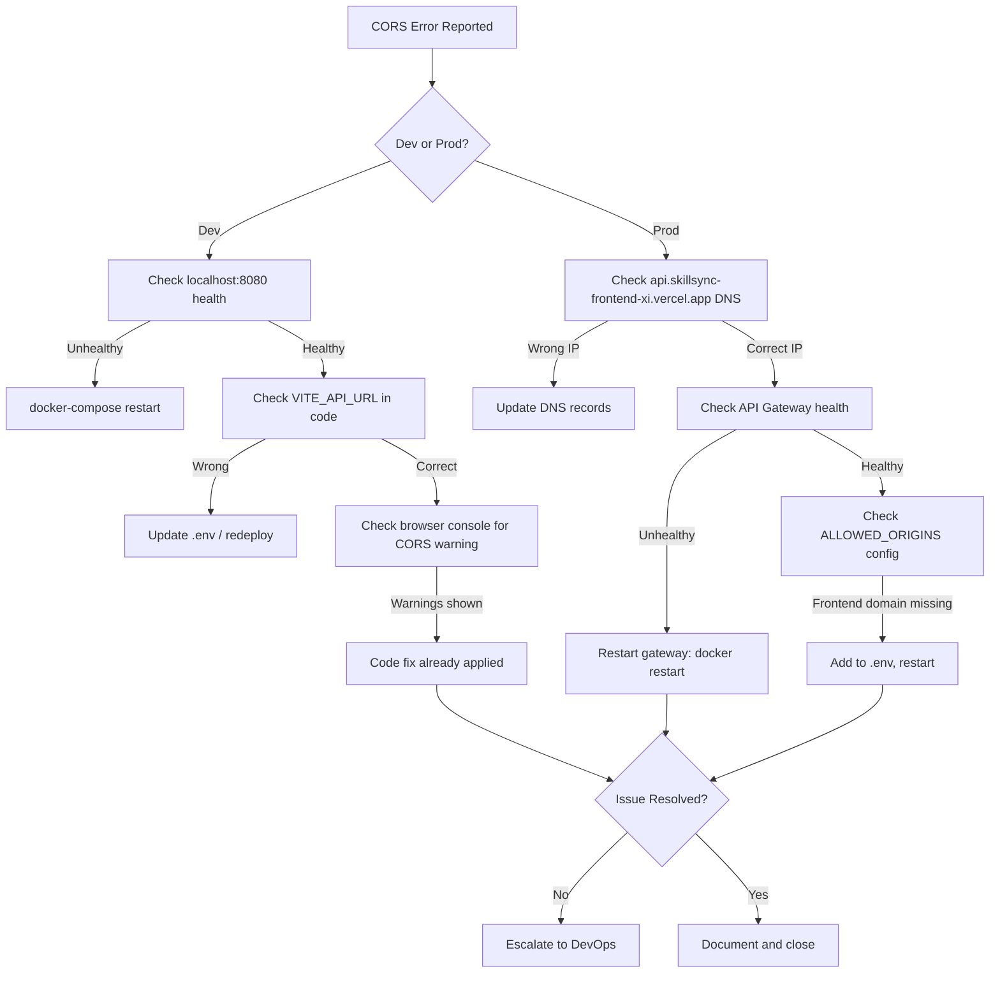

# SkillSync Production CORS & Routing Fix Guide

## Overview

This guide addresses common CORS and 502 errors occurring in production when the frontend cannot reach backend API endpoints. The issue stems from routing configuration mismatches between Vercel (frontend) and EC2 (backend).

**Last Updated:** 2026-04-04  
**Issues Fixed:** CORS errors on `initiate-registration` and other API endpoints returning 502 Bad Gateway

---

## 🔍 Problem Diagnosis

### Symptoms
- Frontend shows `Failed to initiate registration` or similar API errors
- DevTools Network tab shows CORS errors with 502 responses
- Requests appear to go to `https://skillsync-frontend-xi.vercel.app/api/*` instead of `https://api.skillsync-frontend-xi.vercel.app/api/*`

### Root Cause
The frontend is misconfigured to point to the **Vercel frontend domain** (`skillsync-frontend-xi.vercel.app`) for API calls instead of the **EC2 backend API Gateway** (`api.skillsync-frontend-xi.vercel.app`). This occurs when:

1. **VITE_API_URL is not set** in Vercel environment variables
2. **VITE_API_URL is misconfigured** to point to the wrong domain
3. **Browser DNS resolution** favors the frontend domain

### System Architecture (Correct Setup)
```
┌─────────────────────────────────────────────────────────────┐
│                     User Browser                             │
└──────────────────────┬──────────────────────────────────────┘
                       │
              ┌────────┴────────┐
              │                 │
    (Frontend UI)      (API Calls)
    HTTPS/SPA          REST/WebSocket
              │                 │
         ┌────▼─────┐      ┌────▼──────────────┐
         │ Vercel   │      │  AWS EC2           │
         │ Frontend │      │  API Gateway :80   │
         │ CDN      │      │                    │
         └──────────┘      │  ├─ Auth Service   │
                           │  ├─ User Service   │
                           │  ├─ Skill Service  │
                           │  └─ ... (8 others) │
                           └────────────────────┘

Domain Routing:
• Frontend UI:   skillsync-frontend-xi.vercel.app       → Vercel Static Hosting
• API Gateway:   api.skillsync-frontend-xi.vercel.app   → EC2 Load Balancer/Ingress
• EC2 Direct:    3.217.114.102:80 (internal) → API Gateway (for debugging)
```

---

## ✅ Solutions

### Immediate Fix (Code-Level)
**Status**: DEPLOYED in commit to `Frontend/src/services/axios.ts`

The frontend now automatically detects and corrects misconfigured API URLs:

```typescript
// If configuredUrl points to the frontend domain, redirect to API domain
if (isProd && configuredUrl && new URL(configuredUrl).hostname === 'skillsync-frontend-xi.vercel.app') {
    console.warn('[CORS FIX] Detected misconfigured API URL pointing to frontend domain. Redirecting to API Gateway...');
    configuredUrl = 'https://api.skillsync-frontend-xi.vercel.app';
}
```

**When This Triggers**: 
- Production builds only (`import.meta.env.PROD === true`)
- VITE_API_URL is explicitly set to the frontend domain
- Logs warning to console for troubleshooting

### Long-Term Fix (Configuration-Level)

#### Step 1: Set Environment Variable in Vercel Dashboard
1. Navigate to Vercel Project Settings: https://vercel.com/dashboard
2. Go to **Settings** → **Environment Variables**
3. Add a new variable:
   - **Name**: `VITE_API_URL`
   - **Value**: `https://api.skillsync-frontend-xi.vercel.app`
   - **Environments**: Select `Production` (optional: also check `Preview`)
4. **Deploy** → Redeploy the frontend to apply changes

#### Step 2: Verify DNS Configuration
Ensure DNS records correctly point to respective hosts:

```bash
# Frontend (should resolve to Vercel IP/edge location)
nslookup skillsync-frontend-xi.vercel.app

# API Gateway (should resolve to EC2 Elastic IP)
nslookup api.skillsync-frontend-xi.vercel.app
```

#### Step 3: Test CORS Preflight
Test that OPTIONS requests receive proper CORS headers:

```bash
curl -X OPTIONS https://api.skillsync-frontend-xi.vercel.app/api/auth/initiate-registration \
  -H "Origin: https://skillsync-frontend-xi.vercel.app" \
  -H "Access-Control-Request-Method: POST" \
  -v
```

Expected response headers:
```
Access-Control-Allow-Origin: https://skillsync-frontend-xi.vercel.app
Access-Control-Allow-Methods: GET, POST, PUT, DELETE, OPTIONS, PATCH
Access-Control-Allow-Headers: *
Access-Control-Allow-Credentials: true
```

---

## 🛠️ Backend Configuration (API Gateway)

### CORS Configuration Source
**File**: `Backend/api-gateway/src/main/resources/application.properties`  
**Property**: `app.cors.allowed-origins=${ALLOWED_ORIGINS:https://skillsync-frontend-xi.vercel.app}`

### How It Works
1. **CorsConfig.java** registers a `CorsWebFilter` bean that intercepts all requests
2. Allowed origins are comma-separated and trimmed from the environment variable
3. All preflight OPTIONS requests are handled before reaching service routes
4. Credentials are allowed (cookies/HttpOnly tokens are sent automatically)

### Debugging CORS at Gateway Level
```bash
# Check if API Gateway is healthy
curl -i http://localhost:8080/actuator/health

# Test auth endpoint directly (bypassing frontend)
curl -X POST http://localhost:8080/api/auth/initiate-registration \
  -H "Content-Type: application/json" \
  -d '{"email":"test@gmail.com"}' \
  -v

# Test with CORS headers
curl -X OPTIONS http://localhost:8080/api/auth/initiate-registration \
  -H "Origin: https://skillsync-frontend-xi.vercel.app" \
  -H "Access-Control-Request-Method: POST" \
  -v
```

---

## 🚨 Common Issues & Remediation

### Issue 1: "CORS error - 502 Bad Gateway"
**Cause**: API Gateway or backend service is unreachable or down

**Check**:
```bash
# Test API Gateway health
curl http://3.217.114.102:8080/actuator/health/readiness

# Test auth-service health (internal)
docker exec skillsync-auth curl http://localhost:8081/actuator/health

# Check if services are registered in Eureka
curl http://localhost:8761/eureka/apps
```

**Fix**:
- Restart the API Gateway: `docker restart skillsync-gateway`
- Rebuild and redeploy: `docker-compose up --build -d`

### Issue 2: "CORS error - domain not allowed"
**Cause**: Frontend domain not in ALLOWED_ORIGINS environment variable

**Check**:
```bash
# Verify current configuration
curl http://localhost:8080/actuator/env | grep -A5 allowed-origins

# Or check Docker env
docker exec skillsync-gateway env | grep ALLOWED_ORIGINS
```

**Fix**:
1. Update .env file: `ALLOWED_ORIGINS=https://skillsync-frontend-xi.vercel.app,https://localhost:5173`
2. Restart services: `docker-compose down && docker-compose up -d`

### Issue 3: "Requests to skillsync-frontend-xi.vercel.app returning Vercel 404"
**Cause**: Browser is routing API requests to the Vercel frontend instead of EC2 backend

**Check**:
```bash
# In browser console
console.log(import.meta.env.VITE_API_URL);

# Or check network requests
// Open DevTools → Network → Filter by XHR/Fetch
// Check "Request URL" column
```

**Fix**:
1. Code-level: Automatic correction applied (see Immediate Fix section)
2. Config-level: Set `VITE_API_URL` in Vercel (see Long-Term Fix)

### Issue 4: "Requests timeout after ~30-60 seconds"
**Cause**: Network traversal latency, insufficient backend resources, or service discovery delays

**Check**:
```bash
# Monitor API Gateway logs
docker logs -f skillsync-gateway | grep -E "route|gateway|error|exception"

# Check auth-service logs
docker logs -f skillsync-auth | grep -E "error|exception|registration"

# Monitor resource usage
docker stats skillsync-gateway skillsync-auth
```

**Fix**:
- Increase JVM heap: `JAVA_OPTS="-Xms256m -Xmx768m"` in docker-compose.yml
- Increase timeout in application.properties: `server.servlet.session.timeout=30m`
- Scale services or add load balancing

---

## 📋 Verification Checklist

After applying fixes, verify using this checklist:

- [ ] Frontend builds successfully: `npm run build` (no errors)
- [ ] VITE_API_URL set in Vercel environment variables
- [ ] DNS records point to correct hosts:
  - `skillsync-frontend-xi.vercel.app` → Vercel
  - `api.skillsync-frontend-xi.vercel.app` → EC2 (3.217.114.102)
- [ ] API Gateway is running: `docker ps | grep gateway`
- [ ] Auth service is healthy: `curl http://localhost:8081/actuator/health`
- [ ] CORS headers present in OPTIONS preflight response
- [ ] Registration endpoint returns data (not 502): 
  ```bash
  curl -X POST https://api.skillsync-frontend-xi.vercel.app/api/auth/initiate-registration \
    -H "Content-Type: application/json" \
    -H "Origin: https://skillsync-frontend-xi.vercel.app" \
    -d '{"email":"test@gmail.com"}'
  ```
- [ ] Browser console shows no CORS warnings
- [ ] Frontend registration page loads and shows successful form submission

---

## 📚 References

- **Frontend Axios Config**: `Frontend/src/services/axios.ts`
- **API Gateway CORS Config**: `Backend/api-gateway/src/main/java/com/skillsync/apigateway/config/CorsConfig.java`
- **Gateway Routes**: `Backend/api-gateway/src/main/resources/application.properties` (routes[0-21])
- **Auth Service**: `Backend/auth-service/src/main/java/com/skillsync/auth/controller/AuthController.java`
- **Eureka Dashboard**: http://localhost:8761 (dev) or https://api.skillsync-frontend-xi.vercel.app/eureka-ui/ (prod)
- **Architecture Notes**: `docs/architecture_simplification_removal_of_nginx_and_direct_gateway_routing.md`

---

## 🔄 Incident Response Flow



---

## 📞 Support & Escalation

For unresolved issues:
1. **Collect Evidence**: Browser console logs, DevTools Network tab, `docker logs` output
2. **Check Unified Logs**: `docker logs skillsync-gateway | grep -C5 "error"`
3. **Verify Infrastructure**: EC2 security groups, VPC routes, Elastic IP assignment
4. **Contact DevOps**: If DNS unable to resolve or EC2 connectivity lost
